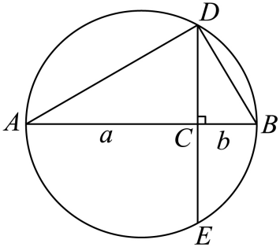

## 讲解

### 是什么

两个非负实数 $a,b$ 的算术平均不小于几何平均：

$$\frac{a+b}{2}\ge\sqrt{ab}\qquad(a\ge0,\ b\ge0).$$

算术平均是把两数的和平均分成两份，几何平均是乘积的非负平方根。“当且仅当 $a=b$ 时取等”包含两个方向：相等的两项一定使左右相等；若左右相等，这两项也一定相等。若 $a\ne b$，关系严格为大于。

原讲义采用 $a,b>0$ 的常用表述。上式可由同一推导延伸到非负数：一项为零、另一项正时严格不等；两项都零时取等。涉及倒数的应用必须另外排除零，不能因为基本式允许零就允许除以零。

公式中的两项可以是整个表达式，不必是题目最初的两个字母。选中两项后，要检查这两个表达式各自非负，而不是只检查它们的积非负；两个负数也有正积，但它们的和为负，不可能不小于正的几何平均。

与它相近的重要不等式是

$$a^2+b^2\ge2ab\qquad(a,b\in\mathbb R),$$

同样在 $a=b$ 时取等。这一式中的 $a,b$ 可以为负。它的全实数范围不能直接移给含 $\sqrt{ab}$ 的基本不等式；“平方和至少是积的两倍”与“算术平均至少是几何平均”比较的量也不同。

### 怎么来的

出发点是实数平方非负和完全平方公式。对任意实数 $u,v$，先展开，再把积项移到右边：

$$
(u-v)^2\ge0
\quad\Longleftrightarrow\quad
u^2-2uv+v^2\ge0
\quad\Longleftrightarrow\quad
u^2+v^2\ge2uv.
$$

这些步骤只是同加、同减同一个量，因此可逆；平方差为零恰好在 $u=v$。这已经证明了全实数范围的重要不等式。

为了把平方和转成 $a+b$，在 $a,b\ge0$ 时令 $u=\sqrt a,v=\sqrt b$。这不是任意换字母：两项非负才保证实数平方根存在，且平方后恰好还原 $a,b$。代入上式：

$$
(\sqrt a-\sqrt b)^2=a+b-2\sqrt a\sqrt b
=a+b-2\sqrt{ab}\ge0.
$$

根号乘法 $\sqrt a\sqrt b=\sqrt{ab}$ 在两数非负时成立。同加 $2\sqrt{ab}$，再同除正数 $2$，得到基本不等式。

取等要求原平方差为零，即 $\sqrt a=\sqrt b$。两边都是非负平方根，平方可逆地得到 $a=b$；反过来 $a=b$ 时平方差为零。因此等号不是猜出来的，而是沿推导追到平方为零的条件。

原资料还用圆解释同一个关系：直径的两段长为 $a,b$，垂直弦的半长为 $\sqrt{ab}$，半径为 $(a+b)/2$。半弦不超过半径由勾股定理保证；等号要求分割点就是圆心。下方原例会把相似、线段比例和取等逐一接齐，几何结论不靠示意图比例。

### 什么时候能用

先认出实际参与比较的两项，再检验定义域和非负性。例如下方原题 D 的两项是 $x^2$ 和 $3/x^2$：表达式首先排除 $x=0$，其余实数才让这两项都正。正性来自整个表达式，不来自原字母 $x$ 必须为正。

若要证明一个大小关系，套用公式只需满足上述前提，不要求两项相等，也不要求乘积固定。相等决定是否能取等；定积或定和则是用公式求固定最值时的额外结构，不能把三件事混成同一个应用前提。

若要宣布“最小值”或“最大值”，还必须做到两件事：先证明所有允许值都不越过这个界，再找到允许的变量值达到它。取等方程要与原等式、区间、整数要求一起检查，不能只写“当且仅当两项相等”。这些判断在定和定积条目中继续展开。

连续用几次基本不等式，最终等号需要每一步同时取等。后续若平方、取倒数或乘除，仍须另外检查非负性、非零性和方向；基本不等式并不会替后续运算自动提供所有条件。

> 原知识定位：专题2.2（Dd6f8fccce878）P0016—P0032。定义、平方非负推导及适用条件按数学规范补讲；原题与原详解、补足理由分列于下。

## 例题

### 原题 1-0

> 来源ID HSMA-B1-C2-Dd6f8fccce878-P0034；原件 `专题2.2 基本不等式（举一反三讲义）数学人教A版2019必修第一册（解析版）.docx`；DOCX正文段落 P0034—P0036；答案与详解 P0037—P0043。年份、地区和试题标签沿原资料记载，未独立核实。

**原资料题干与选项：**

【例1】（24-25高一上·河北石家庄·期中）下列不等式中，正确的是（    ）

A．$a+\frac{4}{a}\ge 4$  B．${a}^{2}+{b}^{2}\ge 4ab$

C．$\frac{a+b}{2}\ge \sqrt{ab}$  D．${x}^{2}+\frac{3}{{x}^{2}}\ge 2\sqrt{3}$

**原资料答案与详解（完整保留，公式转写为LaTeX）：**

【答案】D

【解题思路】根据基本不等式使用的条件判断即可.

【解答过程】对于A：当$a<0$时，$a+\frac{4}{a}\le -4$，故A错误；

对于B：取$a=b=1$，${a}^{2}+{b}^{2}<4ab$，故B错误；

对于C：当$a>0,b<0$时，$\sqrt{ab}$无意义，故C错误；

对于D：$\frac{3}{{x}^{2}}+{x}^{2}\ge 2\sqrt{3}$，取等条件为$\frac{3}{{x}^{2}}={x}^{2}$，即$x=\pm \sqrt[4]{3}$，故D正确.

故选：D.

**展开解析与核验（依据原详解补足，勘误另标）：**

看到题目没有给a、b的正性条件，先检查公式的定义域，再检查所用的两项是否非负。

A中$a=0$使分式无意义；即使只在有意义的a中判断，取$a=-2$，左边为−4，仍小于4。两项的积为4，不能代替两项都为正这个前提。B取$a=b=1$，左边2、右边4，反例足以否定“总成立”。C除了异号时根号无意义，还可取$a=b=-1$：根号有意义，但左边−1小于右边1，因此仅补充$ab\ge 0$仍不够。

D的表达式本身要求$x\ne0$。于是$x^{2}$和$3/x^{2}$都为正，积为3，基本不等式给出
$$x^2+\frac3{x^2}\ge2\sqrt{x^2\cdot\frac3{x^2}}=2\sqrt3.$$
取等要求$x^{2}=3/x^{2}$，乘正数$x^{2}$得$x^{4}=3$，故$x=\pm\sqrt[4]{3}$，两值均非零。D是在其自然定义域$x\ne0$上成立；若把“对所有实数x”包含$x=0$，则式子在0处没有定义，不能这么表述。原资料把四次根号的指数放在根号左侧，正文按其含义转写。

### 原题 1-2

> 来源ID HSMA-B1-C2-Dd6f8fccce878-P0050；原件 `专题2.2 基本不等式（举一反三讲义）数学人教A版2019必修第一册（解析版）.docx`；DOCX正文段落 P0050—P0055；答案与详解 P0056—P0061。年份、地区和试题标签沿原资料记载，未独立核实。

**原资料题干与选项：**

【变式1-2】（24-25高一上·贵州贵阳·期中）如图，$AB$是圆的直径，点$C$是$AB$上一点，$AC=a, BC=b$．过点$C$作垂直于$AB$的弦$DE$，连接$AD, BD$．可证$\triangle ACD~\triangle DCB$，因而$CD=\sqrt{ab}$．由于$CD$小于或等于圆的半径，我们教材中利用该图作为一个说法的几何解释，这个说法正确的是（   ）

A．如果$a>b>0$，那么$\sqrt{a}>\sqrt{b}$

B．如果$a>b>0$，那么${a}^{2}>{b}^{2}$

C．对$\forall a>0, b>0$，都有$\frac{a+b}{2}\ge \sqrt{ab}$，当且仅当$a=b$时等号成立

D．对$\forall a>0, b>0$，都有${a}^{2}+{b}^{2}\ge 2ab$，当且仅当$a=b$时等号成立

**原资料答案与详解（完整保留，公式转写为LaTeX）：**

【答案】C

【解题思路】根据题意，结合$CD$小于或等于圆的半径求解即可.

【解答过程】由题意，由于$CD$小于或等于圆的半径，$AB$是圆的直径，

且$AC=a, BC=b$，$CD=\sqrt{ab}$，

所以$\sqrt{ab}\le \frac{a+b}{2}$，当且仅当$a=b$时等号成立.

故选：C.

**展开解析与核验（依据原详解补足，勘误另标）：**

看到图中半径与CD比较，先把图上的线段译成代数式，不能凭图形看起来的长短作结论。AB为直径，圆周角定理给$\angle ADB=90^{\circ}$；CD垂直AB，所以$\angle ACD=\angle DCB=90^{\circ}$。在直角三角形ADB中，$\angle CAD=\angle DAB=90^{\circ}-\angle DBA$；在直角三角形DCB中，$\angle CDB=90^{\circ}-\angle CBD=90^{\circ}-\angle DBA$。由这两对对应角相等，△ACD与△DCB相似。

由相似的对应边比例$\frac{AC}{CD}=\frac{CD}{BC}$得$CD^{2}=AC\cdot BC=ab$；CD是长度，取非负根，得到$CD=\sqrt{ab}$。令圆心为O，半径$r=\frac{AB}2=\frac{a+b}2$。若C不等于O，OC在直径所在直线上，故$OC\perp CD$，勾股定理给$OD^{2}=OC^{2}+CD^{2}$；若C等于O，则$OC=0,CD=OD$，同一等式仍成立。由$OD=r$，得到$r^2-CD^2=OC^2\ge0$；两长度非负，所以$CD\le r$。只有$OC=0$时取等，此时C为AB中点，即$a=b$。

因此图直接解释的是C：$\sqrt{ab}\le\frac{a+b}2$及其取等条件。A的正数开方保序、B的正数平方保序、D的平方差非负都是真命题，但它们不是本题用“$CD\le $半径”直接对应的说法，不能因未选它们就宣称它们数学上错误。非退化弦及相似证明按$a,b>0$讨论；若C在端点，弦退化，不能照用三角形相似，代数不等式可另以非负数公式核对。

## 易错

- 只检查乘积非负：两个负项也有正积。分别检查参加基本不等式的两个完整量非负，涉及倒数时再排除零。
- 把 $a^2+b^2\ge2ab$ 的全实数范围移给 $a+b\ge2\sqrt{ab}$：后式还要求两项非负。
- 把取等条件当成应用前提：两项不相等仍可使用公式，只是关系严格；若求最值，才须证明允许取等。
- 看到根号有意义就宣布公式成立：$ab\ge0$ 只保证根号存在，不保证 $a+b$ 非负。
- 把几何例题未选的其他真命题判成假：本题问图中长度比较直接对应什么，不是问其余公式是否正确。
