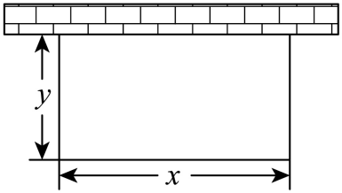
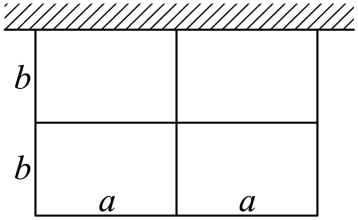

## 讲解

### 判据

围栏最值的第一判断是“哪些边段实际施工”，然后才是定和或定积。靠墙边不施工，共用隔栏只施工一次，内部隔栏也要施工；这些事实决定材料总长中每个方向的系数。只算整体矩形外周长，或把每间周长直接相加，都会先建立错误的模型。

示意图可用于识别连接关系和题设标注，不能按画面比例推断边长、角度或最优形状。长、宽是两个方向的名称；没有另加严格大小关系时，不能自行排除正方形。墙长有上限、门口不用材料或存在异价边段时，必须把它们加入模型，本条原例的墙足够长。

### 流程

1. **逐段列施工清单。** 从外边与内隔栏分别数起；一条真实边段只计一次，再按同方向尺寸合并。说明墙边为何为零、共用边为何不重复，依据是题设连接关系及标注。
2. **区分单位面积和总面积。** 一间长x、宽y，面积是xy；相同的n间总面积才是nxy。实际材料长度按刚数出的边段写，不能用总面积公式代替每间目标。
3. **由固定量选择两正项。** 面积固定且目标为αx+βy时，取αx、βy，它们的积由面积确定；材料长度固定时，这两项的和固定，用它们的积反推面积上界。系数α、β来自施工清单，两者必须为正。
4. **把数学界接回设计。** 取等要求αx=βy，联立本小问原约束求正尺寸；不同目标重新选择两项，不能复制上一问的取等比例。检验所有尺寸限制。
5. **逐段回算。** 用求得尺寸重新计算各施工边段、材料总长和所问面积，确认达到界，再同时报告设计与最值。长度用米，面积用平方米，长度除面积的目标单位为每米。

### 固定面积与固定材料为何方向相反

设已数清的材料长度L=αx+βy，x、y>0，α、β>0。面积xy=S固定时，两项αx、βy均正，乘积为αβS，所以

$$L=\alpha x+\beta y\ge2\sqrt{(\alpha x)(\beta y)}=2\sqrt{\alpha\beta S}.$$

取等是αx=βy。由此x=(β/α)y，代入xy=S得到(β/α)y²=S，正根给y=√(αS/β)、x=√(βS/α)。二者满足原约束，且没有其他尺寸限制时，证明这个最小材料长度实际可取。长宽不必相等，相等的是完整的带系数项。

材料L=ℓ固定时，平方差非负给

$$0\le(\alpha x-\beta y)^2=(\alpha x+\beta y)^2-4\alpha\beta xy
=\ell^2-4\alpha\beta xy.$$

移项并除正数4αβ，得到xy≤ℓ²/(4αβ)。等号仍要求αx=βy，此时两项各为ℓ/2，故x=ℓ/(2α)、y=ℓ/(2β)。检查墙长、边长范围后才能把上界报告为最大面积。如果题设只给L≤ℓ，且不存在妨碍放大的尺寸限制，没用完材料的正尺寸可以同比放大并提高面积，最优应使用全部材料；有其他限制则须另外判断，不能无条件写L=ℓ。

### 目标不是面积时重新构造

有些题固定材料，却问一个分式最小值。先拆分式，检查分母，再利用原长度约束构造准确的1；展开常数项与交叉比值后判断其积是否固定。它的等号可能与“面积最大”或“固定面积用料最少”不同。下方育苗区第二问正是这样的情形，完整保留两问，分别说明为何想到两种方法。

多间围栏应先定拓扑结构，再计数，再写不等式。四间是否排成一行还是两行两列由原图和题设决定；“四间”本身不能确定系数。对相邻两间，共用隔栏是同一施工边段，不论从哪一间看都只存在一条；但它仍需材料，不能因为共用而删去。

## 例题

### 原题 9-2

> 来源ID HSMA-B1-C2-Dd6f8fccce878-P0457；原件 `专题2.2 基本不等式（举一反三讲义）数学人教A版2019必修第一册（解析版）.docx`；DOCX正文段落 P0457—P0460；答案与详解 P0461—P0471。年份、地区和试题标签沿原资料记载，未独立核实。

**原资料题干与选项：**

【变式9-2】（24-25高一上·吉林长春·阶段练习）如图，为了开展劳动教育，某校在“一米农庄”内计划用篱笆围成一个一边靠墙（墙足够长）的矩形育苗区.设育苗区的长为x米，宽为y米.

(1)若育苗区面积为8平方米，则x，y为何值时，所用篱笆总长最小；

(2)若使用的篱笆总长为10米，求$\frac{2x+y}{xy}$的最小值.

**原资料答案与详解（完整保留，公式转写为LaTeX）：**

【答案】(1)育苗区的长为$4m$，宽为$2m$；

(2)$\frac{9}{10}$

【解题思路】（1）利用基本不等式求解和的最小值.

（2）利用基本不等式“1”的妙用求出最小值.

【解答过程】（1）依题意，$xy=8$，所用篱笆总长为$x+2y$，而$x+2y\ge 2\sqrt{2xy}=8$，

当且仅当$x=2y$，即$x=4$，$y=2$时取等号，

所以育苗区的长为$4m$，宽为$2m$时，所用篱笆总长最小.

（2）依题意，$x+2y=10$，

$$\frac{2x+y}{xy}=\frac{1}{x}+\frac{2}{y}=\frac{1}{10}(\frac{1}{x}+\frac{2}{y})\left( x+2y\right)=\frac{1}{10}(5+\frac{2y}{x}+\frac{2x}{y})\ge \frac{1}{10}(5+2\sqrt{\frac{2y}{x}\cdot \frac{2x}{y}})=\frac{9}{10}$$

，

当且仅当$\frac{2y}{x}=\frac{2x}{y}$，即$x=y=\frac{10}{3}$时取等号，

所以$\frac{2x+y}{xy}$的最小值$\frac{9}{10}$.

**展开解析与核验（依据原详解补足，勘误另标）：**

先读图对应的实际边：靠墙的一条长边不用篱笆，另一条水平边长x，两条垂直边各长y，所以需$x+2y$米，面积xy平方米。正性$x,y>0$来自育苗区非退化。

（1）$xy=8$，目标$x+2y$中的两正项乘积$2xy=16$，故篱笆长≥8米。取等$x=2y$，接$xy=8$得$2y^{2}=8$，$y=2,x=4$，均正；图及条件没有给额外上限。代回面积8、篱笆8，得到原答案。

（2）$x+2y=10$。先将$\frac{2x+y}{xy}$拆成$\frac2y+\frac1x$，再乘$(x+2y)/10=1$，由分配律四项为$\frac1{10}[1+2y/x+2x/y+4]$，合并两个常数后为$\frac1{10}\left(5+\frac{2y}x+\frac{2x}y\right)\ge\frac9{10}$。取等$\frac{2y}x=\frac{2x}y$，正性给$x=y$，原和给$x=y=\frac{10}3$，代回目标确为$\frac9{10}$（单位为每米）。

“长、宽”在本题图中用作两个方向的名称，原资料允许$x=y$；若另加“长严格大于宽”，会排除本问取等点，那是改变条件，不能自行添加。两小问的等号分别是$x=2y$、$x=y$，来自不同目标，不能共用。

### 原题 9-3

> 来源ID HSMA-B1-C2-Dd6f8fccce878-P0472；原件 `专题2.2 基本不等式（举一反三讲义）数学人教A版2019必修第一册（解析版）.docx`；DOCX正文段落 P0472—P0475；答案与详解 P0476—P0488。年份、地区和试题标签沿原资料记载，未独立核实。

**原资料题干与选项：**

【变式9-3】（24-25高一上·河北石家庄·阶段练习）如图所示，动物园要围成相同面积的长方形虎笼四间，一面可利用原有的墙，其他各面用钢筋网围成，每间虎笼的长为a（单位：$m$）、宽为b（单位：$m$）（a，b都为正数）.

(1)现有可围$36m$长的钢筋网材料，每间虎笼的长、宽各设计为多少时，可使每间虎笼面积最大？

(2)若使每间虎笼面积为$24{m}^{2}$，每间虎笼的长、宽各设计为多少时，可使围成四间笼的钢筋网总长最小？最小值为多少？

**原资料答案与详解（完整保留，公式转写为LaTeX）：**

【答案】(1)每间虎笼的长设计为$a=\frac{9}{2}$、宽设计为$b=3$时，可使每间虎笼面积最大，面积最大为$\frac{27}{2}{m}^{2}$.

(2)每间虎笼的长设计为$6$、宽设计为$4$时，可使围成四间笼的钢筋网总长最小，最小值为48m.

【解题思路】（1）先由题意得$2a+3b=18$，$a>0,b>0$，每间虎笼面积为$S=ab$，再利用基本不等式即可求出面积S的最大值以及此时$a,b$的值.

（2）先由题意得$S=ab=24,a>,b>0$，钢筋网总长为$l=4a+6b$，再利用基本不等式即可求出l的最小值以及此时$a,b$的值.

【解答过程】（1）由题得$4a+6b=36$即$2a+3b=18$，$a>0,b>0$，

设每间虎笼面积为S，则$S=ab$，

因为$18=2a+3b\ge 2\sqrt{2a\times 3b}=2\sqrt{6ab}$，当且仅当$2a=3b=9$时等号成立，

所以$\sqrt{ab}\le \frac{18}{2\sqrt{6}}=\frac{9}{\sqrt{6}}$即$ab\le \frac{27}{2}$，

所以每间虎笼的长$a=\frac{9}{2}$、宽$b=3$时，可使每间虎笼面积最大，面积最大为$\frac{27}{2}{m}^{2}$.

（2）由题意可得$S=ab=24,a>,b>0$，

设钢筋网总长为l，则$l=4a+6b$，

因为$4a+6b\ge 2\sqrt{4a\times 6b}=4\sqrt{6ab}=48$，当且仅当$4a=6b$即$2a=3b=12$时等号成立，

所以每间虎笼的长设计为$a=6$、宽设计为$b=4$时，可使围成四间笼的钢筋网总长最小，最小值为48m.

**展开解析与核验（依据原详解补足，勘误另标）：**

先按图逐段数钢筋网。四间笼为两行两列，上边利用墙；下面外边长2a，中间横隔栏长2a，横向总4a。左外边、右外边、中间竖隔栏各长2b，纵向总6b。因此网长$L=4a+6b$，每间面积$S=ab$。不能只取外轮廓，也不能把共用隔栏给相邻两个笼各算一次。

（1）$L=36$，即$2a+3b=18$。两正项2a、3b和固定，$6ab\le\left(\frac{2a+3b}2\right)^2=81$，所以$ab\le\frac{27}2$。取等$2a=3b=9$，得$a=\frac92$米、$b=3$米，代回网长18+18=36米，每间面积$27/2$平方米。

（2）每间$ab=24$，目标$4a+6b$两正项积$24ab=576$，故$L\ge2\sqrt{576}=48$米。取等$4a=6b$，即$2a=3b$，接$ab=24$得$a=6$米,$b=4$米。代回面积24、网长24+24=48，最值可取。

**原书条件笔误：** 第（2）问的思路和过程把$a>0$抄成了$a>$，缺少0。题干明确a,b都为正数，补讲依据题干恢复$a>0$，没有改变问题。最大面积是每间的面积；若问四间总面积，要乘4，本题不可混报。

## 易错

- 矩形靠墙时套完整周长$2x+2y$，会多算墙边。
- 多间笼只算外围会漏内隔栏，逐间相加又会重复共用隔栏。
- $\alpha a+\beta b$的取等是$\alpha a=\beta b$，不是图画得相似就令$a=b$。
