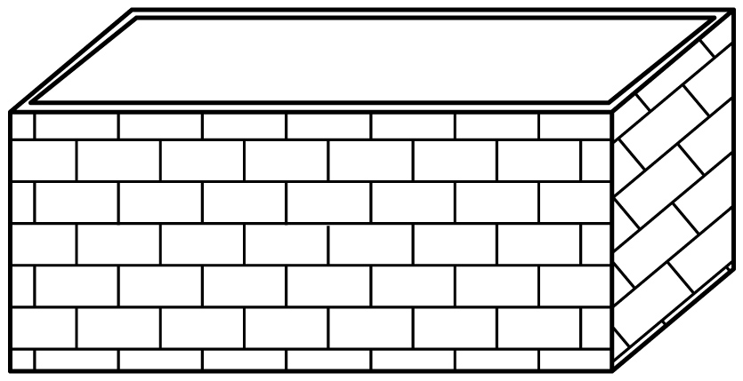
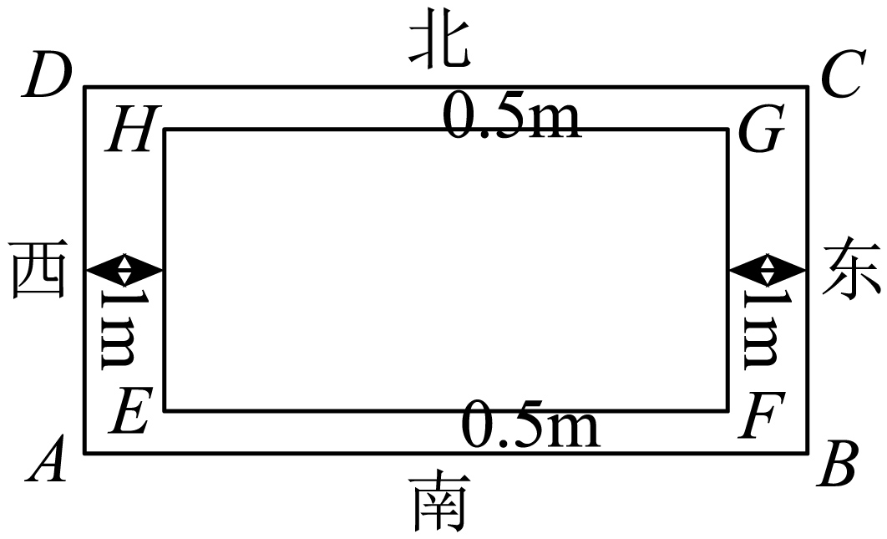

## 讲解

### 判据

实际问题先问清“最少的是什么”：整批总费用、平均每件费用、实际施工长度，还是从给定规格里选够用的材料。它们可以用同一数学工具，但不是同一个目标。固定成本分摊随件数增加而减小，存留费用随件数增加而增大；固定面积使一条边增大时另一条边减小。把这两种相反变化写成正项的定积和，才有使用基本不等式的依据。

建立模型要同时保留单位和实际范围。件数为正整数，几何尺寸为正实数，题设的“长大于宽”、固定深度和材料规格都属于允许范围。不能把连续模型的取等点自动当成整数方案，也不能把购买规格当成几何周长的精确最小值。图中没有给出的生产能力、切割损耗或边长比例不能自行加入。

### 流程

1. **定义变量与所求量。** 写清每个变量代表件数还是长度、单位以及正性或整数限制。区分固定量和随变量变化的量；同一题的不同小问重新确认目标。
2. **按实际规律列总量，逐项说明来源。** 固定成本只计一次；存留费是“件数×平均存留天数×每天每件单价”。几何用料逐条计边、逐面计面积；面积和体积先写题设等式，不能先猜最优形状。
3. **把总量变成题目要求的目标。** 平均每件成本要除以正件数；周长须包含全部边，面积须按实际外边长相乘。分母非零由变量范围保证，不能漏写。
4. **说明为何选择这两项。** 写出两项各自为正、乘积怎样由固定约束确定，以及目标中其他部分是否常数。给出界和完整取等方程；两次估计相加时，必须让两次取等同时成立。
5. **将取等点放回实际范围。** 检查整数、长宽限制、原面积体积、规格及其他题设。连续下界可取，才能叫实际最小值；取等被排除时应重新在真实范围分析，不能只把等号改成大于。
6. **同时回答方案与最优目标。** 件数、边长和费用不能混写成一个答案。按单位回算原总量；选择题逐项比较，尽量用精确式判断是否够用，最后才按规定舍入。

### 固定成本为何要除以件数

设每批固定成本为F元，一次制作N件，N是正整数。平均存留时间与件数成正比；把“比例系数×每天每件费用”合记为q，则每件存留费用为qN元，其中F>0、q>0。整批存留费用是N·qN，因此整批成本为F+qN²；平均每件成本才是

$$C(N)=\frac{F+qN^2}{N}=\frac FN+qN\ge2\sqrt{\frac FN\cdot qN}=2\sqrt{Fq}.$$

两正项乘积Fq固定；等号要求F/N=qN，乘正N得到N²=F/q，故连续取等点N₀=√(F/q)。若N₀恰是允许整数，它就是实际最优方案。

若N₀不是整数而允许所有正整数，不能只四舍五入。对两个正数N₂>N₁，作差有

$$C(N_2)-C(N_1)=F\left(\frac1{N_2}-\frac1{N_1}\right)+q(N_2-N_1)
=(N_2-N_1)\left(q-\frac{F}{N_1N_2}\right).$$

两数都不超过N₀时，N₁N₂<F/q，差为负；两数都不小于N₀时，N₁N₂>F/q，差为正。因此最优整数只可能是夹住N₀的两个正整数，要分别代回比较；若N₀<1，只能取从1起的整数，最优为1。有额外范围或可选批量缺档时，按真实允许集合判断，不直接套相邻整数规则。本批面包原例的取等点本来就是整数，未另编非整数例题。

### 几何用料怎样接到定积

矩形长宽x、y为正，固定面积A给xy=A。若目标是px+qy且p、q>0，选择完整带系数两项px、qy，积为pqA。因此目标至少为2√(pqA)，取等要求px=qy；它不自动要求x=y。先联立xy=A求正尺寸，再回算原用料，才能证明下界可以实现。

直角三角形要用题设“直角”得到斜边√(x²+y²)。面积给xy=2A，边和与斜边要分别估计：x+y≥2√(2A)，而(x−y)²≥0给x²+y²≥2xy=4A；平方根在非负数上保持大小，故斜边≥2√A。两处等号都要求x=y，这与正面积兼容；若额外条件排除等腰，就不能宣称这个界是可取最小周长。

无盖长方体深h固定、容积V固定时，hxy=V给xy=V/h。底面是一个xy，四壁是两个hx和两个hy，没有顶面。底与墙单价不同时分别计价；墙统一单价且正，最低费才等价于求x+y最小。墙面费用若加权不同，应对完整带权项取等，不能直接令长宽相等。

内矩形面积A固定，长宽分别x、y，外长比内长增加p，外宽增加q时，外面积必须先按实际方向写为

$$(x+p)(y+q)=xy+qx+py+pq=A+pq+qx+\frac{pA}{x}.$$

这里p、q是相对两边增加量的总和，不是每侧宽。p、q>0时两个变量项积pqA固定；取等还要检查内长大于内宽等额外限制。求外面积与求草坪面积也不同，后者应再减固定内面积A。下面原题依次展示平均成本、购买规格、分面计价与外面积。

## 例题

### 原题 9-0

> 来源ID HSMA-B1-C2-Dd6f8fccce878-P0440；原件 `专题2.2 基本不等式（举一反三讲义）数学人教A版2019必修第一册（解析版）.docx`；DOCX正文段落 P0440—P0441；答案与详解 P0442—P0446。年份、地区和试题标签沿原资料记载，未独立核实。

**原资料题干与选项：**

【例9】（24-25高一上·四川成都·期末）已知某糕点店制作一款面包的固定成本为400元，每次制作$x$个，每天每个面包的存留成本为1元，若每个面包的平均存留时间为$0.25x$天，为了使每个面包的总成本最小，则每天应制作（   ）

A．20个  B．30个  C．40个  D．50个

**原资料答案与详解（完整保留，公式转写为LaTeX）：**

【答案】C

【解题思路】根据题设有每个面包的总成本$y=\frac{400}{x}+\frac{x}{4}$，应用基本不等式求结果.

【解答过程】由题设，总成本为$400+\frac{{x}^{2}}{4}$，则每个面包的总成本$y=\frac{400}{x}+\frac{x}{4}\ge 2\sqrt{\frac{400}{x}\cdot \frac{x}{4}}=20$，

当且仅当$x=40$时取等号，故每个面包的总成本最小，每天应制作40个.

故选：C.

**展开解析与核验（依据原详解补足，勘误另标）：**

看到固定成本和每个面包的存留成本，应先区分整批总成本与每个的平均成本。x是一次制作的个数，x为正整数。每个存留0.25x天，按每天每个1元计，每个存留成本$x/4$元，整批为$x\cdot (x/4)=x^{2}/4$元。

整批成本$400+x^{2}/4$，除以x得到每个总成本$C=\frac{400}x+\frac x4$。两项正、积100，所以$C\ge 20$元/个。取等$\frac{400}x=\frac x4$，乘$4x>0$得$x^{2}=1600$，正根$x=40$恰为整数，故连续变量得到的取等点在实际离散范围内，确为最优。

逐项核验：A的20个给25元/个，B的30个给$125/6$元/个，C的40个给20元/个，D的50个给$41/2$元/个，故选C。题干用“每天应制作”而模型按每次制作的批量建立，本补讲沿原模型解释x；没有自行增加生产次数或库存限制。

### 原题 9-1

> 来源ID HSMA-B1-C2-Dd6f8fccce878-P0447；原件 `专题2.2 基本不等式（举一反三讲义）数学人教A版2019必修第一册（解析版）.docx`；DOCX正文段落 P0447—P0448；答案与详解 P0449—P0456。年份、地区和试题标签沿原资料记载，未独立核实。

**原资料题干与选项：**

【变式9-1】（24-25高一上·河南南阳·期中）制作一个面积为1${m}^{2}$且形状为直角三角形的铁支架，则较经济（够用，又耗材最少）的铁管长度为（    ）

A．4.6m  B．4.8m  C．5m  D．5.2m

**原资料答案与详解（完整保留，公式转写为LaTeX）：**

【答案】C

【解题思路】设一条直角边为$x$，由面积和勾股定理求出另外两条边，再结合基本不等式求周长最小值即可；

【解答过程】设一条直角边为$x$，由于面积为1${m}^{2}$，所以另一条直角边为$\frac{2}{x}$，

所以斜边长为$\sqrt{{x}^{2}+{\left( \frac{2}{x}\right)}^{2}}$，

所以周长为$x+\frac{2}{x}+\sqrt{{x}^{2}+{\left( \frac{2}{x}\right)}^{2}}\ge 2\sqrt{x\cdot \frac{2}{x}}+\sqrt{2\sqrt{{x}^{2}\cdot {\left( \frac{2}{x}\right)}^{2}}}=2\sqrt{2}+2\approx 4.82$，

当且仅当$x=\frac{2}{x}$且${x}^{2}={\left( \frac{2}{x}\right)}^{2}$，即$x=\sqrt{2}$时取等号，

所以较经济（够用，又耗材最少）的铁管长度为5m，

故选：C.

**展开解析与核验（依据原详解补足，勘误另标）：**

设两直角边为$x>0$、$z>0$，面积$\frac{xz}2=1$得$z=\frac2x$；勾股定理给斜边$\sqrt{x^{2}+z^{2}}$。这是题设“直角”的结论，不能对任意三角形照用。

由$xz=2$，直角边和$x+z\ge2\sqrt2$；平方和$x^2+z^2\ge2xz=4$，开非负根得斜边≥2。两界相加，周长≥$2\sqrt2+2$。两次同时取等都要求$x=z$，接面积得$x=z=\sqrt2$，故最小周长为$2\sqrt2+2$米。

**原书数值笔误：** 其小数约4.82，实际$2\sqrt2+2\approx4.828427$，四舍五入到百分位应为4.83。保留原4.82并注明；选项判断用精确值，不依赖错误舍入。

A的4.6米、B的4.8米都小于理论最小周长，不能够用；C的5米、D的5.2米都可提供足够长度，其中C较少，按题目提供的铁管长度选C。连续模型的最少实际用料是$2\sqrt2+2$米，不能把选项5米反过来宣称为三角形周长的数学最小值。题目“够用”按可用提供的铁管制作支架理解。

### 原题 P0055

> 来源ID HSMA-B1-C2-Ddf1071aabb3d-P0055；原件 `第二章 一元二次函数、方程和不等式（举一反三单元测试·拔尖卷）数学人教A版2019必修第一册（解析版）.docx`；DOCX正文段落 P0055—P0058；答案与详解 P0059—P0066。年份、地区和试题标签沿原资料记载，未独立核实。

**原资料题干与选项：**

6．（5分）（24-25高一上·广东广州·期末）某工厂要建造一个长方体形无盖贮水池，其容积为$4800{m}^{3}$，深为$3m$．如果池底每平方米的造价为100元，池壁每平方米的造价为80元，那么贮水池的最低总造价是（   ）

A．160000元  B．179200元

C．198400元  D．297600元

**原资料答案与详解（完整保留，公式转写为LaTeX）：**

【答案】C

【解题思路】设池底的长为x，宽为y，因水池无盖，则建造池体需要建造池壁有4个面，池底一个面，计算出建造这个水池的总造价是$100xy+2(x+y)\times 3\times 80$，结合基本不等关系求得最小值.

【解答过程】设池底的长为x，宽为y，则$3xy=4800$，即$y=\frac{1600}{x}$

因水池无盖，则建造池体需要建造池壁有4个面，池底一个面，

建造这个水池的总造价是$100xy+2(x+y)\times 3\times 80=160000+480\left( x+\frac{1600}{x}\right)$

$\ge 160000+480\times 2\sqrt{x\cdot \frac{1600}{x}}=198400$

当且仅当$x=\frac{1600}{x}$，即$x=40$时，等号成立，

故选：C.

**展开解析与核验（依据原详解补足，勘误另标）：**

令水池底面长、宽为$x,y$米，均正，深为3米。容积给$3xy=4800$，即$xy=1600$平方米。水池没有顶盖：底面费用为$100xy=160000$元；两块长侧面面积共$2\cdot3x$，两块短侧面共$2\cdot3y$，四壁费用为$80[6x+6y]=480(x+y)$元。因此总造价$C=160000+480(x+y)$，不能把底面和四壁按同一个单价计算。

由正数定积，$x+y\ge2\sqrt{1600}=80$，故$C\ge198400$元。取等$x=y=40$米时深3米，容积4800、底面积1600、四壁总面积480，费用$160000+38400=198400$，全部约束满足，选C。A只有底面费用，漏墙；B低于严格核出的最低造价；D比可实现的最优造价高，都不是最小值。

### 原题 P0158

> 来源ID HSMA-B1-C2-Ddf1071aabb3d-P0158；原件 `第二章 一元二次函数、方程和不等式（举一反三单元测试·拔尖卷）数学人教A版2019必修第一册（解析版）.docx`；DOCX正文段落 P0158—P0159；答案与详解 P0160—P0168。年份、地区和试题标签沿原资料记载，未独立核实。

**原资料题干与选项：**

14．（5分）（24-25高一上·广西南宁·阶段练习）如图，某规划组计划建设一个矩形花草园，在矩形$ABCD$的中心位置建造一个面积为$50{m}^{2}$的矩形$EFGH\left( EF>EH\right)$花园，在矩形$EFGH$的四周铺设草坪，要求南北两侧的草坪宽$0.5m$，东西两侧的草坪宽$1m$，则矩形$ABCD$面积的最小值为        ${m}^{2}$．

**原资料答案与详解（完整保留，公式转写为LaTeX）：**

【答案】$72$

【解题思路】设$EF=xm$，则$EH=\frac{50}{x}m$，根据$EF>EH$可求出$x$的取值范围，求出$AB=\left( x+2\right)m$，$AD=\left( \frac{50}{x}+1\right)m$，利用基本不等式可求得矩形$ABCD$面积的最小值.

【解答过程】设$EF=xm$，则$EH=\frac{50}{x}m$，其中$x>0$，

因为$EF>EH$，则$x>\frac{50}{x}$，可得$x>5\sqrt{2}$，

由题意可得$AB=\left( x+2\right)m$，$AD=\left( \frac{50}{x}+1\right)m$，

所以，矩形$ABCD$的面积为$S=AB\cdot AD=\left( x+2\right)\left( \frac{50}{x}+1\right)=x+\frac{100}{x}+52\ge 2\sqrt{x\cdot \frac{100}{x}}+52=72\left( {m}^{2}\right)$，

当且仅当$x=\frac{100}{x}\left( x>5\sqrt{2}\right)$时，即当$x=10$时，等号成立，

因此，矩形$ABCD$面积的最小值为$72{m}^{2}$.

故答案为：$72$.

**展开解析与核验（依据原详解补足，勘误另标）：**

图示把东西两侧各1米、南北两侧各0.5米草坪明确给出，应相对边合计增量，不能凭图的比例判断长宽。令内长$EF=x>0$米，面积50给内宽$EH=50/x$；条件$EF>EH$等价于$x^2>50$，因x正即$x>5\sqrt2$。外长$x+2$，外宽$50/x+1$，面积$S=(x+2)(50/x+1)=52+x+100/x$。

两个变量项均正且积100，故$S\ge72$平方米。取等$x=100/x$，正根$x=10$，内宽5，满足内长大于内宽；外长12、外宽6，实际面积72。不得只给$x=10$便当面积答案，也不能把两侧合计草坪宽误作每侧宽。

## 易错

- 每个费用乘了一次x，整批费用却漏乘个数；或整批成本未除x就当单位成本。
- 多次估计的取等条件必须同时实现，才能把各下界直接相加当成最小值。
- 实际选项5米可以够用，不表示几何周长的连续最小值恰是5米。
