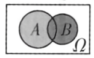
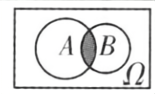

## 讲解

### 是什么

同一试验的事件A、B是同一样本空间Ω中的子集。事件关系和运算用集合表示：

| 表示 | 发生条件 | 集合含义 |
|---|---|---|
| A⊆B | A发生一定导致B发生，反向未必 | A的每个样本点都在B中 |
| A=B | A、B在每个结果下同发生或同不发生 | 样本点集合完全相同 |
| A∪B，或A+B | A、B至少一个发生，也允许同时发生 | 属于A或属于B的结果 |
| A∩B，或AB | A、B同时发生 | 同时属于两者的结果 |
| Ā=Ω\A | A不发生 | Ω内不属于A的结果 |

这里A+B、AB是并、交的事件记号，不是数字加法和乘法；P(AB)能否写成P(A)P(B)需要另外的独立性条件。日常“或”在并事件中包含两者都发生，不是“恰好一个”。

### 怎么来的

设本次结果是ω。若每个ω∈A都有ω∈B，那么A发生必导致B发生，这就是包含；若还反向包含，就得到相等。并事件收进满足至少一个条件的ω；交事件只收满足两个条件的ω。事件表达式是逐个结果检查逻辑条件得到的，不靠事件名字相似来判断。

“A发生且B不发生”是A∩B̄；“都不发生”是Ā∩B̄，也等于并事件的补集；“恰好一个发生”需要把两种方向分别列出。因此：

$$\overline{A\cup B}=\overline A\cap\overline B,\qquad
\text{恰好一个发生}=(A\cap\overline B)\cup(\overline A\cap B).$$

第一式因为“不满足至少一个”，就是两个都不满足；第二式因为仅有“A是而B否”或“A否而B是”两种互斥情形。类似地，“不是两个都发生”是至少一个不发生，即交的补等于两个补的并。

原并、交示意图分别将至少属于一圈、同时属于两圈的区域表示为事件：

### 什么时候能用

所有事件必须来自同一次试验、同一个Ω。只翻译事件关系不需要概率，更不需要假定两次试验独立。判断不包含可找一个实际允许的样本点属于A却不属于B；只有P(A)≤P(B)不足以倒推A⊆B，概率大小不决定样本点集合的包含。

“A发生导致B发生”表达A⊆B，不能颠倒箭头。“至少”“至多”“恰好”要按整数范围准确翻译，特别保留边界等号。

## 例题

### 原例（HSMA-B2-C10-Dec0474da2ef4-P0229—P0236）

**原题与原解析（保留）**

【例4】（24-25高二上·河南信阳·月考）同时掷两枚硬币，“向上的面都是正面”为事件$A$，“向上的面至少有一枚是正面”为事件$B$，则有(　　)

A．$A=B$  B．$A\supseteq B$  C．$A\subseteq B$   D．$A$与$B$之间没有关系

【答案】C

【解题思路】根据题意，结合列举法求得事件$A$和事件$B$，进而得到两事件的关系，得到答案.

【解答过程】由同时抛掷两枚硬币，基本事件的空间为$Ω=${（正，正），（正，反），（反，正），（反，反）}，

其中事件$A=${（正，正）}，事件$B=${（正，正），（正，反），（反，正）}，

所以$A\subseteq B$.

故选：C.

### 补讲

以两枚硬币身份区分结果，A只有（正，正），B有（正，正）、（正，反）、（反，正）。A中的结果全在B，所以A⊆B，选C。B另含一正一反，故A≠B且A不包含B；D说没有关系也错误。判断包含只看可能结果，无需两枚硬币各结果等概率的前提。

### 原例（HSMA-B2-C10-Dec0474da2ef4-P0274—P0282）

**原题与原解析（保留）**

【例5】（2025·湖南娄底·二模）某同学参加跳远测试，共有3次机会．用事件${J}_{i}$（$i=1,2,3$）表示随机事件“第i（$i=1,2,3$）次跳远成绩及格”，那么事件“前两次测试成绩均及格，第三次测试成绩不及格”可以表示为（    ）

A．${J}_{1}\cap {J}_{2}$  B．$\overline{{J}_{2}\cup {J}_{3}}$  C．${J}_{1}\cap {J}_{2}\cap \overline{{J}_{3}}$  D．$\overline{{J}_{1}}\cap \overline{{J}_{2}}\cap \overline{{J}_{3}}$

【答案】C

【解题思路】根据题意依次判断各项事件运算对应的含义，即可得.

【解答过程】${J}_{1}\cap {J}_{2}$表示前两次测试成绩均及格，故A错误；

$\overline{{J}_{2}\cup {J}_{3}}$表示后两次测试都没有及格，故B错误；

${J}_{1}\cap {J}_{2}\cap \overline{{J}_{3}}$表示前两次测试成绩均及格，第三次测试成绩不及格，故C正确；

$\overline{{J}_{1}}\cap \overline{{J}_{2}}\cap \overline{{J}_{3}}$表示三次测试成绩均不及格，故D错误，

故选：C.

### 补讲

“前两次均及格”同时要求J₁与J₂，“第三次不及格”要求J̄₃，三条条件都要满足，故J₁∩J₂∩J̄₃，C正确。A没有限定第三次；B要求后两次都不及格且没规定第一次；D要求三次全不及格。该题只问逻辑表达式，不能在没有独立条件时顺便将这三个事件的概率直接相乘。

## 易错

- 说法不同但满足的结果完全相同，事件仍相等；说法相近但边界不同，事件可能不相等。
- 并事件包含同时发生，恰好一个事件排除同时发生，二者只有互斥时才一致。
- 在相等判断中只证一个方向仅得到包含；要再证反向或直接逐点比对。

## 来源

原件：专题10.1 随机事件与概率（举一反三讲义）高一数学人教A版必修第二册（解析版）.docx；来源 ID：Dec0474da2ef4。

知识与分类定位：HSMA-B2-C10-Dec0474da2ef4-P0155—P0227, HSMA-B2-C10-Dec0474da2ef4-P0228—P0228, HSMA-B2-C10-Dec0474da2ef4-P0273—P0273。

选用原例：HSMA-B2-C10-Dec0474da2ef4-P0229—P0236, HSMA-B2-C10-Dec0474da2ef4-P0274—P0282。
