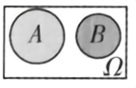
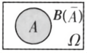

## 讲解

### 是什么

同一试验中，A、B**互斥**指不能同时发生，即A∩B=∅；A、B**互为对立事件**指每次恰好发生其中一个，既不能同时发生，也不能同时不发生。因此：

$$A\text{与}B\text{对立}\iff A\cap B=\varnothing\ \text{且}\ A\cup B=\Omega.$$

互斥只约束交集，对立还要覆盖Ω。对立事件B就是A的补集Ω\A，记Ā，是相对于既定Ω唯一确定的。对立一定互斥，互斥未必对立。

原图先表示两个不相交但可能仍有圈外结果的事件，再表示A与其补集覆盖整个Ω：

### 怎么来的

一次试验只有一个结果。若A、B有共同结果，落在该结果时两者同时发生，故不能互斥；若没有共同结果，就互斥。即便两个集合不相交，结果仍可能落在两者之外，使两者都不发生，所以还需检查并集是否等于Ω。

给A取补集时，每个Ω中的结果按“属于A/不属于A”恰分两类；不重叠且不遗漏，得到A与Ā对立。找对立事件应**否定整个条件**：“恰好k个”否定为“不是k个”，包括比k少和比k多；“至少k个”否定为“至多k−1个”；“至多k个”否定为“至少k+1个”。

### 什么时候能用

先在同一Ω中找共同结果，再找两者之外的结果。找到共同结果就不互斥；找到两者都不发生的结果就不对立。证明对立要同时完成交空、并满两项，而不是只证不能同时发生。不同试验中的两个陈述，未先构建共同试验空间时，不能直接拿来作互斥或对立判断。

空事件与任意事件互斥，空事件只与Ω对立；这也说明互斥与对立的定义不要求两个事件都非空。只有概率和为1也不能倒推对立，还要看样本点是否重叠和遗漏。

## 例题

### 原例（HSMA-B2-C10-Dec0474da2ef4-P0317—P0329）

**原题与原解析（保留）**

【例6】（24-25高一下·贵州贵阳·期末）一个盒子中装有6支圆珠笔，其中3支一等品，2支二等品和1支三等品，若从中任取2支.记事件A=“恰有1支一等品”，事件B=“2支都是二等品”，事件C=“没有三等品”，下列说法正确的是（    ）

A．事件A与事件B互斥  B．事件B与事件C互斥

C．事件A与事件C对立  D．事件B 与事件C对立

【答案】A

【解题思路】利用互斥事件与对立事件的概念逐项判断即可.

【解答过程】对于A，事件A与事件B不会同时发生，所以事件A与事件B互斥，故A正确；

对于B，若取到的两支笔都是二等品，则事件B与事件C同时发生，

所以事件B与事件C不是互斥事件，故B错误；

对于C，若取到的两支笔是一支二等品，一支三等品，则事件A与事件C都没有发生，

所以事件A与事件C不是对立事件，故C错误；

对于D，若取到的两支笔是一支一等品，一支三等品，则事件B与事件C都没有发生，

所以事件B与事件C不是对立事件，故D错误；

故选：A.

### 补讲

A要求恰有一支一等品，B要求两支都是二等品，条件不能同时满足，选项A正确。但取两支一等品时A、B都不发生，所以这对只互斥，不对立。

B的两支二等品没有三等品，所以B⊆C，两者能同时发生，选项B错误。取一等、二等各一支时A、C同时发生；取二等、三等各一支时二者都不发生，故不对立，选项C错误。B与C能同时发生，也能同时不发生，选项D错误。每个排除均以本盒子确实有的笔为依据。

### 原例（HSMA-B2-C10-Dec0474da2ef4-P0342—P0351）

**原题与原解析（保留）**

【变式6-2】（24-25高一下·安徽宿州·期中）在投掷一枚质地均匀的骰子试验中，事件A表示“向上的点数为偶数”，事件B表示“向上的点数是1或3”，事件C表示“向上的点数是4或5或6”，则下列说法正确的是（   ）

A．A与B是对立事件  B．B与C是对立事件

C．A与C是互斥事件  D．A与B是互斥事件

【答案】D

【解题思路】根据互斥事件和对立事件的概念逐项分析即可.

【解答过程】当向上的点数为5时，事件A与B同时不发生，故A错误；

当向上的点数为2时，事件B与C同时不发生，故B错误；

当向上的点数是4或6时，事件A与事件C同时发生，故C错误；

事件A与事件B不能同时发生，故D正确．

故选：D.

### 补讲

Ω={1，2，3，4，5，6}，A={2，4，6}，B={1，3}，C={4，5，6}。A∩B空，所以D正确；但A∪B缺5，所以A、B不对立，选项A错误。B∪C缺2，故选项B错误；A∩C含4、6，故选项C错误。不要把“偶数”和“1或3”看成全部奇偶两类，漏掉的5正是关键。

## 易错

- 两个事件涉及不同人，不表示互斥；两人都取得红球仍可能同时发生。
- “没有共同样本点”只完成第一项检查，必须再检查是否覆盖全体才能判对立。
- 对立是一个完整事件的补，不是把条件中的某一个词换成相反词就结束。

## 来源

原件：专题10.1 随机事件与概率（举一反三讲义）高一数学人教A版必修第二册（解析版）.docx；来源 ID：Dec0474da2ef4。

知识与分类定位：HSMA-B2-C10-Dec0474da2ef4-P0176—P0184, HSMA-B2-C10-Dec0474da2ef4-P0222—P0227, HSMA-B2-C10-Dec0474da2ef4-P0316—P0316。

选用原例：HSMA-B2-C10-Dec0474da2ef4-P0317—P0329, HSMA-B2-C10-Dec0474da2ef4-P0342—P0351。
