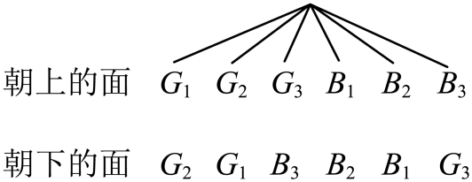

## 讲解

### 判据与流程

游戏题问获胜机会是否公平时，本条在同一局胜负规则、各人成功奖励一致的范围内比较胜率。机会公平指各人获胜概率相等；奖励、成本或其他收益不同，胜率只说明其中一项，不能单凭它判全部制度公平。

1. **补全一局规则。**何时开始、如何随机、何时结束、哪类结果谁胜、是否有平局或无人胜，都要核对。两种胜者名称不保证它们等可能；无胜者的样本点不能从分母消失。
2. **由机制确定基本结果。**均匀器具、等机会抽取和互不影响的投掷等条件决定哪些结果等可能。人主动选一个数字不是自动均匀随机；只有明确等概率随机选择并独立才可把其组合均分。
3. **按原胜负条件分类。**列出顺序与身份，再数每人获胜包含的基本结果；用等可能有限模型得“有利数/全部数”，若基本结果不同概率，须加对应概率而不是只数名称。
4. **在同一口径比较。**先比较单局胜率，包括平局保留的分母；若规则指定平局重来，还须按这条规则分析有胜者时的份额，不可自行改题。二人胜负互斥且覆盖所有结果时才可一人胜率用1减另一人。
5. **注明判断范围。**胜率相等只能说明这种规则、这些随机机制下机会相同；不保证一场胜负或有限场次各赢一半，不自动证明不同收益方案公平。

## 易错

两枚硬币“同面”包含正正、反反两个等可能结果，“恰一正”也两个；三枚“全同面”却只占八个结果中的两个。三张卡片抽到同色卡的类型有两张，并不是同色/异色两名称各一半。必要随机机制写在计算前，不从答案倒补成事实。

知识与分类依据：`HSMA-B2-C10-D299681904ac0-P0026-P0028`；`HSMA-B2-C10-D299681904ac0-P0323-P0323`，《专题10.3 频率与概率（举一反三讲义）高一数学人教A版必修第二册（解析版）.docx》。资料原文与补讲、勘误分别说明。

## 例题

### 原例：两枚与三枚硬币的不同胜负份额

来源：`HSMA-B2-C10-D299681904ac0-P0359-P0370`；原件《专题10.3 频率与概率（举一反三讲义）高一数学人教A版必修第二册（解析版）.docx》。题号、学年及地区按讲义原标注，未另作来源核验。

以下完整保留原题、原答案与原详解（仅统一等价排版、还原原表行列及配图路径）：

【变式6-2】（24-25高一下·江西吉安·期末）（1）用掷两枚质地均匀的硬币做胜负游戏，规定：两枚硬币同时出现正面或同时出现反面算甲胜，一个正面、一个反面算乙胜．这个游戏是否公平？请通过计算说明．

（2）若投掷质地均匀的三枚硬币，规定：三枚硬币同时出现正面或同时出现反面算甲胜，其他情况算乙胜．这个游戏是否公平？请通过计算说明．

【答案】（1）这个游戏公平的；答案见解析；

（2）这个游戏不公平；答案见解析．

【解题思路】（1）根据题意，利用列举法结合古典概型的概率公式得到$P(A)=P(B)$，即可得解；

（2）利用列举法结合古典概型的概率公式求解，即可得出结果.

【解答过程】（1）抛掷两枚质地均匀的硬币，所有情况有：{（正正），（正反），（反正），（反反）}．

记事件A，B分别为“甲胜”，“乙胜”，则$P(A)=P(B)=\frac{1}{2}$，

$\therefore $这个游戏公平的．

（2）拋掷三枚质地均匀的硬币，所以有情况有：{（正正正），（正正反），（正反正），（正反反），（反正正），（反正反），（反反正），（反反反）}．

记事件A，B分别为“甲胜”，“乙胜”，

则$P(A)=\frac{2}{8}=\frac{1}{4}$，$P(B)=\frac{3}{4}$．这个游戏不公平．

#### 补充讲解

先按每枚硬币均匀、不同硬币的投掷互不影响的理想机制列样本点，而不是把“两种胜者名称”当作两种等可能结果。两枚时四个有序结果正正、正反、反正、反反各1/4；甲胜有正正、反反两个，乙胜有正反、反正两个，二人单局胜率均1/2。

三枚时八个有序结果各1/8；甲只在正正正、反反反获胜，概率2/8=1/4，乙在其余六个结果获胜，6/8=3/4。因此只按同一次胜负与相同奖励比较，两枚方案机会公平，三枚方案偏向乙。两小问的胜负规则均互斥且覆盖所有结果，没有遗漏平局状态。

原解采用互不影响的投掷机制；“每枚均匀”保证各自正反均1/2，但若多枚被强制联动，组合结果未必等可能，不能只据名称使用4或8作等可能分母。若胜利收益不同，胜率是否相等仅说明机会这一项，不能独自判断整个制度是否公平。

### 原例：三张卡片的类型与面身份权重

来源：`HSMA-B2-C10-D299681904ac0-P0371-P0379`；原件《专题10.3 频率与概率（举一反三讲义）高一数学人教A版必修第二册（解析版）.docx》。题号、学年及地区按讲义原标注，未另作来源核验。

以下完整保留原题、原答案与原详解（仅统一等价排版、还原原表行列及配图路径）：

【变式6-3】（24-25高一·全国·课后作业）一天，甲拿出一个装有三张卡片的盒子（一张卡片的两面都是绿色，一张卡片的两面都是蓝色，还有一张卡片一面是绿色，另一面是蓝色），跟乙说玩一个游戏，规则是：甲将盒子里的卡片顺序打乱后，由乙随机抽出一张卡片放在桌子上，然后卡片朝下的面的颜色决定胜负，如果朝下的面的颜色与朝上的面的颜色一致，则甲赢，否则甲输.乙对游戏的公平性提出了质疑，但是甲说：“当然公平！你看，如果朝上的面的颜色为绿色，则这张卡片不可能两面都是蓝色，因此朝下的面要么是绿色，要么是蓝色，因此，你赢的概率为$\frac{1}{2}$，我赢的概率也是$\frac{1}{2}$，怎么不公平？”分析这个游戏是否公平.

【答案】见解析.

【解题思路】把卡片六个面的颜色记为${G}_{1}$，${G}_{2}$，${G}_{3}$，${B}_{1}$，${B}_{2}$，${B}_{3}$，其中，G表示绿色，B表示蓝色；${G}_{3}$和${B}_{3}$是两面颜色不一样的那张卡片的颜色，用树形图得到样本空间，计算出概率即可判断.

【解答过程】解：把卡片六个面的颜色记为${G}_{1}$，${G}_{2}$，${G}_{3}$，${B}_{1}$，${B}_{2}$，${B}_{3}$，

其中，G表示绿色，B表示蓝色；${G}_{3}$和${B}_{3}$是两面颜色不一样的那张卡片的颜色.

游戏所有的结果可以用如图表示.

不难看出，此时，样本空间中共有6个样本点，朝上的面与朝下的面颜色不一致的情况只有2种，因此乙赢的概率为$\frac{2}{6}=\frac{1}{3}$.

因此，这个游戏不公平.

#### 补充讲解

等可能随机抽三张卡片，甲在抽到绿绿或蓝蓝时必胜，乙只在抽到绿蓝时获胜。卡片身份才是本局的三种等可能结果，所以甲胜2/3、乙胜1/3；以相同奖励、一次胜负比较，游戏不公平。这个无条件比较不需要先知道朝上哪一面。

原树形图还把每张卡的两个朝向各算成一个面，共六个样本点；要使这六点等可能，除等概率抽卡外，还须每张卡随机决定朝向、两朝向同等机会。原题未明确朝向机制，故这个六面计数有额外假设；它的无条件甲乙胜率结论仍可由三张等可能卡片的类型直接验证。

在上述随机朝向假设下，若已看到朝上绿色，剩余可能朝上面是G₁、G₂、G₃，三面等可能；前两面所属卡片朝下也是绿，仅G₃的朝下为蓝，故甲机会2/3，乙1/3。甲原话把“两种可能颜色”当成两种等可能情况，漏掉绿绿卡可用两面呈现绿色。这不是说颜色名称越多概率越大，而是须还原它们包含的等可能基本结果。
