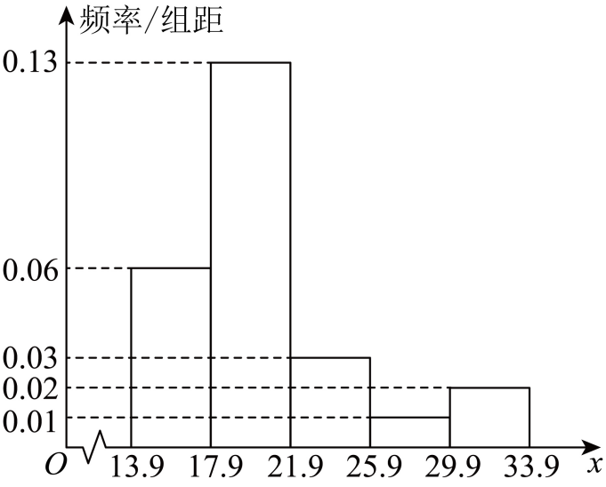

## 错法

样本算出一个比例或方差，就说总体“一定正好如此”；看到一组均值高或方差低，就说群体身份导致差异，甚至替每个人下结论。它把“这次数据的算术事实”“总体的条件性估计”“因果解释”三层证据合成了一个确定断言。

分层调查又容易把整体样本比例直接冠为总体比例；若各层抽样比例不等，样本层人数权重就不能替代总体层权重。把一个分位点所属分类当成整组分类、把同类人来源份额当成组内比例，同样扩大了原计算回答的问题。

## 正解

先说统计量的对象：这一样本、这次评分或这次竞赛。原始数据齐全时可以精确复算描述量，但样本取得是否合理、是否覆盖总体、各层是否按比例、记录是否可比，决定能否用它作总体估计。随机抽样也会产生随机误差，不能保证每次样本都给出总体真值。

分层总体比例的估计应是∑Wⱼpⱼ，其中Wⱼ为总体第j层人数/总体人数，pⱼ为该层样本满足判据的比例。Wⱼ非负且和为1；按比例分配时Wⱼ可由样本层占比给出，未知时应说明缺失而非默认。比较组内比例须用各组自己的人数为分母；比较该类人员的来源组成才用所有组该类总人数。

仅一次观察到的群体差异，没有因果设计，至多提供某解释的线索。其他因素或选择过程也可能同时影响结果。应写“按讲义假设，更像……”“在这次样本中……”“在这些抽样条件下估计……”，并明确尚不能证明身份、原因或干预效果。语言限定是证据对应，不是算完后例行加一句模糊免责声明。

知识与分类依据：`HSMA-B2-C9-D94817a3cf89b-P0010-P0036`，《专题9.3 统计案例 公司员工的肥胖情况调查分析（举一反三讲义）高一数学人教A版必修第二册（解析版）.docx》；`HSMA-B2-C9-D0316d94cc45c-P0890-P0890`，《专题9.2 用样本估计总体（举一反三讲义）高一数学人教A版必修第二册（解析版）.docx》。原例题号及资料疑点与补讲分别列明。

## 例题

### 原例：评分集中只支持更像而不证明身份或原因

来源：`HSMA-B2-C9-D94817a3cf89b-P0038-P0053`；原件《专题9.3 统计案例 公司员工的肥胖情况调查分析（举一反三讲义）高一数学人教A版必修第二册（解析版）.docx》。题号、学年及地区按讲义原标注，未另作来源核验。

以下完整保留原题、原答案与原详解（仅统一等价排版、还原原表行列及配图路径）：

【例1】（24-25高一下·重庆·期中）在重庆复旦中学“复旦好声音”校园歌手决赛中，由9名专业人士和9名观众代表各组成一个评委小组，给参赛选手打分，下面是两组评委对同一名选手的打分：

小组A：85  86   92  87  89  95  82  91  85

小组B：95  93  51  88  90  89  91  92  94

(1)分别求两组评委打分的平均分．

(2)判断小组A和小组B中哪一个更像是由专业人士组成，根据所学的统计知识，说明理由.

【答案】(1)88，87

(2)A组更像，理由见解析

【解题思路】（1）根据平均数的定义计算即可求解；

（2）分别求出两组的方差，比较大小，结合方差的表示意义即可下结论.

【解答过程】（1）记小组A的数据依次为${x}_{i}$，小组B的数据依次为${y}_{i}$，$i=1,2,\cdot \cdot \cdot ,9$，

由题意可得：每组的平均数分别为：$\overline{{x}_{A}}=\frac{1}{9}\sum _{i=1}^{9} {x}_{i}=88$，$\overline{{x}_{B}}=\frac{1}{9}\sum _{i=1}^{9} {y}_{i}=87$.

（2）A组更像是由专业人士组成，

两组的方差分别为：${S}_{A}^{2}=\frac{1}{9}\sum _{i=1}^{9} {\left( {x}_{i}-88\right)}^{2}=14.9$，${S}_{B}^{2}=\frac{1}{9}\sum _{i=1}^{9} {\left( {y}_{i}-87\right)}^{2}=166.7$.

由于专业人士给分更符合专业规则，相似程度更高，${S}_{A}^{2}=14.9$，${S}_{B}^{2}=166.7$，

因而$14.9<166.7$，

根据方差越大数据波动越大，因此A组更像是由专业人士组成的．

#### 补充讲解

A的分数和为792，B为783，各除9得到88与87。相对各自均值的偏差，A为−3、−2、4、−1、1、7、−6、3、−3，平方和9+4+16+1+1+49+36+9+9=134；B为8、6、−36、1、3、2、4、5、7，平方和64+36+1296+1+9+4+16+25+49=1500。

因此精确的描述性方差为134/9和1500/9；原解14.9与166.7是保留一位小数的近似数，严格应使用≈。比较方差可判断A组这一次评分更集中、B组波动更大；B的51对平方偏差和贡献1296，解释了为何只看两个相近均值会遗漏差异。

第二问措辞是“更像”。在讲义假设“专业组给分较一致”的条件下，这些数据提供A更像的依据，却不能证明职业身份，更不能证明专业身份导致低方差。题目只给同一位选手一次评分，没有身份机制、更多评分资料或因果对照；也不宜不查原因便删除51。

### 原例：分层样本总体估计与组内比例的范围

来源：`HSMA-B2-C9-D94817a3cf89b-P0376-P0487`；原件《专题9.3 统计案例 公司员工的肥胖情况调查分析（举一反三讲义）高一数学人教A版必修第二册（解析版）.docx》。题号、学年及地区按讲义原标注，未另作来源核验。

本题的背景数字、BMI分类名称、健康判断及末尾建议均为**讲义原载**。这里仅按题目给定的数值与分类做数学分析，不把原载文字作为已核验的健康标准、个人诊断或行动建议；数学疑点见后面的补充讲解。

以下完整保留原题、原答案与原详解（仅统一等价排版、还原原表行列及配图路径）：

【变式3-3】（24-25高二下·上海·期中）25年3月9日，在十四届全国人大三次会议民生主题记者会上，国家卫健委主任雷海潮表示，将持续推进“体重管理年”行动.国家卫健委发布的《成人肥胖食养指南（2024版）》显示，我国18岁及以上居民超重率、肥胖率分别达到$34.3\%$和$16.4\%$，居民肥胖率呈上升趋势.目前，国际上常用身体质量指数（BMI）来衡量人体肥胖程度以及是否健康，其计算公式是

$BMI=\frac{\text{体重}(\text{单位}: kg )}{\text{身}{\text{高}}^{2}(\text{单位}{: m}^{2})}$.

中国成人的BMI数值标准为：$BMI<18.5$为偏瘦；$18.5\le BMI\le 23.9$为正常；$24\le BMI$ $\le 27.9$为偏胖；$BMI\ge 28$为肥胖.

为了解某公司员工的身体肥胖情况，研究人员从公司员工体检数据中，根据年龄采用分层随机抽样方法抽取了50名员工的身高和体重数据，计算得到他们的BMI值如下：

老年组：21.8  18.2  25.2  28.1  21.5  19.1  25.7  24.4  17.6  20.8

中年组：20.5  20.2  17.4  21.6  18.4  20.3  30.8  23.6  23.3  22.8

20.8  16.8  19.0  16.4  18.7  26.1  20.2  17.6  15.4  21.5

19.5  31.6  19.1  20.4  13.9

青年组：18.6  16.6  15.9  18.3  18.1

29.7  18.9  16.9  25.8  19.8  18.5  16.0  17.6  19.1  26.5

根据上面的数据，请回答以下问题：

(1)请完成下表，并绘制25名中年组员工的体重指数（BMI）的频率分布直方图；

(2)分别求出以上老年组和青年组员工体重指数（BMI）的第30百分位数（精确到小数点后一位数字），并比较老年组和青年组员工在肥胖状况上的差异；

(3)分析公司员工胖瘦程度的整体情况，并提出控制体重的至少两条建议.

25名员工的BMI值的频率分布表如下：

| 分组 | 频数 | 频率 | 频率／组距 |
| --- | --- | --- | --- |
| $[13.9,17.9)$ |  |  |  |
| $[17.9,21.9)$ |  |  |  |
| $[21.9,25.9)$ |  |  |  |
| $[25.9,29.9)$ |  |  |  |
| $[29.9,33.9)$ |  |  |  |

【答案】(1)答案见解析

(2)答案见解析

(3)答案见解析

【解题思路】（1）先统计数据，再计算频率，最后画频率分布直方图即可；

（2）按照百分位数概念来求解即可；

（3）通过偏胖率和偏瘦率来分析各层次员工，然后给出健身锻炼和健康饮食的建议

【解答过程】（1）

| 分组 | 频数 | 频率 | 频率／组距 |
| --- | --- | --- | --- |
| $[13.9,17.9)$ | 6 | 0.24 | 0.06 |
| $[17.9,21.9)$ | 13 | 0.52 | 0.13 |
| $[21.9,25.9)$ | 3 | 0.12 | 0.03 |
| $[25.9,29.9)$ | 1 | 0.04 | 0.01 |
| $[29.9,33.9)$ | 2 | 0.08 | 0.02 |

频率直方图如下：

（2）老年组工体重指数（BMI）21.8  18.2  25.2  28.1  21.5  19.1  25.7  24.4  17.6  20.8,

从小到大排序为：17.8  18.2  19.1  20.8  21.5  21.8  24.4  25.2  25.7  28.1，

根据$10\times 30\%=3$，所以老年组员工体重指数（BMI）的第30百分位数是$\frac{19.1+20.8}{2}=19.95$，

青年组员工体重指数（BMI）18.6  16.6  15.9  18.3  18.1  29.7  18.9  16.9  25.8  19.8  18.5  16.0  17.6  19.1  26.5，

从小到大排序为：15.9  16  16.6  16.9  17.6  18.1  18.3  18.5  18.6  18.9  19.1  19.8  25.8  26.5  29.7，

根据$15\times 30\%=4.5$，所以青年组员工体重指数（BMI）的第30百分位数是$17.6$，

根据第30百分位数比较可知：老年组员工属于正常，青年组员工偏瘦.

（3）统计汇总表如下：

| 组别 | 偏瘦 | 正常 | 偏胖 | 肥胖 |
| --- | --- | --- | --- | --- |
| 老年组 | 2 | 4 | 3 | 1 |
| 中年组 | 7 | 15 | 1 | 2 |
| 青年组 | 7 | 5 | 2 | 1 |
| 合计 | 16 | 24 | 6 | 4 |

由上表格可知公司总体偏胖（包含肥胖）率为$\frac{10}{50}=20\%$，

其中老年组占了$\frac{4}{10}=40\%$，说明老年组偏胖率最高，中年组和青年组偏胖率相当，

由上表格可知公司总体偏瘦率为$\frac{16}{50}=32\%$，

其中青年组和中年组偏瘦率相当，各占了$\frac{7}{16}=43.75\%$，老年组偏瘦率很低，

由上分析：老年组要注意超重和肥胖问题，要加强体育锻炼，每天至少60分钟中等强度有氧运动（如快走、游泳、跑步、打球等）.

青年和中年组要注意营养健康问题，公司可开展健康饮食讲座，提升员工健康意识，同时提倡结合力量训练（如举重）增肌，避免单纯增脂.

#### 补充讲解

**先锁定数学口径。**这里沿用原题给出的四类名称，不据此诊断任何人的健康。公式分子体重用kg，分母身高用m后平方；若记录用cm，须先把身高除100，再平方。本题已经列出BMI数据，只按列出的数值计算，不重新猜身高、体重或隐藏精度。

第一问，中年组25个数按[13.9,17.9)、[17.9,21.9)、[21.9,25.9)、[25.9,29.9)、[29.9,33.9)各只归入一组，频数6、13、3、1、2，总和25。各除25得0.24、0.52、0.12、0.04、0.08，再除组距4得0.06、0.13、0.03、0.01、0.02。直方图每根柱的面积“高度×4”才是频率；五柱面积之和1，与原图一致。此处完整保留了原题待填表与原解填写表。

第二问按讲义百分位数约定，先升序。老年组原始最小值为17.6，原解排序行误写17.8；正确有序数据是17.6、18.2、19.1、20.8、21.5、21.8、24.4、25.2、25.7、28.1。10×30%=3为整数，取第3、4个数平均，即(19.1+20.8)/2=19.95；按通常四舍五入保留一位小数应为20.0，原解19.95未完成题意精度要求。青年15×30%=4.5非整数，取第5个数17.6，符合一位小数。

两个第30百分位点20.0与17.6说明样本各组较低一段的分布位置不同，不能把一个分位点所属区间概括成整组“正常”或整组“偏瘦”。第三问原分类计数核对无误；按样本内各组人数作分母，含原题“偏胖、肥胖”的合计比例为老年4/10=40%、中年3/25=12%、青年3/15=20%，偏瘦比例为2/10=20%、7/25=28%、7/15≈46.7%。原解称中年、青年“相当”缺乏这些组内比例的支持；7/16=43.75%说的是这两个组各占样本全部16名“偏瘦”者的份额，不能替代7/25和7/15。

样本合计50人中上述合计比例10/50=20%，偏瘦16/50=32%。原题只说按年龄分层随机抽样，未说明比例分配，也未给公司各年龄层人数。因此20%、32%首先是**本样本**的描述；若各层样本比例与总体比例一致，可作为公司相应比例的估计。若不一致，须用公司的年龄层总体权重加权各层样本比例，目前信息不足，不能无条件称公司总体真值。

**分类区间的资料疑点独立保留：**原题本例写18.5≤BMI≤23.9、24≤BMI≤27.9；作为连续实数规则会遗漏(23.9,24)与(27.9,28)。已展示数据都为一位小数，且没有落入这些空档，故本题计数可以完成；若今后使用未取整的BMI，须先明确完整边界和取整规则，不能自行把本例≤23.9静默改成<24。

讲义知识原文另列（`HSMA-B2-C9-D94817a3cf89b-P0022`，仅引用讲义措辞）：

> 中国成人的BMI数值标准为：BMI<18.5为偏瘦；18.5≤BMI<23.9为正常；24≤BMI<27.9为偏胖；BMI≥28为肥胖.

这句知识原文的数学勘误：它使用严格小于23.9、27.9，故空档为[23.9,24)、[27.9,28)，连23.9与27.9本身也未覆盖；与本原例闭右边界口径不同。它不能作为无条件完整分类，也不能靠默认“一位小数”补上被遗漏的23.9与27.9。

原解给出的“每天至少60分钟……”和“力量训练……”等两条建议属于讲义原载，已在上文保全；这些调查数据本身不能检验具体干预措施、强度或效果。报告在数学部分应交代数据口径、抽样权重、组内分母及误差，不能把讲义建议写成由统计计算证明的行动结论。
