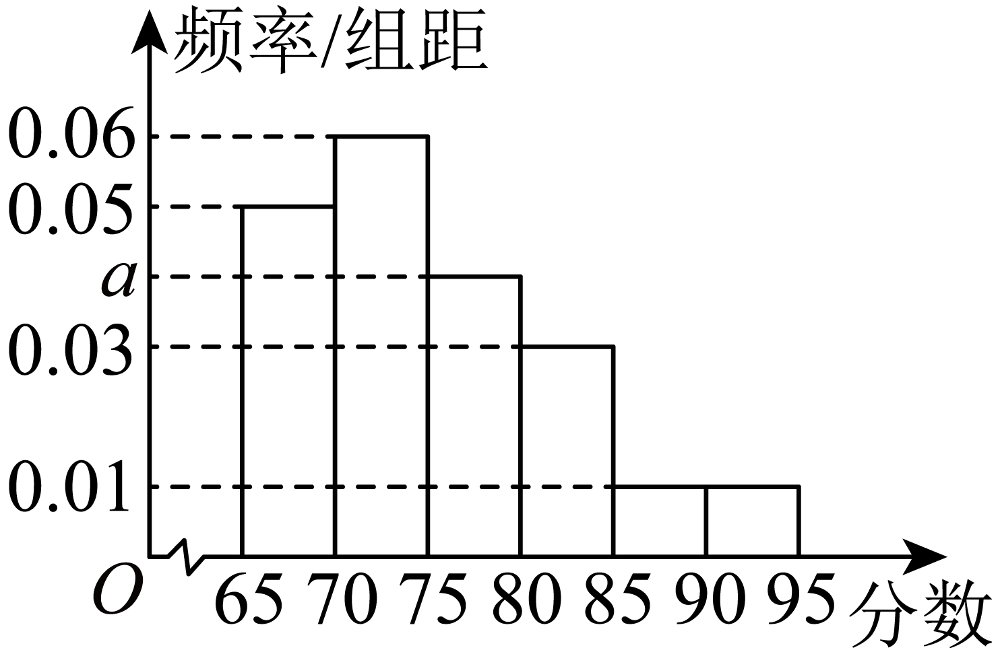

## 错法

看到纵轴数字a=0.04，就把它看作“该组占4%”，直接用500×0.04求人数。错因是条形图常用柱高表达数量，读图时把这种习惯移到频率分布直方图，却没有读“频率/组距”的轴名。

若组距为5，0.04表示每单位长度的频率密度，整组覆盖5个单位，频率是0.20；直接乘高度只得到20人，漏掉整组宽度。

## 正解

先读纵轴，再按本组的宽度计算面积：$f=d\times h$。频率没有单位，密度含“每单位长度”；面积把该长度约去，才得到比例。所有完整分组面积应相加为1，这也是识别错读纵轴的检查。

求样本频数用 $n f=n d h$，估计总体人数用 $N f=N d h$，n和N分别是样本、总体容量。组距不同时逐组乘各自宽度；不能将一个共同宽度提出。若纵轴本来就标频率，才直接读高度，不额外乘组距。

对只占一组内部部分的区间，图没有给具体数据分布，不能擅自按宽度比例计算精确频率；若题目允许均匀假设，要明确是估计。

## 例题

### 原例：HSMA-B2-C9-D0316d94cc45c-P0490–P0497

**原题、原答案、原思路与原详解**（原有次序保留；角度符号等价转写为 LaTeX）：

【变式5-1】（2025高二下·湖南·学业考试）某中学举行了一次“网络信息安全”知识竞赛，将参赛的500名学生成绩分为6组，绘制了如图所示的频率分布直方图，则成绩在区间$\left[ 75,80\right)$内的学生有（  ）

    

A．80名  B．100名  C．120名  D．140名

【答案】B

【解题思路】先根据频率分布直方图的性质，求得$a$的值，再根据样本中成绩在区间$\left[ 75,80\right)$内的频率$\times $参赛的人数即可.

【解答过程】由频率分布直方图可知$\left( 0.05+0.06+0.03+a+0.01+0.01\right)\times 5=1$，解得$a=0.04$，

所以成绩在区间$\left[ 75,80\right)$内的学生有$500\times 0.04\times 5=100$名.

故选：B.

**补讲与核验**

图中每组宽度都是5，故纵轴不是频率，而是频率密度。把各柱面积相加：
$$5(0.05+0.06+0.03+a+0.01+0.01)=1.$$
已知高度之和为0.16，故先除以5得 $0.16+a=0.2$，再减0.16得 $a=0.04$。区间 $[75,80)$ 的频率是 $5\times0.04=0.20$，频数为 $500\times0.20=100$，选B。A、C、D分别要求该组频率为0.16、0.24、0.28，与图中面积0.20不符。
根据这个原题还能把图还原为频率表；下表频率、频数均来自原图，其余区间按左闭右开、末组右闭的常用记法列出，不据此推断原图未交代的具体端点人数。

| 成绩区间 | 频率密度 | 频率（面积） | 频数 |
|---|---:|---:|---:|
| $[65,70)$ | 0.05 | 0.25 | 125 |
| $[70,75)$ | 0.06 | 0.30 | 150 |
| $[75,80)$ | 0.04 | 0.20 | 100 |
| $[80,85)$ | 0.03 | 0.15 | 75 |
| $[85,90)$ | 0.01 | 0.05 | 25 |
| $[90,95]$ | 0.01 | 0.05 | 25 |

频率之和为1，频数之和为500；这两次核对检验了“高度→面积→人数”的每一步。这里只求参赛500人的分组人数，不涉及把样本推广到其他人。

## 来源

原件：专题9.2 用样本估计总体（举一反三讲义）高一数学人教A版必修第二册（解析版）.docx。

知识与题型口径：HSMA-B2-C9-D0316d94cc45c-P0019–P0024；所选原例见各例标题段落号。
