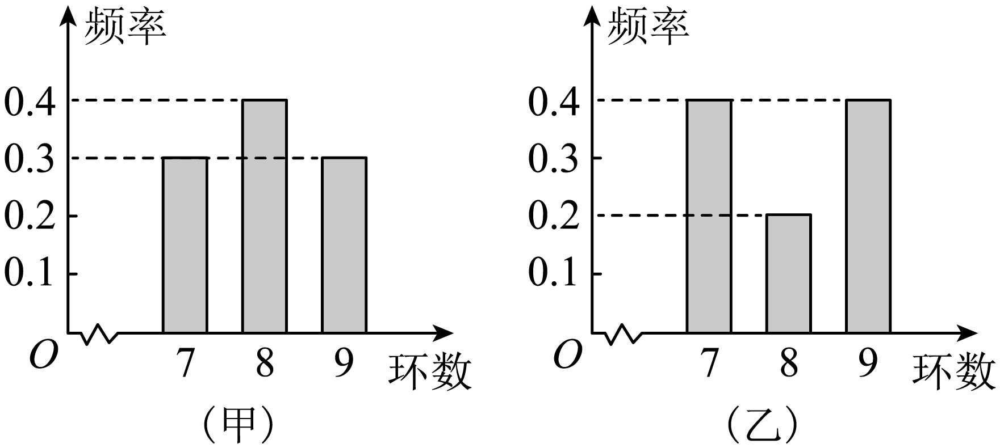

## 讲解

### 是什么

对同一变量的n个实际数据x₁、…、xₙ，n为正整数，均值为x̄=(x₁+…+xₙ)/n。偏差xᵢ−x̄表示第i个数离中心的有向距离。描述这组数据的方差s²是平方偏差的平均，标准差s是它的非负平方根：

$$s^2=\frac1n\sum_{i=1}^{n}(x_i-\bar x)^2,\qquad s=\sqrt{s^2}.$$

方差和标准差越小，数据围绕自己的均值越集中；这是离散程度，不直接等同于成绩越高或产品越好。若原数据单位为小时，方差单位为小时²，标准差单位为小时；无单位分数也仍有“平方”与“原变量尺度”之别。

### 怎么来的

偏差和∑(xᵢ−x̄)=∑xᵢ−nx̄=0，因为均值定义给∑xᵢ=nx̄。直接平均偏差，正负抵消，不能辨别散布；改用平方使每项非负、较大偏差受到较大权重，再除数据个数，是平方距离的平均。开非负平方根将量纲还原到原变量尺度。

计算式可以从定义逐步展开。第一步用(a−b)²=a²−2ab+b²，第二步把不随i变化的x̄提出求和，第三步代入∑xᵢ=nx̄：

$$\begin{aligned}
s^2&=\frac1n\sum_{i=1}^{n}(x_i^2-2x_i\bar x+\bar x^2)\\
&=\frac1n\sum_{i=1}^{n}x_i^2-\frac{2\bar x}{n}\sum_{i=1}^{n}x_i+\frac{n\bar x^2}{n}\\
&=\frac1n\sum_{i=1}^{n}x_i^2-2\bar x^2+\bar x^2\\
&=\frac1n\sum_{i=1}^{n}x_i^2-\bar x^2.
\end{aligned}$$

结果是“平方的平均−平均的平方”，不是“均值−平方的平均”。数值接近时直接算偏差可少做大数相减。

若不同取值c₁、…、cₖ的频数分别f₁、…、fₖ，∑fⱼ=n，同一平方偏差重复fⱼ次，合并重复项得到s²=∑fⱼ(cⱼ−x̄)²/n。令频率pⱼ=fⱼ/n，就得到s²=∑pⱼ(cⱼ−x̄)²，不需再除n。只有实际取值已知时这是精确式；连续分组用中点只能作估计。

### 什么时候能用

数据必须是同一个对象集合、同一变量和单位；描述某个子样本时n就是这个子样本的个数。s²≥0、s≥0；所有数据相等时二者为0，反过来平方和为0要求每个偏差均0。n=1也可描述，方差0；n=0无均值，公式失效。

本章描述已给数据并据此估计总体，分母用n。别的统计推断中可能采用分母n−1的校正样本方差，那是另一明确约定，须n>1；不能因为看到“样本”二字便改本题分母。若给总体全部N个数据，相同定义改用N，得到该有限总体方差；抽样算出的s²仅作总体离散程度估计，非必然等于总体真值。

## 易错

漏平方会得到偏差和0；只取绝对值平均是另一个指标，不能冒充方差。漏除n得到平方偏差和，漏开方得到方差而非标准差。比较方差要核对变量尺度与对象，同一单位下平方根递增，可直接比较方差而无需近似开根。

原知识P0760–0762的公式求和下限写成n=1而项含xᵢ，不能当作规范求和符号；本条采用i=1并从定义展开，原载体疑点单列保留。

知识与分类依据：`HSMA-B2-C9-D0316d94cc45c-P0759-P0771`，《专题9.2 用样本估计总体（举一反三讲义）高一数学人教A版必修第二册（解析版）.docx》。原例题号及资料疑点与补讲分别列明。

## 例题

### 原例：先用均值补全数据再算方差

来源：`HSMA-B2-C9-D0316d94cc45c-P0776-P0782`；原件《专题9.2 用样本估计总体（举一反三讲义）高一数学人教A版必修第二册（解析版）.docx》。题号、学年及地区按讲义原标注，未另作来源核验。

以下完整保留原题、原答案与原详解（仅统一等价排版、还原原表行列及配图路径）：

【例10】（24-25高一下·北京通州·期末）已知一组样本数据16，$x$，14，15，13的平均数为15，则该组样本数据的方差为（    ）

A．2.0  B．2.1  C．2.2  D．2.4

【答案】A

【解题思路】根据样本数据的平均数和方差公式计算即可.

【解答过程】因为该组样本数据的平均数为15，所以$\frac{16+x+14+15+13}{5}=15$，解得$x=17$，

则该组样本数据的方差为${s}^{2}=\frac{1}{5}\left[ {\left( 16-15\right)}^{2}+{\left( 17-15\right)}^{2}+{\left( 14-15\right)}^{2}+{\left( 15-15\right)}^{2}+{\left( 13-15\right)}^{2}\right]=\frac{10}{5}=2.0$，

故选：A.

#### 补充讲解

平均数15意味着五个数的和为5×15=75。已知四个数的和为16+14+15+13=58，所以未知数x=75−58=17。五个数相对15的偏差依次为1、2、−1、0、−2，偏差和0；直接平均偏差会得到0，不能测量散布。

先平方消去正负抵消：1²+2²+(−1)²+0²+(−2)²=1+4+1+0+4=10。再除以实际数据个数5，得到方差2，故A正确，B、C、D均不等于这组数据的平方偏差平均数。标准差是√2；把方差2直接写成标准差会漏开方。

展开式也可核对：平方和16²+17²+14²+15²+13²=256+289+196+225+169=1135；1135/5−15²=227−225=2。这里的分母5用于描述这五个数据，不能临时改成4。

### 原例：离散频率保留了完整取值计数

来源：`HSMA-B2-C9-D0316d94cc45c-P0834-P0845`；原件《专题9.2 用样本估计总体（举一反三讲义）高一数学人教A版必修第二册（解析版）.docx》。题号、学年及地区按讲义原标注，未另作来源核验。

以下完整保留原题、原答案与原详解（仅统一等价排版、还原原表行列及配图路径）：

【变式11-1】（22-23高二上·四川资阳·期末）已知甲、乙两位同学在一次射击练习中各射靶10次，射中环数频率分布如图所示：

令${\overline{x}}_{\text{甲}}$，${\overline{x}}_{\text{乙}}$分别表示甲、乙射中环数的均值；${s}_{\text{甲}}^{2}$，${s}_{\text{乙}}^{2}$分别表示甲、乙射中环数的方差，则（    ）

A．${\overline{x}}_{\text{甲}}<{\overline{x}}_{\text{乙}}$，${s}_{\text{甲}}^{2}>{s}_{\text{乙}}^{2}$  B．${\overline{x}}_{\text{甲}}>{\overline{x}}_{\text{乙}}$，${s}_{\text{甲}}^{2}<{s}_{\text{乙}}^{2}$

C．${\overline{x}}_{\text{甲}}={\overline{x}}_{\text{乙}}$，${s}_{\text{甲}}^{2}>{s}_{\text{乙}}^{2}$  D．${\overline{x}}_{\text{甲}}={\overline{x}}_{\text{乙}}$，${s}_{\text{甲}}^{2}<{s}_{\text{乙}}^{2}$

【答案】D

【解题思路】根据频率分布图分别计算${\overline{x}}_{\text{甲}},{\overline{x}}_{\text{乙}}$，${s}_{\text{甲}}^{2},{s}_{\text{乙}}^{2}$，比较大小可得.

【解答过程】由图可知，${\overline{x}}_{\text{甲}}=7\times 0.3+8\times 0.4+9\times 0.3=8,$ ${\overline{x}}_{\text{乙}}=7\times 0.4+8\times 0.2+9\times 0.4=8,$

${s}_{\text{甲}}^{2}=\left[ {\left( 7-8\right)}^{2}\times 0.3+{\left( 8-8\right)}^{2}\times 0.4+{\left( 9-8\right)}^{2}\times 0.3\right]=0.6$，

${s}_{\text{乙}}^{2}=\left[ {\left( 7-8\right)}^{2}\times 0.4+{\left( 8-8\right)}^{2}\times 0.2+{\left( 9-8\right)}^{2}\times 0.4\right]=0.8$，

所以${\overline{x}}_{\text{甲}}={\overline{x}}_{\text{乙}}$，${s}_{\text{甲}}^{2}<{s}_{\text{乙}}^{2}$.

故选：D.

#### 补充讲解

图中7、8、9是实际离散环数，不是三个连续区间的中点。各射10次，甲的频率0.3、0.4、0.3对应次数3、4、3，乙0.4、0.2、0.4对应4、2、4；因此所有原始取值的计数已经给全，可以精确计算这次练习的统计量。

甲均值(7×3+8×4+9×3)/10=8，乙同理为8。两端7、9到8的平方距离都为1，中间8的平方距离0；甲方差(3+0+3)/10=0.6，乙(4+0+4)/10=0.8，D正确。A、B把相同均值误判大小，C把0.6与0.8的顺序颠倒。

写成频率式，0.3×1+0.4×0+0.3×1已经把“除10”包含在0.3、0.4中，不能再除10。可比较这一次十次射击的波动，不能断言乙以后每次成绩都更差；两人的这次均值相同。
