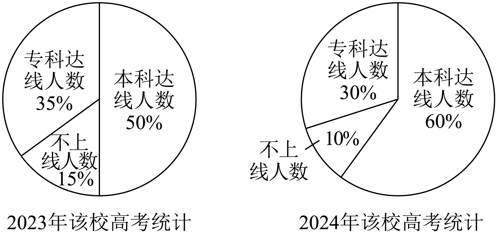

## 讲解

### 是什么

统计图把数据关系画出来，选择图形取决于想看哪一种关系。

| 图形 | 主要表达 | 读图关键 |
|---|---|---|
| 条形图 | 类别之间的数量或比例比较 | 横轴类别，纵轴量及单位，每条柱高对应一项 |
| 折线图 | 按时间或其他有序变量排列的数值变化 | 读点的坐标，再看相邻点的增减与变化方向 |
| 扇形图 | 同一个整体中各部分所占比例 | 整圆为100%，比例=圆心角/360度 |
| 频率分布直方图 | 数值区间内的数据分布 | 横轴是连续数值分组，柱面积对应频率 |

条形图可画人数也可画百分比，名称本身不能决定纵轴单位。直方图与条形图外观相近，却以面积而非单纯柱高表达频率。

### 怎么来的

条形图给同类数量使用同一比例尺；纵轴从0起时，柱高之比等于数量之比。纵轴截断时要读取标注数值，不能直接比较可见柱段的长度比。折线图把顺序相邻的观测值连接，便于看到变化趋势；连接线表达观测间的变化，不自动提供所有中间时刻的真实值。

扇形图把同一整体划分为不重叠的部分，部分份额f对应圆心角 $360^\circ f$。于是读到比例后，只有知道这个整圆所代表的总数N，才能用 $Nf$ 得到人数；只有知道人数m和对应比例f>0，才能反求 $N=m/f$。

比较两图前要把“谁占谁的比例”写清。若第二图描述第一图中某一部分的内部结构，要连乘比例；若两图分别描述不同年份，要先核各年总数。份额变化与人数变化的结论不相同。

### 什么时候能用

分类数量比较适合条形图；时间趋势适合折线图；部分与整体关系适合扇形图。扇形图的各部分应覆盖同一个整体，互不重叠；允许多选而产生交叉类别的数据，通常不能直接塞进一个总和100%的饼图。

跨图比较必须核对调查对象、时期、单位、类别划分与分母。纵轴截断会放大视觉差异，要读标注数值；评价方向也要读指标定义，指标上升未必表示状况改善。

## 易错

- 占比下降不一定人数下降；总人数改变时先乘回各自总数。
- “增加了百分之几”以原来的量作分母；占比的差则以百分点表示。
- 子群体内部39.6%不能直接当作全体39.6%，要再乘子群体占全体的比例。

## 例题

### 原例：HSMA-B2-C9-D0316d94cc45c-P0343–P0355

**原题、原答案、原思路与原详解**（原有次序保留；角度符号等价转写为 LaTeX）：

【例3】（24-25高三上·广东梅州·月考）$AQI$ 表示空气质量指数，$AQI$ 的数值越小，表明空气质量越好，当 $AQI$ 的数值不大于 $100$ 时称空气质量为“优良”．如图是某地 $3$ 月 $1$ 日到 $12$ 日 $AQI$ 的数值的统计数据，图中点 $A$ 表示 $3$ 月 $1$ 日的 $AQI$ 的数值为 $201$．则下列叙述不正确的是 （    ）

  

A．这 $12$ 天中有 $6$ 天空气质量为“优良”

B．这 $12$ 天中空气质量最好的是 $3$ 月 $9$ 日

C．从 $3$ 月 $9$ 日到 $12$ 日，空气质量越来越好

D．从 $3$ 月 $4$ 日到 $9$ 日，空气质量越来越好

【答案】C

【解题思路】结合已知条件和图像，逐项求解即可.

【解答过程】对A：由$3$月$1$日到$12$日$AQI$指数值的统计数据，$AQI$指数值不大于$100$的有$95,85,77,67,72,92$共$6$天，故A正确；

对B：$3$月$9$日的$AQI$指数值为$67$，为$12$天来的最小值，故B正确；

对C：从$3$月$9$日到$12$日，$AQI$指数值逐渐变大，说明空气质量越来越差，故C错误；

对D：从$3$月$4$日到$9$日，$AQI$指数值逐渐变小，说明空气质量越来越好，故D正确.

故选：C.

**补讲与核验**

先看指标含义：数值小表示空气好，折线上升表示指标增加，因而空气变差。把12个数据和日期对应起来，图中为 $201,111,138,144,104,95,85,77,67,72,92,135$。

A中应检查“不大于100”，即允许等于100；第6至11天共6天满足，A正确。B中67是12个数据的最小值，对应9日，B正确。C中9至12日的数值依次67、72、92、135，持续增加，空气越来越差，C错误。D中4至9日的数值依次144、104、95、85、77、67，持续减小，空气越来越好，D正确。题目要选“不正确”，故选C。

折线表达时间先后与数值变化，不保证数值越大对应的实际状况越好；必须先读指标的评价方向。

### 原例：HSMA-B2-C9-D0316d94cc45c-P0403–P0419

**原题、原答案、原思路与原详解**（原有次序保留；角度符号等价转写为 LaTeX）：

【例4】（2026高三·全国·专题练习）某高中2024年的高考考生人数是2023年高考考生人数的1.5倍.为了更好地对比该校考生的升学情况，统计了该校2023年和2024年高考分数达线情况，得到如图所示扇形统计图：

下列结论正确的是（   ）

A．该校2024年与2023年的本科达线人数比为6:5

B．该校2024年与2023年的专科达线人数比为6:7

C．2024年该校本科达线人数增加了80%

D．2024年该校不上线的人数有所减少

【答案】C

【解题思路】根据扇形统计图及各人数的百分比进行计算即可.

【解答过程】不妨设2023年的高考人数为a，则2024年的高考人数为$1.5a$.

由图可知2023年本科达线人数为$0.5a$，2024年本科达线人数为$0.9a$，

故2024年与2023年的本科达线人数比为9：5，故A不正确；

本科达线人数增加了$\frac{0.9a-0.5a}{0.5a}\times 100\%=80\%$，故C正确；

2023年专科达线人数为$0.35a$，2024年专科达线人数为$0.45a$，

所以2024年与2023年的专科达线人数比为9：7，故B错误；

2023年不上线人数为$0.15a$，2024年不上线人数也是$0.15a$，不上线的人数无变化，故D错误.

故选：C.

**补讲与核验**

两年的整圆各表示各年考生总人数，两个“100%”的基数不同。设2023年有 $a>0$ 人，2024年有1.5a人。先把比例变成人数：本科分别 $0.50a$ 和 $0.60\times1.5a=0.90a$；专科分别 $0.35a$ 和 $0.30\times1.5a=0.45a$；不上线分别 $0.15a$ 和 $0.10\times1.5a=0.15a$。

A把比例60:50当人数比；真实人数比是0.90:0.50=9:5，A错。B真实人数比0.45:0.35=9:7，B错。C以2023年本科人数为增长率分母，$(0.90a-0.50a)/(0.50a)=0.8$，增长80%，C对。D虽然占比从15%降至10%，但人数相等，D错。选C。

60%减50%是增加10个百分点；人数增加80%是另一个量。只有总人数相同才能直接通过占比大小比较两组人数。

## 来源

原件：专题9.2 用样本估计总体（举一反三讲义）高一数学人教A版必修第二册（解析版）.docx。

知识与题型口径：HSMA-B2-C9-D0316d94cc45c-P0025–P0042；所选原例见各例标题段落号。
