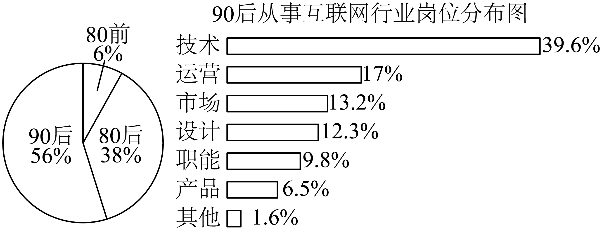
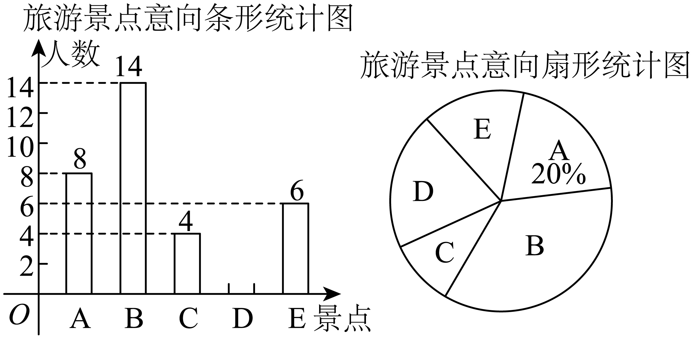
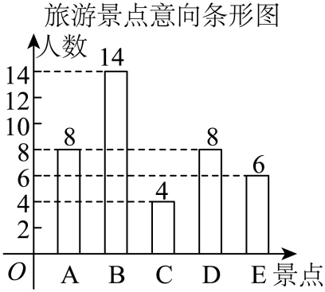

## 讲解

### 判据

题目同时给条形图、扇形图、折线图等，或者需要比较不同时期或不同群体的数据，先为每张图确定对象与分母。相同类别的信息可相互配对；对象不同或分母未知时不能直接比较百分比后的绝对人数。

### 流程

1. 给每张图写“调查谁、什么时候、纵轴单位、100%是谁”。如果一图描述全体、另一图描述子群体内部，两图的分母不同。
2. 匹配同一类别：人数m、比例f已知且f>0时，整体人数N=m/f；已知N与f时，部分人数m=Nf。这来自 $f=m/N$，不是凭图的大小估测。
3. 对嵌套类别，先求子群体人数Na，再乘内部比例b，子类别人数为Nab。若比较两群体子类别，须分别求人数或给出可靠上下界；比例缺失且上下界不能决定大小，就写“不能确定”。
4. 补残图时利用互不重叠、覆盖整体的各部分和等于整体；若调查允许多选，这个加总关系未必成立。扇形圆心角是比例乘360度。
5. 跨年份的人数增长率用“新人数−旧人数”除以旧人数（旧人数应非零）；两个占比相减表示百分点变化。用样本比例推广到总体时明确是估计，不能省略两个容量的区别。

## 易错

- 以全体人数上界比较子类别有时足够，有时不足；不能一概因内部比例未知就认定无法判断，也不能一概直接比较整组人数。
- 选项“不一定正确”要求找不能由资料保证的结论，与“必定为假”不同。
- 统计图比例相乘之前先确认包含关系，不能把两张无关图的百分比随意相乘。

## 例题

### 原例：HSMA-B2-C9-D0316d94cc45c-P0530–P0547

**原题、原答案、原思路与原详解**（原有次序保留；角度符号等价转写为 LaTeX）：

【例6】（24-25高一下·四川内江·期末）某调查机构对全国互联网行业进行调查统计，得到整个互联网行业从业者年龄的分布饼状图､90后从事互联网行业者的岗位分布条形图，则下列结论中不一定正确的是（    ）

A．互联网行业从事技术岗位的人数中，90后比80后多

B．90后互联网行业者中从事技术岗位的人数超过整个从事互联网行业者总人数的$20\%$

C．互联网行业中从事运营岗位的人数90后比80前多

D．互联网行业从业人员中90后占一半以上

【答案】A

【解题思路】利用整个互联网行业从业者年龄分布饼状图、90后从事互联网行业岗位分布条形图即可判断各选项的真假．

【解答过程】选项A；设整个互联网行业总人数为a，

互联网行业中从事技术岗位的90后人数为$56\%a\times 39.6\%=22.176\%a$，小于80后的人数$38\%a$，

但80后中从事技术岗位的人数比例未知，故A错误． 

选项B：设整个互联网行业总人数为a，90后从事技术岗位人数为56％×39.6％a，

而90后总人数的20％为$56\%\times 39.6\%a$，故B正确；

选项C：设整个互联网行业总人数为a，

互联网行业中从事运营岗位的90后人数为$56\%a\times 17\%=9.52\%a$，

超过80前的人数6％a，且80前中从事运营岗位的人数比例未知，故C正确；

选项D： 由整个互联网行业从业者年龄分布饼状图得到互联网行业从业人员中90后占$56\%$，故D正确.

故选：A．

**补讲与核验**

先给每张图确定分母：饼图的100%是全行业人数N，条形图的100%是其中90后人数0.56N。嵌套类别的比例需要相乘，90后技术岗位人数为 $0.56N\times0.396=0.22176N$。

A不能确定。80后总人数0.38N是所有岗位合计，其技术人数未给，可以小于、等于或大于0.22176N；因此本选项“不一定正确”，不是已证明90后技术人数较少。

B比较的是全行业总人数的20%，即0.20N；0.22176N>0.20N，所以B一定正确。原解P0542的文字和等式有误，见下方勘误。

C中90后运营人数为 $0.56N\times0.17=0.0952N$。80前运营人数最多也只有全部80前人数0.06N，因而 $0.0952N>0.06N$ 足以确定90后运营人数较多，不需知道80前内部运营比例。D直接读出90后占全行业56%>50%。所以选A。

此题同时示范两个判断：总数上界足够时可以比较；上界0.38N较大而内部比例未知时，不能凭整组总数推断技术子组人数。

### 原例：HSMA-B2-C9-D0316d94cc45c-P0579–P0596

**原题、原答案、原思路与原详解**（原有次序保留；角度符号等价转写为 LaTeX）：

【变式6-3】（24-25高一上·陕西西安·开学考试）“千年古都，大美西安”.某校数学兴趣小组就最想去的西安旅游景点随机调查了本校部分学生，要求每位学生选择且只能选择一个最想去的景点（景点对应的名称分别是A：大雁塔；B：兵马俑；C：陕西历史博物馆；D：秦岭野生动物园；E：曲江海洋馆）.下面是根据调查结果进行数据整理后绘制出的不完整的统计图：

请你根据图中提供的信息，解答下列问题：

(1)求被调查的学生总人数；

(2)补全条形统计图，并求扇形统计图中表示最想去景点“D”的扇形圆心角的度数；

(3)若该校共有800名学生，请估计该校学生中最想去兵马俑的人数.

【答案】(1)$40$人

(2)作图见解析，${72}^{\circ}$

(3)$280$人

【解题思路】（1）对于求被调查学生总人数，我们可以根据已知部分人数及其所占比例来计算总人数，这里用到比例关系的概念；

（2）补全条形统计图需要先求出各部分的人数，再根据人数画出图形。求扇形圆心角的度数，根据圆心角的度数等于该部分占总体的比例乘以${360}^{\circ}$； 

（3）估计全校想去兵马俑旅游的人数，是利用样本中想去兵马俑的比例来估计总体的情况.

【解答过程】（1）被调查的学生总人数为$8\div 20\%=40$（人）；

（2）最想去D景点的人数为：$40-8-14-4-6=8$(人)，

补全条形统计图为：

扇形统计图中表示“最想去景点“D”的扇形圆心角的度数为$\frac{8}{40}\times {360}^{\circ}={72}^{\circ}$.

（3）$800\times \frac{14}{40}=280$，所以估计“最想去景点兵马俑”的学生人数为280人.

**补讲与核验**

第一问把相同类别A的两图信息配对：A有8人，占被调查者20%，故样本总人数 $n=8/0.20=40$。不能拿B的14人去除A的20%。

第二问每人只能选一个，五类互不重叠且覆盖样本，因此D人数是总数减去其余四类：$40-(8+14+4+6)=8$。D的份额为8/40=0.20，整圆360度乘以该份额得72度；原解补全条形图保留在上文。

第三问先用样本中B的频率14/40=0.35，再乘全校总人数800得估计280人。随机调查提高样本代表性的依据，但280仍是估计；不能把“样本中14人想去”直接当全校人数。

## 资料疑点与勘误

原件P0542保留原文：“而90后总人数的20％为 $56\%\times39.6\%a$，故B正确”。这里文字及等式均有误；选项B比较的是整个行业总人数的20%，应比较 $0.56\times0.396a=0.22176a$ 与 $0.20a$。前者较大，B正确，最终答案A不变。P0540“故A错误”应按“不一定正确”理解：资料不足以确定A，不能断言A在任何实际情形下都为假。

## 来源

原件：专题9.2 用样本估计总体（举一反三讲义）高一数学人教A版必修第二册（解析版）.docx。

知识与题型口径：HSMA-B2-C9-D0316d94cc45c-P0529–P0596；所选原例见各例标题段落号。
