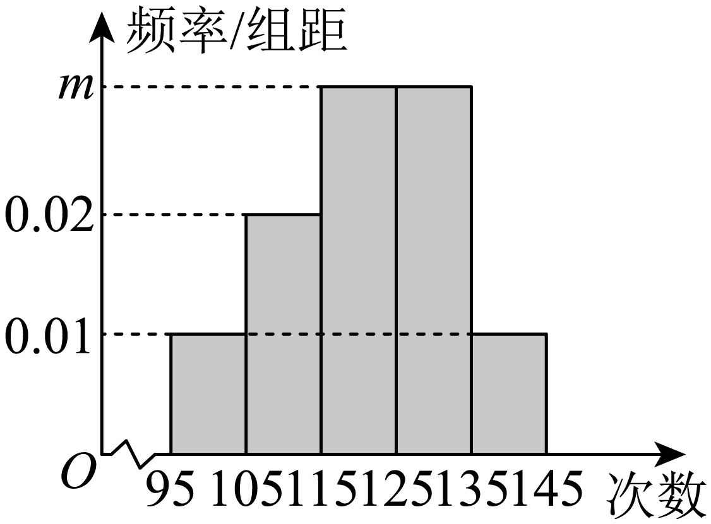

## 讲解

### 判据

看到纵轴标“频率/组距”，题目求未知柱高、某些区间人数或用样本估计总体人数，就先用矩形面积。设第j组宽 $d_j>0$、高度h_j，则该组频率 $f_j=d_jh_j$，所有组覆盖全部数据时 $\sum_jd_jh_j=1$。

### 流程

1. 读每组左右端点相减，得到各组宽度；先读纵轴再运算。如果纵轴已经是频率，不再乘组距。所有组宽相同时才可提出共同组距d，写 $d\sum h_j=1$。
2. 由面积总和1列方程求未知高度。代回后查各组非负、面积和为1；这检验图与方程是否相容。
3. 把所问条件译成区间，确认端点是否包含，选择对应完整分组，面积相加得频率f。若所问区间切在组内，原图不足以确定精确f，应注明需要额外假设。
4. 求样本频数时计算nf，n是样本容量；用样本比例估计总体人数时计算Nf，N是总体容量，并写“约”或“估计”。不要用总体容量代替样本容量。
5. 确切样本人数必须为整数；图中数值经过四舍五入时结果可能只是近似，应按题目精度处理。总体估计出现非整数则在保留计算依据后按题意取适当整数。

## 易错

- 漏乘组距会把密度当比例，人数常缩小到真实计算结果的1/d。
- “至少125”包含125，要按端点规则选后一组。
- 未知样本容量时，频率只能给比例，不能倒推出抽样人数。

## 例题

### 原例：HSMA-B2-C9-D0316d94cc45c-P0490–P0497

**原题、原答案、原思路与原详解**（原有次序保留；角度符号等价转写为 LaTeX）：

【变式5-1】（2025高二下·湖南·学业考试）某中学举行了一次“网络信息安全”知识竞赛，将参赛的500名学生成绩分为6组，绘制了如图所示的频率分布直方图，则成绩在区间$\left[ 75,80\right)$内的学生有（  ）

    

A．80名  B．100名  C．120名  D．140名

【答案】B

【解题思路】先根据频率分布直方图的性质，求得$a$的值，再根据样本中成绩在区间$\left[ 75,80\right)$内的频率$\times $参赛的人数即可.

【解答过程】由频率分布直方图可知$\left( 0.05+0.06+0.03+a+0.01+0.01\right)\times 5=1$，解得$a=0.04$，

所以成绩在区间$\left[ 75,80\right)$内的学生有$500\times 0.04\times 5=100$名.

故选：B.

**补讲与核验**

图中每组宽度都是5，故纵轴不是频率，而是频率密度。把各柱面积相加：
$$5(0.05+0.06+0.03+a+0.01+0.01)=1.$$
已知高度之和为0.16，故先除以5得 $0.16+a=0.2$，再减0.16得 $a=0.04$。区间 $[75,80)$ 的频率是 $5\times0.04=0.20$，频数为 $500\times0.20=100$，选B。A、C、D分别要求该组频率为0.16、0.24、0.28，与图中面积0.20不符。
根据这个原题还能把图还原为频率表；下表频率、频数均来自原图，其余区间按左闭右开、末组右闭的常用记法列出，不据此推断原图未交代的具体端点人数。

| 成绩区间 | 频率密度 | 频率（面积） | 频数 |
|---|---:|---:|---:|
| $[65,70)$ | 0.05 | 0.25 | 125 |
| $[70,75)$ | 0.06 | 0.30 | 150 |
| $[75,80)$ | 0.04 | 0.20 | 100 |
| $[80,85)$ | 0.03 | 0.15 | 75 |
| $[85,90)$ | 0.01 | 0.05 | 25 |
| $[90,95]$ | 0.01 | 0.05 | 25 |

频率之和为1，频数之和为500；这两次核对检验了“高度→面积→人数”的每一步。这里只求参赛500人的分组人数，不涉及把样本推广到其他人。

### 原例：HSMA-B2-C9-D0316d94cc45c-P0498–P0510

**原题、原答案、原思路与原详解**（原有次序保留；角度符号等价转写为 LaTeX）：

【变式5-2】（24-25高一下·贵州铜仁·期末）某校高一年级有学生2000名，为了了解高一学生的体能情况，随机抽取部分学生进行1分钟跳绳测试，将所得数据整理后，按$\left[ 95,105\right),\left[ 105,115\right),\left[ 115,125\right)$，$\left[ 125,135\right),\left[ 135,145\right]$分为5组，画出频率分布直方图，如图所示．

(1)求$m$的值；

(2)若规定：高一学生1分钟跳绳125次以上（含125次）成绩为良好．试估计该校高一学生1分钟跳绳成绩良好的人数．

【答案】(1)$0.03$

(2)$800$

【解题思路】（1）在频率分布直方图中，所有条形图的面积之和为$1$，列式可求得实数$m$的值；

（2）根据频率分布直方图求出跳绳良好的频率，即可得解.

【解答过程】（1）在频率分布直方图中，所有条形图的面积之和为$1$，

可得$\left( 0.01+0.02+m+m+0.01\right)\times 10=1$，解得$m=0.03$.

（2）可知高一学生1分钟跳绳成绩良好包括$\left[ 125,135\right),\left[ 135,145\right]$两组，

故高一学生1分钟跳绳成绩良好的频率为$\left( 0.03+0.01\right)\times 10=0.4$，

因此该校高一学生1分钟跳绳成绩良好的人数约为$2000\times 0.4=800$（人）.

**补讲与核验**

两道小问共用同一张图。先把5个柱的面积相加为1，组距为10，所以 $0.01+0.02+2m+0.01=0.1$。已知高度之和0.04，故 $2m=0.06$，$m=0.03$。

“125次以上（含125次）”包含 $[125,135)$ 和 $[135,145]$，不包含 $[115,125)$；125落入左端闭合的后一组。两组面积是 $10\times0.03+10\times0.01=0.40$。用样本比例估计全校2000人的比例，才得到 $2000\times0.40=800$ 人。

800是总体人数的估计，不能说全校恰好有800名良好学生；样本容量没有给出，也不能从图中频率反推本次抽了多少人。

## 来源

原件：专题9.2 用样本估计总体（举一反三讲义）高一数学人教A版必修第二册（解析版）.docx。

知识与题型口径：HSMA-B2-C9-D0316d94cc45c-P0481–P0529；所选原例见各例标题段落号。
