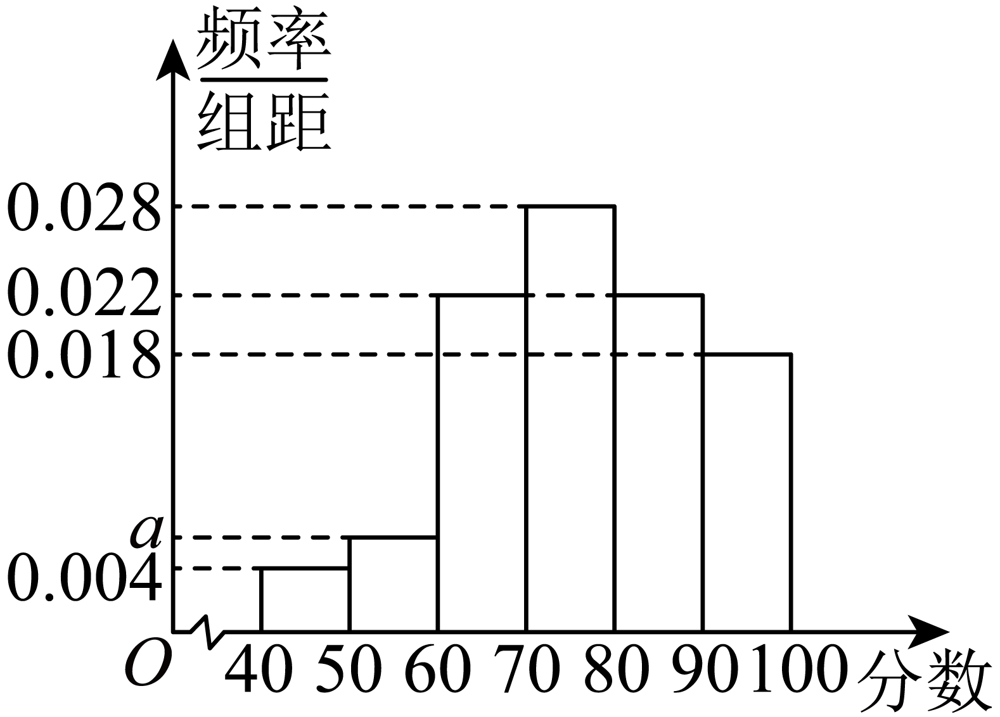
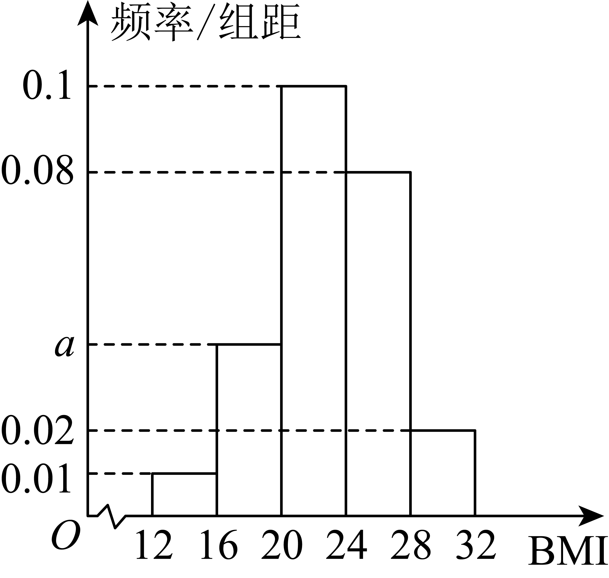

## 讲解

### 判据

只有分组频数表或频率分布直方图，而非每个原始值，题目要求估计平均数、中位数、众数。分组保留每组人数，丢失组内具体值；先说明以下算法是带假设的估计，不能当作原数据精确统计量。

### 流程

1. 由组距 $d_j$ 乘柱高 $h_j$ 得频率 $f_j$，先查各频率非负、和为1。有未知柱高时先用总面积解参数。这一步只是在还原各组占比。
2. **均值估计**：取每组中点 $c_j=(L_j+U_j)/2$，计算 $\widehat{\mu}=\sum_jc_jf_j$。理由是把该组每个真实数值都暂用c_j替代，替代后的总和除以n等于c_j乘该组频率后加总；各非空组真实均值都恰为组中点时，可以保证它等于原始平均数，一般没有这一信息。
3. **中位数估计**：累计各组频率，找0.50面积位置所在的组。设该组左端为L、宽d、频率f>0，之前累计频率为F，且 $F\le0.50\le F+f$。还需面积0.50−F，假定该组内均匀分布，其密度h=f/d不变，则所需宽度 $t=(0.50-F)/h=d(0.50-F)/f$，估计 $\widehat{m}=L+t$。这是直方图面积模型的分位位置，不是恢复原样本的中间项。
4. **众数估计**：等宽分组时最高柱就是频率最大组，讲义常用该组中点估计最常见取值。这里实际确定的是众数组/高密度区间，不能保证该组中点实际出现，也不能保证原数据众数位于该组。不等宽时最高柱是密度最大组，不一定是人数最多组，应说明采用哪一种组内模型，不能把最高柱机械说成原始众数。
5. 若0.50刚在组边界，按面积模型可取该边界；若中间出现零密度空档而累计面积恰0.50，平分面积的位置可能是一段区间，需要另定代表值。不能在零频率组上除以f。并列最高柱可能给出多个候选估计，题目信息不足时写明非唯一。
6. 保留必要中间精度，最后按题意四舍五入；报告同时写“估计”、单位与所用假设，避免将近似值写成原数据精确等式。

## 易错

- 平均组中点是错误的，除非各组频率相等；应以频率为权重。
- 中位数不是必定取所在组中点，0.50在该柱中的位置由累计面积决定。
- 用最高柱中点估计众数，只是约定的描述方法；分组后不能核原始最高频数。

## 例题

### 原例：HSMA-B2-C9-D0316d94cc45c-P0723–P0736

**原题、原答案、原思路与原详解**（原有次序保留；角度符号等价转写为 LaTeX）：

【变式9-2】（24-25高一下·甘肃嘉峪关·期中）某校抽取100名高二学生期中考试的语文成绩，绘制频率分布直方图（如图所示），其中样本数据分组区间为：$\left[ 40,50\right)$，$\left[ 50,60\right)$，…，$\left[ 80,90\right)$，$\left[ 90,100\right]$．

(1)求频率分布直方图中a的值；

(2)根据频率分布直方图，估计这100名学生语文成绩的中位数和平均数．（保留小数点后1位）

【答案】(1)$a=0.006$

(2)中位数为：$76.4$；平均数为：$76.2$

【解题思路】（1）根据给定的频率分布直方图，利用各小矩形面积和为1求出$a$值.

（2）利用频率分布直方图估计中位数和平均数.

【解答过程】（1）由频率分布直方图，得$0.004\times 10+a\times 10+0.022\times 10+0.028\times 10+0.022\times 10+0.018\times 10=1$，

所以$a=0.006$．

（2）由频率分布直方图，样本数据在$[40,70)$的频率为$0.32$，在$[40,80)$的频率为$0.6$，

因此语文成绩的中位数$m\in (70,80)$，则$(m-70)\times 0.028=0.5-0.32$，则$m\approx 76.4$，

这100名学生语文成绩的平均数为：

$45\times 0.04+55\times 0.06+65\times 0.22+75\times 0.28+85\times 0.22+95\times 0.18=76.2$.

**补讲与核验**

第一问先乘组距10把高度换成面积。已知高度之和 $0.004+0.022+0.028+0.022+0.018=0.094$，总高度应为 $1/10=0.1$，故 $a=0.006$。六组频率依次为 $0.04,0.06,0.22,0.28,0.22,0.18$，和为1。

第二问的累计频率在70处为 $0.04+0.06+0.22=0.32$，在80处为 $0.32+0.28=0.60$，故直方图的0.50面积位置在 $[70,80)$。还缺 $0.50-0.32=0.18$ 的面积，该柱高度0.028，所需宽度为 $0.18/0.028=45/7$，所以中位数估计为 $70+45/7=76.428\ldots$，保留一位小数是76.4。

均值估计用各组中点 $45,55,65,75,85,95$ 代表该组数据，再乘各组频率加总，得到76.2。这是按中点替代后的加权平均；原题没有提供每组的实际成绩，所以不能称为100个原始成绩的精确平均数。

中位数插值也隐含组内均匀分布：宽度比例等于组内频率比例。只能由图读到原数据中间项所属的组，不能由图保证原始数据的中位数正好等于76.4。题干写“估计”正是这两种假设的使用边界。

### 原例：HSMA-B2-C9-D0316d94cc45c-P0694–P0709

**原题、原答案、原思路与原详解**（原有次序保留；角度符号等价转写为 LaTeX）：

【例9】（24-25高一下·浙江宁波·期末）学校为了解全校1800名学生的身体肥胖情况，随机抽取了100名学生的体检数据，将其BMI值分成以下五组：$\left[ 12,16\right)$，$\left[ 16,20\right)$，$\left[ 20,24\right)$，$\left[ 24,28\right)$，$\left[ 28,32\right]$，得到相应的频率分布直方图，如图所示.则下列说法错误的是（   ）

  

A．$a=0.04$

B．估计样本的中位数为23

C．估计样本的众数为22

D．估计全校学生BMI值落在区间$\left[ 28,32\right]$的人数为36人

【答案】D

【解题思路】对A，根据频率和为1求解即可；对B，根据成绩低于中位数的频率为0.5计算即可；对C，根据频率分布直方图的众数判断即可；对D，计算区间$\left[ 28,32\right]$的频率，进而可得人数.

【解答过程】对A，由题意，$4\times \left( 0.01+a+0.1+0.08+0.02\right)=1$，解得$a=0.04$，故A正确；

对B，区间$\left[ 12,16\right),\left[ 16,20\right),\left[ 20,24\right)$的频率分别为$0.04,0.16,0.4$，

因为$0.04+0.16+0.4>0.5$，$0.04+0.16<0.5$，故中位数位于$\left[ 20,24\right)$内.

设中位数为$x$，则$0.04+0.16+0.1\times \left( x-20\right)=0.5$，解得$x=23$，故B正确；

对C，由直方图可得估计这组数据的众数为$\frac{20+24}{2}=22$，故C正确；

对D，由直方图可得$\left[ 28,32\right]$的频率为$4\times 0.02=0.08$，

故估计全校学生BMI值落在区间$\left[ 28,32\right]$的人数为$1800\times 0.08=144$，故D错误.

故选：D.

**补讲与核验**

A中每组组距4，故总高度为1/4=0.25；除去0.01、0.10、0.08、0.02的和0.21，得a=0.04，A对。五组频率依次为 $0.04,0.16,0.40,0.32,0.08$。

B中前两组累计0.20，前三组累计0.60；0.50的面积位置在 $[20,24)$。按该组密度0.10均匀插值，还差面积0.30，需要宽度 $0.30/0.10=3$，所以从左端20前进3得23，B的估计值成立。

C中各组宽度相同，最高柱也就是频率最大的组 $[20,24)$；按讲义的估计规则取组中点 $(20+24)/2=22$，C作为估计成立。原数据的众数未必是22，甚至未必在这个组；频率最大组只说明这一整组的人数最多。

D中 $[28,32]$ 的样本频率是 $4\times0.02=0.08$，用它估计总体1800人的比例，人数约144，D的36漏乘组距4，故选D。由于全校并未全查，144也是估计人数。

## 资料疑点与勘误

原件P0656将最高矩形中的横坐标直接说成原数据众数，并把中位数两侧写成各有50%个体，措辞不严。分组已经丢失组内具体值；最高密度组中点是常用估计，不能保证是原数据众数。原始中位数只要求两侧各至少一半（相等值可同时计入），直方图面积平分是连续组内模型的估计。P0735“平均数为”须结合原题P0726“估计”理解，本条明确标为中点加权估计。原题与原解保留在例题中。

## 来源

原件：专题9.2 用样本估计总体（举一反三讲义）高一数学人教A版必修第二册（解析版）.docx。

知识与题型口径：HSMA-B2-C9-D0316d94cc45c-P0655–P0758；所选原例见各例标题段落号。
