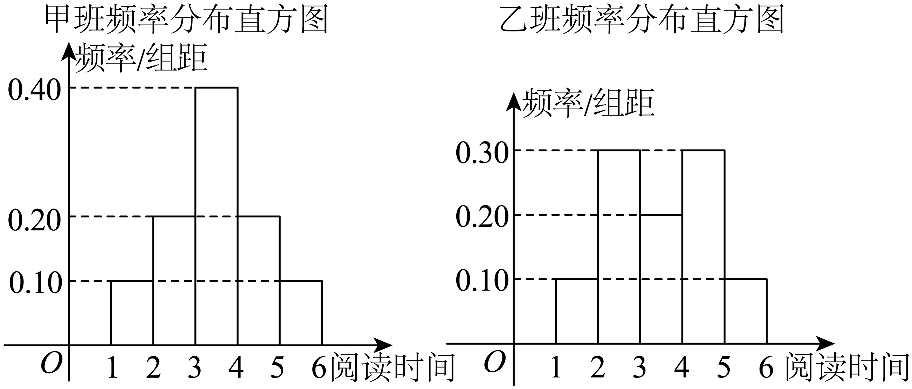

## 讲解

### 判据与流程

给频数、频率图表或连续分组直方图，问方差、标准差或比较散布时，先区分**实际不同取值的计数**与**区间分组**。前者可精确描述该样本，后者缺少组内每个原值，通常作中点估计。

1. **读每个取值与权重。**离散表取实际值cⱼ；连续分组取中点cⱼ=(下界+上界)/2，并标记估计模型。频数fⱼ先除总个数n变频率pⱼ；直方图纵轴若为频率/组距，则pⱼ=柱高×该组组距，不能直接用高度。
2. **检查权重。**所有pⱼ≥0且∑pⱼ=1，这是加权平均有效的条件。不同组距分别乘各自宽度；端点约定应保证每个观测只落一组。
3. **先算加权均值。**μ=∑pⱼcⱼ，因为该值重复的比例为pⱼ；不等频率时不能把组中点简单平均。
4. **围绕同一个μ算平方距离。**定义给v=∑pⱼ(cⱼ−μ)²；也可用v=∑pⱼcⱼ²−μ²。展开依据是∑pⱼ=1和∑pⱼcⱼ=μ，交叉项为−2μ²，常数项μ²。连续组时v是中点模型的方差估计，离散实际值表时是精确描述性方差。
5. **需要时取非负平方根。**标准差为√v，比较两组可以先比较v。说明用了哪些假设、误差和原单位，不把估计精度冒充原始数据精度。

$$v=\sum_{j=1}^{k}p_j(c_j-\mu)^2,\qquad \mu=\sum_{j=1}^{k}p_jc_j.$$

为什么中点估计不精确：一个区间内的数可能靠左、靠右或散在各处，同样的组频率并不确定它们的实际平方偏差。用中点把组内散布压成一个值，也可能改变真实均值；没有额外信息，不能宣称这种估计与真实方差相等，也不能仅凭中点估计断言原始两组方差的大小顺序。

## 易错

频率已经含除n，不再除一次。连续直方图柱高不等于频率；本题即使组距恰好1而数值相同，也不是通用规则。实际整数7、8、9的频率与连续区间的中点代表是两种信息，不能一概写“都是估计”。

知识与分类依据：`HSMA-B2-C9-D0316d94cc45c-P0759-P0774`，《专题9.2 用样本估计总体（举一反三讲义）高一数学人教A版必修第二册（解析版）.docx》；`HSMA-B2-C9-D0316d94cc45c-P0821-P0821`，《专题9.2 用样本估计总体（举一反三讲义）高一数学人教A版必修第二册（解析版）.docx》。原例题号及资料疑点与补讲分别列明。

## 例题

### 原例：阅读时长直方图的中点估计

来源：`HSMA-B2-C9-D0316d94cc45c-P0822-P0833`；原件《专题9.2 用样本估计总体（举一反三讲义）高一数学人教A版必修第二册（解析版）.docx》。题号、学年及地区按讲义原标注，未另作来源核验。

以下完整保留原题、原答案与原详解（仅统一等价排版、还原原表行列及配图路径）：

【例11】（2025高一下·全国·专题练习）某校为了解高一学生一周课外阅读情况，随机抽取甲，乙两个班的学生，收集并整理他们一周阅读时间（单位：h），绘制了下面频率分布直方图．根据直方图，得到甲，乙两校学生一周阅读时间的平均数分别为$\overline{{x}_{1}}$，$\overline{{x}_{2}}$，标准差分别为${s}_{1}$，${s}_{2}$，则（   ）

    甲班频率分布直方图            乙班频率分布直方图

A．$\overline{{x}_{1}}>\overline{{x}_{2}}$，${s}_{1}>{s}_{2}$  B．$\overline{{x}_{1}}<\overline{{x}_{2}}$，${s}_{1}<{s}_{2}$

C．$\overline{{x}_{1}}=\overline{{x}_{2}}$，${s}_{1}>{s}_{2}$  D．$\overline{{x}_{1}}=\overline{{x}_{2}}$，${s}_{1}<{s}_{2}$

【答案】D

【解题思路】根据平均数和方差的计算公式求解后比较大小即可.

【解答过程】根据频率分布直方图可知$\overline{{x}_{1}}=1.5\times 0.1+2.5\times 0.2+3.5\times 0.4+4.5\times 0.2+5.5\times 0.1=3.5$，

$\overline{{x}_{2}}=1.5\times 0.1+2.5\times 0.3+3.5\times 0.2+4.5\times 0.3+5.5\times 0.1=3.5$，

${s}_{1}^{2}={(1.5-3.5)}^{2}\times 0.1+{(2.5-3.5)}^{2}\times 0.2+{(3.5-3.5)}^{2}\times 0.4+{(4.5-3.5)}^{2}\times 0.2+{(5.5-3.5)}^{2}\times 0.1=1.2$，

${s}_{2}^{2}={(1.5-3.5)}^{2}\times 0.1+{(2.5-3.5)}^{2}\times 0.3+{(3.5-3.5)}^{2}\times 0.2+{(4.5-3.5)}^{2}\times 0.3+{(5.5-3.5)}^{2}\times 0.1=1.4$．

所以$\overline{{x}_{1}}=\overline{{x}_{2}}$，${s}_{1}<{s}_{2}$．

故选：D.

#### 补充讲解

纵轴为频率/组距，组距均为1，所以本题柱高恰好数值等于各组频率。五组中点1.5、2.5、3.5、4.5、5.5和频率是：甲0.1、0.2、0.4、0.2、0.1；乙0.1、0.3、0.2、0.3、0.1。各列频率之和为1。

按中点模型，两组关于3.5对称，左右配对的偏差加权和抵消，故估计均值都为3.5。相对这个中心的平方偏差依次为4、1、0、1、4。甲的估计方差为4×0.1+1×0.2+0×0.4+1×0.2+4×0.1=1.2；乙为4×0.1+1×0.3+0×0.2+1×0.3+4×0.1=1.4。非负平方根保持大小，故估计标准差√1.2<√1.4，D符合这一模型。A、B错在估计均值的比较，C错在离散程度的方向。

**口径补充：**直方图没有提供每个学生在组内的实际阅读时间；以上是各组用中点代替的估计值，原解的等号不能保证原始样本真实均值恰好相等或真实方差必有此顺序。题干前称“两个班”，后称“两校”，补讲按前文两个班理解，不据此扩大调查对象。

### 原例：实际整数环数的频率精确计算

来源：`HSMA-B2-C9-D0316d94cc45c-P0834-P0845`；原件《专题9.2 用样本估计总体（举一反三讲义）高一数学人教A版必修第二册（解析版）.docx》。题号、学年及地区按讲义原标注，未另作来源核验。

以下完整保留原题、原答案与原详解（仅统一等价排版、还原原表行列及配图路径）：

【变式11-1】（22-23高二上·四川资阳·期末）已知甲、乙两位同学在一次射击练习中各射靶10次，射中环数频率分布如图所示：

令${\overline{x}}_{\text{甲}}$，${\overline{x}}_{\text{乙}}$分别表示甲、乙射中环数的均值；${s}_{\text{甲}}^{2}$，${s}_{\text{乙}}^{2}$分别表示甲、乙射中环数的方差，则（    ）

A．${\overline{x}}_{\text{甲}}<{\overline{x}}_{\text{乙}}$，${s}_{\text{甲}}^{2}>{s}_{\text{乙}}^{2}$  B．${\overline{x}}_{\text{甲}}>{\overline{x}}_{\text{乙}}$，${s}_{\text{甲}}^{2}<{s}_{\text{乙}}^{2}$

C．${\overline{x}}_{\text{甲}}={\overline{x}}_{\text{乙}}$，${s}_{\text{甲}}^{2}>{s}_{\text{乙}}^{2}$  D．${\overline{x}}_{\text{甲}}={\overline{x}}_{\text{乙}}$，${s}_{\text{甲}}^{2}<{s}_{\text{乙}}^{2}$

【答案】D

【解题思路】根据频率分布图分别计算${\overline{x}}_{\text{甲}},{\overline{x}}_{\text{乙}}$，${s}_{\text{甲}}^{2},{s}_{\text{乙}}^{2}$，比较大小可得.

【解答过程】由图可知，${\overline{x}}_{\text{甲}}=7\times 0.3+8\times 0.4+9\times 0.3=8,$ ${\overline{x}}_{\text{乙}}=7\times 0.4+8\times 0.2+9\times 0.4=8,$

${s}_{\text{甲}}^{2}=\left[ {\left( 7-8\right)}^{2}\times 0.3+{\left( 8-8\right)}^{2}\times 0.4+{\left( 9-8\right)}^{2}\times 0.3\right]=0.6$，

${s}_{\text{乙}}^{2}=\left[ {\left( 7-8\right)}^{2}\times 0.4+{\left( 8-8\right)}^{2}\times 0.2+{\left( 9-8\right)}^{2}\times 0.4\right]=0.8$，

所以${\overline{x}}_{\text{甲}}={\overline{x}}_{\text{乙}}$，${s}_{\text{甲}}^{2}<{s}_{\text{乙}}^{2}$.

故选：D.

#### 补充讲解

图中7、8、9是实际离散环数，不是三个连续区间的中点。各射10次，甲的频率0.3、0.4、0.3对应次数3、4、3，乙0.4、0.2、0.4对应4、2、4；因此所有原始取值的计数已经给全，可以精确计算这次练习的统计量。

甲均值(7×3+8×4+9×3)/10=8，乙同理为8。两端7、9到8的平方距离都为1，中间8的平方距离0；甲方差(3+0+3)/10=0.6，乙(4+0+4)/10=0.8，D正确。A、B把相同均值误判大小，C把0.6与0.8的顺序颠倒。

写成频率式，0.3×1+0.4×0+0.3×1已经把“除10”包含在0.3、0.4中，不能再除10。可比较这一次十次射击的波动，不能断言乙以后每次成绩都更差；两人的这次均值相同。
