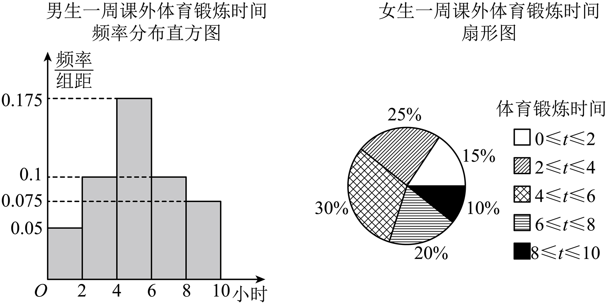

## 讲解

### 判据与流程

问两个群体“优劣、差异”或把分层数据合为整体时，先明确目标：平均水平、常见值、分布位置、稳定程度还是达标人数比例。目标不同，恰当指标及结论可能不同。

1. **核对可比性。**单位、时间、测量标准一致；不同群体人数不同，门槛以上人数改为相应群体内的比例，避免把大群体人数多误作比例高。用本次全部成员数据可描述本次两组，用抽样数据推总体则还需抽样条件。
2. **用多项指标对应问题。**均值看平均水平，中位数/百分位数看位置，众数看最多的取值，方差/标准差看散布，门槛比例看达到指定标准的份额。说明每个指标为什么支持该结论，不能只列数。
3. **合并时找正确权重。**若分别m、n个实际数据，合并样本均值μ=(mμ₁+nμ₂)/(m+n)。若要估计总体而非只合并样本，权重应是总体各层比例；比例分配才允许直接采用样本比例。
4. **合并方差计入两类散布。**设各组描述性方差v₁、v₂。对第一组一个数x，x−μ=(x−μ₁)+(μ₁−μ)；平方展开，求和的交叉项为2(μ₁−μ)∑(x−μ₁)=0，因为这组偏差和0。因此第一组总平方偏差为mv₁+m(μ₁−μ)²，第二组同理；加起来除m+n。

$$v=\frac m{m+n}\left[v_1+(\mu_1-\mu)^2\right]+\frac n{m+n}\left[v_2+(\mu_2-\mu)^2\right].$$

式中v₁、v₂使用各自组人数为分母，m、n为正整数。组均值相等时第二类项为0；不同均值时它非负，不能只加权内部方差。若某组无观测，该组均值方差未定义，不硬代这一两组式。

5. **写有条件结论。**“按稳定性，甲这次更集中”“按高分率，乙较高”可并列；若指标支持不同方向，说明取舍或暂不合成唯一排名。分组中点统计和抽样总体统计各自都要保留估计口径，更不将群体差异等同于因果。

## 易错

两个群体均值相同不保证方差相同；方差较小不保证门槛比例较高。合并方差漏组间中心距离会丢信息，直接对标准差加权也不符合平方偏差定义。群体均值之间的差异不能自动代表任何一个个体的差异。

知识与分类依据：`HSMA-B2-C9-D0316d94cc45c-P0759-P0774`，《专题9.2 用样本估计总体（举一反三讲义）高一数学人教A版必修第二册（解析版）.docx》；`HSMA-B2-C9-D0316d94cc45c-P0890-P0890`，《专题9.2 用样本估计总体（举一反三讲义）高一数学人教A版必修第二册（解析版）.docx》；`HSMA-B2-C9-D94817a3cf89b-P0037-P0037`，《专题9.3 统计案例 公司员工的肥胖情况调查分析（举一反三讲义）高一数学人教A版必修第二册（解析版）.docx》。原例题号及资料疑点与补讲分别列明。

## 例题

### 原例：不同指标给出不同竞赛评价

来源：`HSMA-B2-C9-D94817a3cf89b-P0121-P0160`；原件《专题9.3 统计案例 公司员工的肥胖情况调查分析（举一反三讲义）高一数学人教A版必修第二册（解析版）.docx》。题号、学年及地区按讲义原标注，未另作来源核验。

以下完整保留原题、原答案与原详解（仅统一等价排版、还原原表行列及配图路径）：

【变式1-3】（25-26高一上·全国·课后作业）在一次科技知识竞赛中，两组学生的成绩如下表：

| 分数 | $50$ | $60$ | $70$ | $80$ | $90$ | $100$ |
| --- | --- | --- | --- | --- | --- | --- |
| 人数：甲组 | $2$ | $5$ | $10$ | $13$ | $14$ | $6$ |
| 人数：乙组 | $4$ | $4$ | $16$ | $2$ | $12$ | $12$ |

已经算得两个组的平均分都是$80$分．请根据你所学过的统计知识，进一步判断这两个组在这次竞赛中的成绩谁优谁劣，并说明理由．

【答案】答案见解析

【解题思路】分别从众数、方差、中位数分数以上的人数和$90$分以上的人数依次进行分析即可.

【解答过程】（1）$\because $甲组成绩的众数为$90$，乙组成绩的众数为$70$，

$\therefore $从成绩的众数比较看，甲组成绩好些；

（2）由已知得：两个组的平均分都是$80$分，

$\therefore $甲组成绩的方差${s}_{1}^{2}=\frac{1}{50}\times \left[ 2\times {\left( 50-80\right)}^{2}+5\times {\left( 60-80\right)}^{2}+10\times {\left( 70-80\right)}^{2}+13\times {\left( 80-80\right)}^{2}+14\times {\left( 90-80\right)}^{2}+6\times {\left( 100-80\right)}^{2}\right]$ $=172$；

乙组成绩的方差

${s}_{2}^{2}=\frac{1}{50}\times \left[ 4\times {\left( 50-80\right)}^{2}+4\times {\left( 60-80\right)}^{2}+16\times {\left( 70-80\right)}^{2}+2\times {\left( 80-80\right)}^{2}+12\times {\left( 90-80\right)}^{2}+12\times {\left( 100-80\right)}^{2}\right]$ $=256$；

$\because {s}_{1}^{2}<{s}_{2}^{2}$，$\therefore $甲组成绩较乙组成绩稳定，甲组好些；

（3）$\because $甲、乙两组成绩的中位数、平均数都是$80$分，

其中甲组成绩在$80$分以上(包括$80$分)的有$33$人，乙组成绩在$80$分以上(包括$80$分)的有$26$人，

$\therefore $从这一角度看，甲组的成绩较好．

（4）从成绩统计表看，甲组成绩大于等于$90$分的有$20$人，乙组成绩大于等于$90$分的有$24$人，

$\therefore $乙组成绩集中在高分段的人数多．同时乙组得满分的人数比甲组得满分的人数多$6$人，

$\therefore $从这一角度看，乙组的成绩较好．

#### 补充讲解

两个组各50人，均值都80分。方差的分子是“某分数的平方偏差×该分数人数”：甲为2×900+5×400+10×100+13×0+14×100+6×400=8600，除50得172；乙为4×900+4×400+16×100+2×0+12×100+12×400=12800，除50得256。因此甲波动较小。

继续核对不同问题的指标：甲频数最大14在90分，乙最大16在70分，众数支持甲；两组第25、26个成绩均落在80分，中位数相同。至少80分的比例甲33/50、乙26/50，支持甲；至少90分的比例甲20/50、乙24/50，满分甲6人、乙12人，高分及满分指标支持乙。

“谁更好”需要事先说明目标。若重视整体集中与至少80分比例，可以说这次竞赛甲较好；若重视至少90分或满分，则乙较好。不能把172<256解释成甲每个学生都比乙好，也不能隐藏不同指标支持不同结论。原数据覆盖此次两组所有参赛者，可以描述本次竞赛；不能据此断言以后比赛或别的学科仍保持同样优劣。

### 原例：按层比例合并均值与方差估计

来源：`HSMA-B2-C9-D0316d94cc45c-P0942-P0955`；原件《专题9.2 用样本估计总体（举一反三讲义）高一数学人教A版必修第二册（解析版）.docx》。题号、学年及地区按讲义原标注，未另作来源核验。

以下完整保留原题、原答案与原详解（仅统一等价排版、还原原表行列及配图路径）：

【变式12-3】（24-25高一下·河南信阳·期中）树人中学男女学生比例约为$2:3$，某数学兴趣社团为了解该校学生课外体育锻炼情况（锻炼时间长短（单位：小时）），采用样本量比例分配的分层抽样，抽取男生$m$人，女生$n$人进行调查.记男生样本为${x}_{1},{x}_{2},\cdot \cdot \cdot ,{x}_{m}$，样本平均数、方差分别为$\overline{x},{s}_{1}^{2}$；女生样本为${y}_{1},{y}_{2},\cdot \cdot \cdot ,{y}_{n}$，样本平均数、方差分别为$\overline{y},{s}_{2}^{2}$；总样本平均数、方差分别为$\overline{w},{s}^{2}$.

(1)该兴趣社团通过分析给出以上两个统计图，假设两个统计图中每个组内的数据均匀分布，根据两图信息分别估计男生样本、女生样本的平均数；

(2)已知男生样本方差${s}_{1}^{2}=5.5$，女生样本方差${s}_{2}^{2}=5.7$，请结合（2）问的结果计算总样本方差${s}^{2}$的估计值.

【答案】(1)$\overline{x}=5.2$；$\overline{y}=4.7$

(2)${s}^{2}=5.68$

【解题思路】（1）利用各组区间中点值代表该组的各个值，由频率分布直方图、扇形统计图估计平均数的方法可求得结果；

（2）根据分层抽样计算平均数和方差的方法直接求解即可.

【解答过程】（1）$\because $每个组内的数据均匀分布，$\therefore $以各组的区间中点值代表该组的各个值；

由频率分布直方图估计男生样本课外体育锻炼时间的平均数$\overline{x}=1\times 0.05\times 2+3\times 0.1\times 2+5\times 0.175\times 2+7\times 0.1\times 2+9\times 0.075\times 2$ $=0.1+0.6+1.75+1.4+1.35=5.2$；

由扇形图估计女生样本课外体育锻炼时间的平均数$\overline{y}=1\times 15\%+3\times 25\%+5\times 30\%+7\times 20\%+9\times 10\%$ $=0.15+0.75+1.5+1.4+0.9=4.7$.

（2）$\because $采用按比例分配的分层随机抽样，$\therefore m:n=2:3$；

$\therefore $估计树人中学学生课外运动时间的平均数$\overline{w}=\frac{m}{m+n}\overline{x}+\frac{n}{m+n}\overline{y}=\frac{2}{5}\times 5.2+\frac{3}{5}\times 4.7=4.9$，

$\therefore {s}^{2}=\frac{m}{m+n}\left[ {s}_{1}^{2}+{\left( \overline{x}-\overline{w}\right)}^{2}\right]+\frac{n}{m+n}\left[ {s}_{2}^{2}+{\left( \overline{y}-\overline{w}\right)}^{2}\right]$ $=\frac{2}{5}\times \left[ 5.5+{\left( 5.2-4.9\right)}^{2}\right]+\frac{3}{5}\times \left[ 5.7+{\left( 4.7-4.9\right)}^{2}\right]$ $=\frac{2}{5}\times 5.59+\frac{3}{5}\times 5.74=5.68$.

#### 补充讲解

男生直方图柱高须先乘组距2，得到频率0.10、0.20、0.35、0.20、0.15；女生扇形图直接给0.15、0.25、0.30、0.20、0.10。各组中点1、3、5、7、9小时加权得到男生5.2、女生4.7小时。这仍是按题给组内均匀假设的估计；真实样本组内取值未给，不能把中点逐个当成观测事实。

按比例分配使m:n=2:3，这才允许以2/5、3/5加权。均值估计为2/5×5.2+3/5×4.7=2.08+2.82=4.9。合并方差还要计入组间中心距离，不能仅算2/5×5.5+3/5×5.7=5.62。

男生中心偏差5.2−4.9=0.3，平方0.09；女生4.7−4.9=−0.2，平方0.04。将各组内部方差加上相应中心平方偏差再加权：2/5×(5.5+0.09)+3/5×(5.7+0.04)=2.236+3.444=5.68小时²。标准差的估计是√5.68小时，而不是5.68小时。原题第二问“结合（2）问”应指结合（1）问，原句保留在上文。

图例把两个相邻区间的端点都写成≤；若实际记录恰在2、4、6、8小时，整理时须约定只计入一组，不能重复计数。本题频率已给，按这些既定比例计算，不自行重分数据。男女均值不同只是本次样本中的群体差异，未能证明性别本身造成锻炼时间差异。
