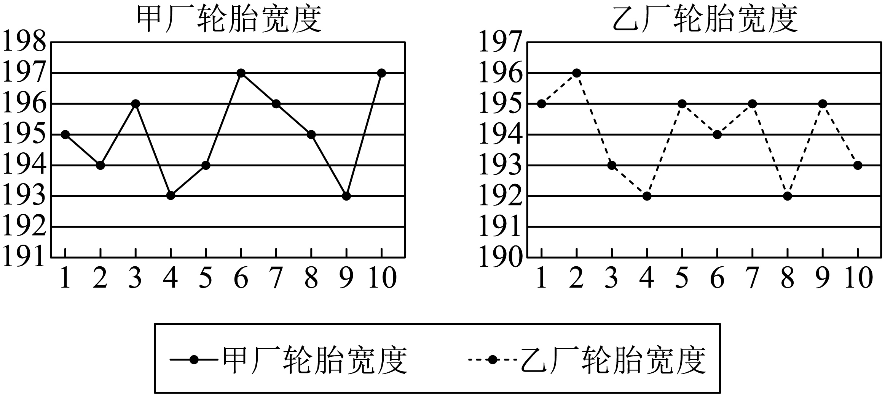

## 讲解

### 判据与流程

题目给原始观测值、均值或可补全的数据，问“波动、集中、稳定”，就考虑方差或标准差。若问“哪个更好”，还要核对题目重视平均水平、达标比例还是稳定性。

1. **定对象与单位。**先写这一步统计哪些观测。若题目先给全部产品、后只比较达标产品，后一步先按题给达标区间及端点约定筛选，n随子样本改变；否则均值与分母将对应不同对象。
2. **算或核对均值。**x̄=∑xᵢ/n；均值是偏差的共同参照中心，不能用门槛值或另一组均值替代。未知值可先由总和nx̄求出。
3. **列平方偏差。**逐项写xᵢ−x̄，平方后相加；正负抵消只能检查偏差和0，不能替代平方和。重复值可按频数合并。
4. **除以同一对象的n。**得到描述性方差s²；需要标准差时取s=√s²≥0。单位分别为原单位平方与原单位，分母n−1须有题目另定的口径。
5. **限定比较结论。**同变量、同单位下方差小等价于标准差小。均值相近而方差较小可说该样本更集中；不能由小方差直接推出每个成绩更高、所有产品更优或未来必然保持。

## 易错

不同均值的两组各用自己的中心。筛选子样本时不能保留全部样本分母；把全部产品与达标部分混作同一质量指标会偏移结论。均值受极端值影响、平方偏差更放大极端值，应先查记录与情境，不能为让结果稳定便擅自删数。

知识与分类依据：`HSMA-B2-C9-D0316d94cc45c-P0759-P0775`，《专题9.2 用样本估计总体（举一反三讲义）高一数学人教A版必修第二册（解析版）.docx》；`HSMA-B2-C9-D94817a3cf89b-P0037-P0037`，《专题9.3 统计案例 公司员工的肥胖情况调查分析（举一反三讲义）高一数学人教A版必修第二册（解析版）.docx》。原例题号及资料疑点与补讲分别列明。

## 例题

### 原例：相近均值下比较评分波动

来源：`HSMA-B2-C9-D94817a3cf89b-P0038-P0053`；原件《专题9.3 统计案例 公司员工的肥胖情况调查分析（举一反三讲义）高一数学人教A版必修第二册（解析版）.docx》。题号、学年及地区按讲义原标注，未另作来源核验。

以下完整保留原题、原答案与原详解（仅统一等价排版、还原原表行列及配图路径）：

【例1】（24-25高一下·重庆·期中）在重庆复旦中学“复旦好声音”校园歌手决赛中，由9名专业人士和9名观众代表各组成一个评委小组，给参赛选手打分，下面是两组评委对同一名选手的打分：

小组A：85  86   92  87  89  95  82  91  85

小组B：95  93  51  88  90  89  91  92  94

(1)分别求两组评委打分的平均分．

(2)判断小组A和小组B中哪一个更像是由专业人士组成，根据所学的统计知识，说明理由.

【答案】(1)88，87

(2)A组更像，理由见解析

【解题思路】（1）根据平均数的定义计算即可求解；

（2）分别求出两组的方差，比较大小，结合方差的表示意义即可下结论.

【解答过程】（1）记小组A的数据依次为${x}_{i}$，小组B的数据依次为${y}_{i}$，$i=1,2,\cdot \cdot \cdot ,9$，

由题意可得：每组的平均数分别为：$\overline{{x}_{A}}=\frac{1}{9}\sum _{i=1}^{9} {x}_{i}=88$，$\overline{{x}_{B}}=\frac{1}{9}\sum _{i=1}^{9} {y}_{i}=87$.

（2）A组更像是由专业人士组成，

两组的方差分别为：${S}_{A}^{2}=\frac{1}{9}\sum _{i=1}^{9} {\left( {x}_{i}-88\right)}^{2}=14.9$，${S}_{B}^{2}=\frac{1}{9}\sum _{i=1}^{9} {\left( {y}_{i}-87\right)}^{2}=166.7$.

由于专业人士给分更符合专业规则，相似程度更高，${S}_{A}^{2}=14.9$，${S}_{B}^{2}=166.7$，

因而$14.9<166.7$，

根据方差越大数据波动越大，因此A组更像是由专业人士组成的．

#### 补充讲解

A的分数和为792，B为783，各除9得到88与87。相对各自均值的偏差，A为−3、−2、4、−1、1、7、−6、3、−3，平方和9+4+16+1+1+49+36+9+9=134；B为8、6、−36、1、3、2、4、5、7，平方和64+36+1296+1+9+4+16+25+49=1500。

因此精确的描述性方差为134/9和1500/9；原解14.9与166.7是保留一位小数的近似数，严格应使用≈。比较方差可判断A组这一次评分更集中、B组波动更大；B的51对平方偏差和贡献1296，解释了为何只看两个相近均值会遗漏差异。

第二问措辞是“更像”。在讲义假设“专业组给分较一致”的条件下，这些数据提供A更像的依据，却不能证明职业身份，更不能证明专业身份导致低方差。题目只给同一位选手一次评分，没有身份机制、更多评分资料或因果对照；也不宜不查原因便删除51。

### 原例：筛选标准轮胎后重新确定统计对象

来源：`HSMA-B2-C9-D0316d94cc45c-P0924-P0941`；原件《专题9.2 用样本估计总体（举一反三讲义）高一数学人教A版必修第二册（解析版）.docx》。题号、学年及地区按讲义原标注，未另作来源核验。

以下完整保留原题、原答案与原详解（仅统一等价排版、还原原表行列及配图路径）：

【变式12-2】（24-25高三上·黑龙江鸡西·期末）为了了解甲、乙两个工厂生产的轮胎的宽度是否达标，分别从两厂随机选取了10个轮胎，将每个轮胎的宽度（单位：$mm$）记录下来并绘制出折线图：

(1)分别计算甲、乙两厂提供10个轮胎宽度的平均值；

(2)轮胎的宽度在$\left[ 194,196\right]$内，则称这个轮胎是标准轮胎.试比较甲、乙两厂分别提供的10个轮胎中所有标准轮胎宽度的方差的大小，根据两厂的标准轮胎宽度的平均水平及其波动情况，判断这两个工厂哪个厂的轮胎相对更好?

【答案】(1)195mm；194$mm$

(2)乙厂的轮胎相对更好

【解题思路】（1）根据平均数的求法可直接求得结果；

（2）确定甲、乙两厂生产的轮胎中标准轮胎的宽度数据，由此可计算得到平均数和方差，对比数据即可得到结论.

【解答过程】（1）记甲厂提供的$10$个轮胎宽度的平均值为${\overline{x}}_{1}$，乙厂提供的$10$个轮胎宽度的平均值为${\overline{x}}_{2}$，

${\overline{x}}_{1}=\frac{195\times 2+194\times 2+196\times 2+193\times 2+197\times 2}{10}=195\left( mm\right)$，${\overline{x}}_{2}=\frac{195\times 4+194+196+193\times 2+192\times 2}{10}=194\left( mm\right)$.

（2）甲厂$10$个轮胎宽度在$\left[ 194,196\right]$内的数据为$195,194,196,194,196,195$，

则平均数为$\frac{195+194+196+194+196+195}{6}=195$，

所以方差${s}_{1}^{2}=\frac{1}{6}\times \left[ {0}^{2}+{\left( -1\right)}^{2}+{1}^{2}+{\left( -1\right)}^{2}+{1}^{2}+{0}^{2}\right]=\frac{2}{3}$；

乙厂$10$个轮胎宽度在$\left[ 194,196\right]$内的数据为$195,196,195,194,195,195$，

则平均数为$\frac{195+196+195+194+195+195}{6}=195$，

所以方差${s}_{2}^{2}=\frac{1}{6}\times \left[ {0}^{2}+{1}^{2}+{0}^{2}+{\left( -1\right)}^{2}+{0}^{2}+{0}^{2}\right]=\frac{1}{3}$；

因为甲、乙两厂生产的标准轮胎宽度的平均值一样，但乙厂的方差更小，

所有乙厂的轮胎相对更好.

#### 补充讲解

先从图逐点读十个宽度。甲为195、194、196、193、194、197、196、195、193、197；乙为195、196、193、192、195、194、195、192、195、193。分别求和为1950与1940，除10得到195 mm与194 mm，完成第一问。

第二问的对象变为[194,196]内的标准轮胎，两个端点194与196均包括。甲留下6个：195、194、196、194、196、195；乙留下6个：195、196、195、194、195、195。两子样本均值都195 mm，但方差的分母必须随对象改为6：甲平方偏差和4，方差2/3 mm²；乙平方偏差和2，方差1/3 mm²。标准差分别√(2/3) mm与√(1/3) mm。

按题目限定的“这些标准轮胎的平均水平与波动”比较，乙的子样本更稳定；两个样本达标比例其实同为6/10，单看筛选后方差不能说明乙厂全部产品都更好。原解最后“所有乙厂……”按语境是“所以”的文字误写，也应限制在本题所比较的样本及指标内；未来批次和未达标产品不能由这六个数据确定。
