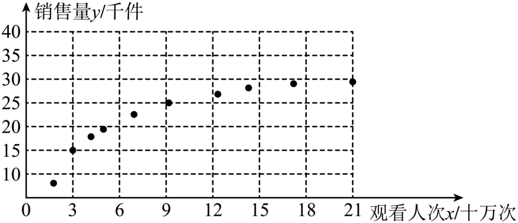

## 错法

把ẑ=â+b̂x指数回代后写成“E(Y|x)=e^{ẑ}”，认为既然log误差均值0，exp误差均值就等于1；也把原观测ln y与拟合值ẑ写成相等恒等式。错在对非线性函数随意交换平均与变换。

## 正解

响应取log需每个观测y>0；对数尺度先拟合，再以互逆指数恢复预测曲线ŷ=exp(ẑ)。它是反变换模型值，不是每个真实y，也不能无条件当原响应算术条件均值。

这是拓展，考试可用：在给定x下设ln Y=μ(x)+ε，则指数回代得到Y=e^{μ(x)}e^ε。若相应平均存在，对同一x下响应加权平均，常量因子提出得E(Y|x)=e^{μ(x)}E(e^ε|x)。零均值E(ε|x)=0不决定非线性量E(e^ε|x)=1，因此缺少后一因子的条件时不等于直接e^{μ(x)}。更不能把估计ẑ再升级成已知真实μ。

按题设求非线性模型时，原填空答案正确保留，只把预测与真实随机量记号分清。拟合目标在log尺度，评价原响应误差要重新算y−exp(ẑ)，不能拿log SSE当原响应SSE。

## 例题

### 原例：HSMA-B5-C8-D788889460b25-P0533–P0538

**原题、原答案、原思路与原详解**（原次序保留，按原XML恢复表格；公式等价规范转写）：

24．（24-25高二下·内蒙古巴彦淖尔·阶段练习）在研究两个变量的相关关系时，观察散点图发现样本点集中于某一条指数曲线$y={e}^{bx+a}$的周围．令$\hat{z}=\ln y$，求得线性回归方程为${z}^{\land }=0.25x-2.58$，则该模型的非线性回归方程为  $y={e}^{0.25x-2.58}$  ．

【解题思路】由回归直线方程${z}^{\land }=0.25x-2.58$可得：$\ln y=0.25x-2.58$，解出$y$，问题得解．

【解答过程】由回归直线方程${z}^{\land }=0.25x-2.58$,$\hat{z}=\ln y$得：$\ln y=0.25x-2.58$，

整理得：$y={e}^{0.25x-2.58}$，

所以该模型的回归方程为$y={e}^{0.25x-2.58}$.

故答案为: $y={e}^{0.25x-2.58}$.

**补讲与条件核验**

本题应把样本变换理解为zᵢ=ln yᵢ，拟合值记ẑ，而不是把实际ln y都写成ẑ。观测y必须为正，实数对数才有定义。题给ẑ=0.25x−2.58，对两边施以互为反函数的指数，得到模型预测ŷ=exp(ẑ)=e^{0.25x−2.58}，与原答案相同；ŷ始终为正。

这条回代曲线是把对数尺度的拟合值还原，并不自动等于原响应的条件均值。若写随机模型ln Y=μ(x)+ε，则Y=e^{μ(x)}e^ε；若相应平均存在，在给定x下取平均得E(Y|x)=e^{μ(x)}E(e^ε|x)，仅有E(ε|x)=0并不能使后一因子等于1。这是拓展，考试可用；不用额外误差分布假设把回代值称作原尺度算术平均，也不把ln尺度的SSE与原Y尺度的SSE直接比较。

### 原例：HSMA-B5-C8-Dc61681467287-P0550–P0582

**原题、原答案、原思路与原详解**（原次序保留，按原XML恢复表格；公式等价规范转写）：

【变式8-3】（24-25高二下·吉林长春·阶段练习）《中共中央国务院关于全面推进乡村振兴加快农业农村现代化的意见》，这是21世纪以来第$18$个指导“三农”工作的中央一号文件.文件指出，民族要复兴，乡村必振兴，要大力推进数字乡村建设，推进智慧农业发展.某乡村合作社借助互联网直播平台进行农产品销售，众多网红主播参与到直播当中，在众多网红直播中，统计了$10$名网红直播的观看人次${x}_{i}$和农产品销售量${y}_{i}\left( i=1,2,3,\cdots ,10\right)$的数据，得到如图所示的散点图.

(1)利用散点图判断，$\hat{y}=\hat{a}+\hat{b}x$和$\hat{y}=\hat{c}+\hat{d}\ln x$哪一个更适合作为观看人次$x$和销售量$y$的回归方程类型；（只要给出判断即可，不必说明理由）

(2)对数据作出如下处理：得到相关统计量的值如表：

| $\overline{x}$ | $\overline{y}$ | $\overline{\omega }$ | $\sum _{i=1}^{10} {\left( {x}_{i}-\overline{x}\right)}^{2}$ | $\sum _{i=1}^{10} {\left( {\omega }_{i}-\overline{\omega }\right)}^{2}$ | $\sum _{i=1}^{10} \left( {x}_{i}-\overline{x}\right)\left( {y}_{i}-\overline{y}\right)$ | $\sum _{i=1}^{10} \left( {\omega }_{i}-\overline{\omega }\right)\left( {y}_{i}-\overline{y}\right)$ |
| --- | --- | --- | --- | --- | --- | --- |
| $9.4$ | $30.3$ | $2$ | $366$ | $6.6$ | $439.2$ | $66$ |

其中令${\omega }_{i}=\ln {x}_{i}$，$\overline{\omega }=\frac{1}{10}\sum _{i=1}^{10} {\omega }_{i}$.

根据（1）的判断结果及表中数据，求$y$（单位：千件）关于$x$（单位：十万次）的回归方程，并预测当观看人次为$280$万人时的销售量；

参考数据和公式：$\ln 2\approx 0.69$，$\ln 7\approx 1.95$

附：对于一组数据$\left( {u}_{1},{v}_{1}\right)$、$\left( {u}_{2},{v}_{2}\right)$、$\cdots $、$\left( {u}_{n},{v}_{n}\right)$，其回归线$\hat{v}=\hat{\alpha }+\hat{\beta }u$的斜率和截距的最小二乘估计分别为：$\hat{\beta }=\frac{\sum _{i=1}^{n} \left( {u}_{i}-\overline{u}\right)\left( {v}_{i}-\overline{v}\right)}{\sum _{i=1}^{n} {\left( {u}_{i}-\overline{u}\right)}^{2}}$，$\hat{\alpha }=\overline{v}-\hat{\beta }\overline{u}$.

【解题思路】（1）根据散点图中散点的分布情况可选择合适的回归模型；

（2）令$\omega =\ln x$，则$\hat{y}=\hat{c}+\hat{d}\omega $，将表格中的数据代入最小二乘法公式，可求得$\hat{d}$、$\hat{c}$的值，进而可得出$y$关于$x$的回归方程，将$x=28$代入回归方程可得出销售量.

【解答过程】（1）解：由散点图可知，散点分布在一条对数型曲线附近，所以选择回归方程$\hat{y}=\hat{c}+\hat{d}\ln x$更适合.

（2）解：令$\omega =\ln x$，则$\hat{y}=\hat{c}+\hat{d}\omega $，

因为$\sum _{i=1}^{10} \left( {\omega }_{i}-\overline{\omega }\right)\left( {y}_{i}-\overline{y}\right)=66$，$\sum _{i=1}^{10} {\left( {\omega }_{i}-\overline{\omega }\right)}^{2}=6.6$，

所以$\hat{d}=\frac{\sum _{i=1}^{10} \left( {\omega }_{i}-\overline{\omega }\right)\left( {y}_{i}-\overline{y}\right)}{\sum _{i=1}^{10} {\left( {\omega }_{i}-\overline{\omega }\right)}^{2}}=\frac{66}{6.6}=10$，

又因为$\overline{y}=30.3$，$\overline{\omega }=2$，所以$\hat{c}=\overline{y}-d\overline{\omega }=30.3-10\times 2=10.3$，

所以$y$与$\omega $的线性回归方程为$\hat{y}=10.3+10\omega $，

故$y$关于$x$的回归方程为$\hat{y}=10.3+10\ln x$.

令$x=28$，代入回归方程可得$\hat{y}=10.3+10\ln 28=10.3+10\times \left( 2\ln 2+\ln 7\right)\approx 43.6$（千件）

所以预测观看人次为$280$万人时的销售量约为$43600$件.

**补讲与条件核验**

第一问只要求选类型。原图呈增长放缓的形状，原选择对数模型。第二问按题给表而非从图估坐标：令ω=ln x，斜率d̂=66/6.6=10，截距ĉ=30.3−10×2=10.3，故ŷ=10.3+10 ln x。280万人换为28个十万次；用ln28=2ln2+ln7≈3.33，代得43.6千件，即43600件。

图表有原始疑点：原图10个销售量点均在y=30水平线下，统计表却给ȳ=30.3，二者不能同时是同一组精确数据。保留原图和统计表；模型形状依图判断，题给统计量用于数值计算，不凭图制造更换表格的数据。预测x=28也超出图中观测范围，需继续适用模型的假定。

ω̄=2是逐点ln后平均，不是ln x̄=ln9.4；线性回归在ω,y坐标中通过(2,30.3)，在原坐标中相应点是(e²,30.3)，不能写成(2,30.3)或(9.4,30.3)必在该曲线上。

## 来源

原件：专题8.2 一元线性回归模型及其应用【九大题型】（举一反三）（人教A版2019选择性必修第三册）（解析版）.docx。

知识与分类口径：HSMA-B5-C8-Dc61681467287-P0016–P0024；HSMA-B5-C8-Dc61681467287-P0157–P0182；相关题型的分类和所选原例见各例精确定位。

补例原件：专题8.7 统计分析中的必考七类问题（举一反三）（人教A版2019选择性必修第三册）（解析版）.docx，仅使用HSMA-B5-C8-D788889460b25-P0533–P0538。

