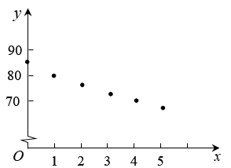

## 错法

把“回归线经过样本中心”扩大为任何非线性回归曲线都过(x̄,ȳ)；或知道u=g(x)后把g(x̄)当作ū，还可能将变换均值ū直接充当原横坐标。错在不同坐标平面和平均次序混在一起。

## 正解

固定变换后样本为(uᵢ,yᵢ)，uᵢ=g(xᵢ)。含截距OLS线通过(ū,ȳ)，其中ū=Σg(xᵢ)/n，通常不等于g(x̄)。原曲线ŷ=α̂+β̂g(x)若要通过某响应ȳ，需解g(x*)=ū；存在性、唯一性还由g的范围及一一对应性决定。

对u=aˣ、0<a<1，ū>0且原对应x*=ln ū/ln a，不是ū；对u=ln x，则对应x*=e^{ū}。这说明原冷却解把(mean(aˣ),ȳ)称作回归方程上的点，只有明确位于u,y平面的直线时才成立，不能照搬到原x,y曲线。

仿射变换g(x)=cx+d可与平均交换，非线性ln、sqrt、指数不普遍如此。若a未知，u本身依赖未知参数，不能按已知固定数据一次求全体参数。

## 例题

### 原例：HSMA-B5-C8-Dc61681467287-P0501–P0514

**原题、原答案、原思路与原详解**（原次序保留，按原XML恢复表格；公式等价规范转写）：

【变式8-1】（2025高三·全国·专题练习）中国茶文化博大精深，茶水的口感与茶叶类型和水的温度有关为了建立茶水温度$y$随时间$x$变化的函数模型，小明每隔$1$分钟测量一次茶水温度，得到若干组数据$\left( {x}_{1},{y}_{1}\right)$、$\left( {x}_{2},{y}_{2}\right)$、$\cdots $、$\left( {x}_{n},{y}_{n}\right)$，绘制了如图所示的散点图．小明选择了如下$2$个函数模型来拟合茶水温度$y$随时间$x$的变化情况，函数模型一：$y=kx+b\left( k<0,x\ge 0\right)$；函数模型二：$y=k{a}^{x}+b\left( k>0,0<a<1,x\ge 0\right)$，下列说法不正确的是（    ）

A．变量$y$与$x$具有负的相关关系

B．由于水温开始降得快，后面降得慢，最后趋于平缓，故模型二能更好的拟合茶水温度随时间的变化情况

C．若选择函数模型二，利用最小二乘法求得到$y=k{a}^{x}+b$的图象一定经过点$\left( \overline{x},\overline{y}\right)$

D．当$x=5$时，通过函数模型二计算得$y=65.1$，用温度计测得实际茶水温度为$65.2$，则残差为$0.1$

【解题思路】根据题中所给散点图，根据正负相关的概念即可判断A选项；根据水温的变化情况，以及指数函数的单调性，即可判断B选项；根据最小二乘法可求出的回归方程一定经过$\left( \overline{{a}^{x}},\overline{y}\right)$，即可判断C选项；根据残差的定义可判断D选项．

【解答过程】对于A选项，观察散点图，变量$x$与$y$具有负的相关关系，A对；

对于B选项，由于函数模型二中的函数$y=k{a}^{x}+b\left( k>0,0<a<1,x\ge 0\right)$，

在$x\ge 0$时，函数单调递减，且递减速度越来越慢，

所以，模型二能更好的拟合茶水温度随时间的变化情况，B对；

对于C选项，若选择函数模型二，利用最小二乘法求出的回归方程一定经过$\left( \overline{{a}^{x}},\overline{y}\right)$，C错；

对于D选项，根据残差的定义可知，残差$=$真实值$-$预测值，故残差为$65.2-65.1=0.1$，D对.

故选：C.

**补讲与条件核验**

A由原图的整体降温趋势判断为负相关；B描述开始降得较快、以后放慢，k>0且0<a<1的k aˣ+b在x增加时递减，并趋向b，符合这种形状。图只能初选模型，不能证明未来一直照此变化。D用观测减预测：65.2−65.1=0.1 ℃，符号正确。原答案C保留。

C不能把原变量均值点直接套到非线性曲线。若先固定a、设uᵢ=a^{xᵢ}，含截距OLS线是ŷ=k̂u+b̂，它通过(ū,ȳ)；还原到原x,y平面，对应横坐标应解a^{x_*}=ū，得到x_*=ln ū/ln a，并不是ū，更不必等于x̄。原P0507/P0512写“回归方程一定经过(mean(aˣ),ȳ)”未说明是u,y坐标平面；作为原x,y曲线上的点并不正确，原文与规范解释分列。

若a也未知，就不能把u=aˣ当作一列预先固定的解释数据一次套线性公式来估计全部k,a,b。需要先给a或另做参数搜索/非线性拟合；本题只辨析性质，不要求拟合三个参数。

### 原例：HSMA-B5-C8-Dc61681467287-P0492–P0500

**原题、原答案、原思路与原详解**（原次序保留，按原XML恢复表格；公式等价规范转写）：

【例8】（2024·福建宁德·三模）2024海峓两岸各民族欢度“三月三”暨福籽同心爱中华$\cdot $福建省第十一届“三月三”畲族文化节活动在宁德隆重开幕.海峡两岸各民族同胞齐聚于此，与当地群众共同欢庆“三月三”，畅叙两岸情.在活动现场，为了解不同时段的入口游客人流量，从上午10点开始第一次向指挥中心反馈入口人流量，以后每过一个小时反馈一次.指挥中心统计了前5次的数据$\left( i,{y}_{i}\right)$，其中$i=1,2,3,4,5,{y}_{i}$为第$i$次入口人流量数据（单位:百人），由此得到$y$关于$i$的回归方程$\hat{y}=\hat{b}{\log }_{2}(i+1)+5$.已知$\overline{y}=9$，根据回归方程（参考数据:${\log }_{2}3\approx 1.6,{\log }_{2}5\approx 2.3$），可顶测下午4点时入口游客的人流量为（    ）

A．9.6  B．11.0  C．11.3  D．12.0

【解题思路】首先利用换元法将回归方程转化为线性回归方程，再代入样本点中心，求$\hat{b}$，再根据方程进行预测.

【解答过程】设$x={\log }_{2}\left( i+1\right)$，$i=1,2,3,4,5$，则$\hat{y}=\hat{b}x+5$

所以$\overline{x}=\frac{{\log }_{2}2+{\log }_{2}3+{\log }_{2}4+{\log }_{2}5+{\log }_{2}6}{5}=\frac{4+2{\log }_{2}3+{\log }_{2}5}{5}\approx \frac{4+2\times 1.6+2.3}{5}$ $=1.9$，且$\overline{y}=9$，

则$9=\hat{b}\times 1.9+5$，得$\hat{b}=\frac{4}{1.9}$，

所以$\hat{y}=\frac{4}{1.9}{\log }_{2}(i+1)+5$，

下午4点对应的$i=7$，此时预测游客的人流量$\hat{y}=\frac{4}{1.9}\times {\log }_{2}8+5\approx 11.3$.

故选：C.

**补讲与条件核验**

第一次10时的i=1，以后每小时加1，所以16时对应i=7，而非6或16。换元zᵢ=log₂(i+1)后拟合线为ŷ=b̂z+5，它通过(z̄,ȳ)。z̄应先对五个i逐个取对数再平均：
$$\bar z=[\log_2 2+\log_2 3+\log_2 4+\log_2 5+\log_2 6]/5\approx1.9.$$
代ȳ=9得9=1.9b̂+5，即b̂≈4/1.9。i=7时z=log₂8=3，ŷ≈5+12/1.9≈11.3百人，选C；按题给精度约1130人。其他三个选项不是这组编号与变换后均值的结果。

不能先求ī=3再用log₂4=2替代z̄；非线性变换一般不与平均交换。采集仅到14时(i=5)，16时的值为外推预测，需人流模型在该时段继续适用。资料“顶测”为“预测”的文字笔误，不影响原计算。

## 来源

原件：专题8.2 一元线性回归模型及其应用【九大题型】（举一反三）（人教A版2019选择性必修第三册）（解析版）.docx。

知识与分类口径：HSMA-B5-C8-Dc61681467287-P0016–P0024；HSMA-B5-C8-Dc61681467287-P0157–P0182；相关题型的分类和所选原例见各例精确定位。

