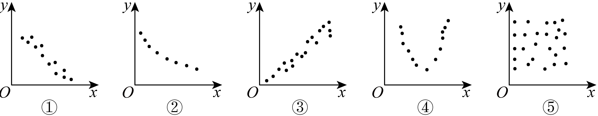
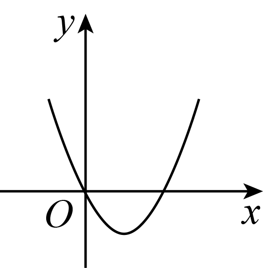
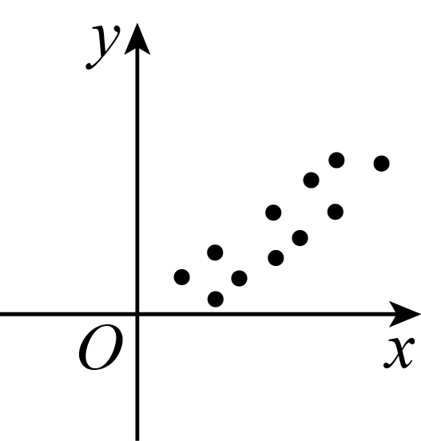
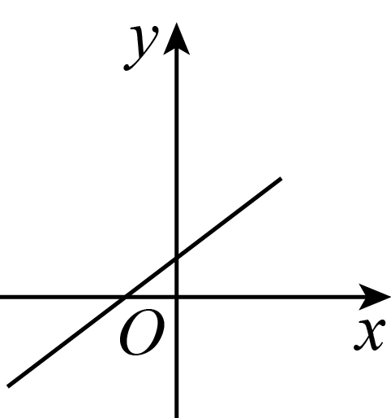
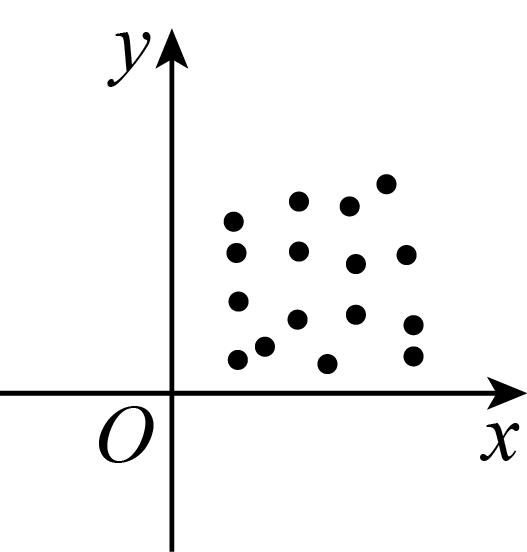

## 错法

见r=0、|r|很小或图上没有明显直线，就说两个变量“完全无关联”“独立”；也把有精确曲线的函数图因为不符合教材非确定相关分类而说成没有任何关系。

## 正解

两列不恒定时，r=0只等价于Σ(x_i−x̄)(y_i−ȳ)=0，即样本线性偏差乘积相互抵消。它只是一项线性度量的结论，不描述所有曲线结构。U形可以在左右两侧分别下降和上升，曲线结构明确，而正负贡献可能抵消；原图没有精确坐标，不能进一步宣布那个样本r恰为0。

概率意义的独立要求任意关于两变量的取值事件满足联合概率等于两个边缘概率的乘积，是关于整个分布的条件。一个有限样本积和为0远不足以核这一条件。若讨论总体的偏差乘积期望（称为协方差），在具有有限方差等相应条件下，独立可推出这一期望为0；这一期望为0也不能反向当独立定义。

做题先看散点形状和语境，再用合法r描述线性关联；需要“无任何关联”或“独立”的结论时，检查是否真的给出了分布与相应证据，不能借样本的零或弱线性相关代替。

## 例题

### 原例（HSMA-B5-C8-D9f1692bb6096-P0115—P0121）

**原题与原解析（保留）**

【变式3-1】（24-25高二下·全国·课后作业）下列散点图中，两个变量呈负相关的个数是（    ）

A．1  B．2  C．3  D．4

【解题思路】由正、负相关的概念逐项判断即可.

【解答过程】从整体上看，当一个变量的值增加时，另一个变量的相应值呈现减少的趋势，则这两个变量为负相关．

结合散点图可知，①②满足题意，即两个变量呈负相关的个数为2个．

故选：B.

### 补讲

从左向右看各图的整体走向。①点大致围绕下降直线，②点大致围绕下降曲线，二者都是x增大时y总体趋于减小，所以负相关的图有2幅，选B。③整体向右上方，④是先降后升的U形，⑤没有明显趋势。

②虽不是线性形状，仍可在定性语境下说负相关；判断“线性相关强不强”还要另看与直线的贴近程度。④有非线性关联，不能因不是整体上升或下降就说完全无关系，也不能在没有各点精确坐标时宣布它的r恰好为0。

### 原例（HSMA-B5-C8-D9f1692bb6096-P0058—P0066）

**原题与原解析（保留）**

【例2】（24-25高二下·宁夏固原·阶段练习）下图中的两个变量，具有相关关系的是（    ）

A．  B．

C．  D．

【解题思路】根据相关关系的概念逐项分析判断.

【解答过程】相关关系是一种非确定性关系.

对于A、C：两个变量具有函数关系，是一种确定性关系，故A、C错误；

对于D：图中的散点分布没有什么规律，故两个变量之间不具有相关关系，故D错误；

对于B：图中的散点分布在从左下角区域到右上角区域，两个变量具有相关关系，故B正确；

故选：B.

### 补讲

四个选项必须连同原图看。A是一条确定的抛物线，C是一条确定的直线：按本题“函数关系与非确定的相关关系”的对照，归入函数关系。B的点没有恰好全部落在同一条曲线上，却集中在整体向右上方的带状区域，所以符合本题相关关系的语境。D的点未显示明显方向或形状，原题排除D并选B。

图上不能读出精确r，未显示趋势也不足以证明总体独立。A虽是函数曲线，仍有清楚的非线性结构；C若作为非恒定数据，完全线性关系的|r|=1。不要把本题的分类简写为“函数关系在统计上永远不相关”。

### 资料说明（与原解分开）

原P0063/P0064的“函数关系”排除和“没有相关关系”采用教材定性分类。规范边界：函数也可有统计关联；散点没有明显趋势不足以证明总体无关系或独立。

## 来源

原件：专题8.1 成对数据的统计相关性【六大题型】（举一反三）（人教A版2019选择性必修第三册）（解析版）.docx；来源 ID：D9f1692bb6096。

知识与分类定位：HSMA-B5-C8-D9f1692bb6096-P0013—P0023, HSMA-B5-C8-D9f1692bb6096-P0115—P0121, HSMA-B5-C8-D9f1692bb6096-P0167—P0174。

选用原例：HSMA-B5-C8-D9f1692bb6096-P0115—P0121, HSMA-B5-C8-D9f1692bb6096-P0058—P0066。
