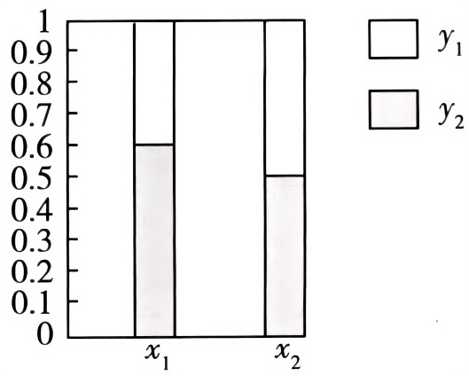
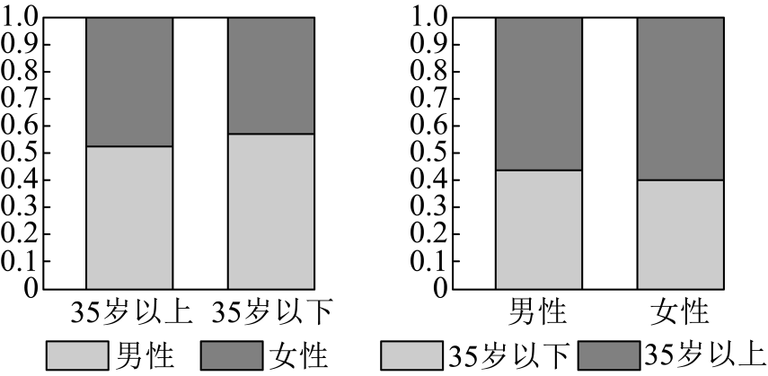

## 讲解

### 是什么

每根条代表一个组，把该组总量归一为1（100%），再按另一分类变量的各类别比例分色堆积。两根条总高相同，只说明都用“组内全部”作单位，不说明两组人数相同。色块高给组内频率，不给绝对人数，也不是概率密度。

### 怎么来的

以X=x₁、x₂为两根条，若下方色块表示Y=y₁，原频数a、c要分别除以各自组总数a+b、c+d，色块高度为a/(a+b)、c/(c+d)，另色高度是各自补数，整条都为1。从图回到人数，则要乘该条所代表组总数；没有基数，不能只凭柱高换出人数。

原图两高度约0.6与0.5，说明两个样本组内的频率有差异，差异大小可作为关联线索。抽样本来就会波动，差多少才足以拒绝总体独立，还受样本量及检验水平影响，单凭图不能给H₀真假的概率。

### 什么时候能用

比较各组构成比例，或结合已知组总人数还原交叉频数。两幅按不同变量分组的图，还可提供同组人数不等式，但若它们只给“多于一半”等关系，不能补造精确人数。图例、每根条的分组方向、阴影代表哪类都先看清；读到刻度之间时保留图示精度。

知识来源：HSMA-B5-C8-D9e1bd0cb65d9-P0042-P0048，原件《专题8.3 列联表与独立性检验【八大题型】（举一反三）（人教A版2019选择性必修第三册）（解析版）.docx》。原文“判定相互影响/有关系”照原资料理解为观察关联线索，规范不把图当因果证明或统计显著性的自动判据。

## 易错

- 跨条比较色块高度，是比较比例；跨条比较人数还需对应基数。
- 两条相同高不是两组相同大，只是各自归一为100%。
- 图上两个比例相等只表示样本构成相同，不证明来源总体必然独立。

## 例题

### 原例：例3：双向条形图给人数约束

来源：HSMA-B5-C8-D9e1bd0cb65d9-P0243-P0280。原件：专题8.3 列联表与独立性检验【八大题型】（举一反三）（人教A版2019选择性必修第三册）（解析版）.docx。

#### 原题与原解（完整保留）

【例3】（2024高三·北京·专题练习）$2020$年$12$月$26$日太原地铁$2$号线开通，在一定程度上缓解了市内交通的拥堵状况，为了了解市民对地铁$2$号线开通的关注情况，某调查机构在地铁开通后两天抽取了部分乘坐地铁的市民作为样本，分析其年龄和性别结构．并制作出如下等高堆积条形图：

根据图中信息，下列结论不一定正确的是（    ）

A．样本中男性比女性更关注地铁$2$号线开通

B．样本中多数女性是$35$岁及以上

C．样本中$35$岁以下的男性人数比$35$岁及以上的女性人数多

D．样本中$35$岁及以上的人对地铁$2$号线的开通关注度更高

【解题思路】通过对等高堆积条形图的分析，结合所列列联表及不等式性质，逐一对每个选项进行推理判断即可.

【解答过程】设等高条形图对应$2\times 2$列联表如下：

|  | $35$岁及以上 | $35$岁以下 | 总计 |
| --- | --- | --- | --- |
| 男性 | $a$ | $c$ | $a+c$ |
| 女性 | $b$ | $d$ | $b+d$ |
| 总计 | $a+b$ | $c+d$ | $a+b+c+d$ |

根据第$1$个等高条形图可知，$35$岁及以上男性比$35$岁及以上女性多，即$a>b$；

$35$岁以下男性比$35$岁以下女性多，即$c>d$．

根据第$2$个等高条形图可知，男性中$35$岁及以上的比$35$岁以下的多，即$a>c$；

女性中$35$岁及以上的比$35$岁以下的多，即$b>d$，

对于A，男性人数为$a+c$，女性人数为$b+d$，

因为$a>b,c>d$，所以$a+c>b+d$，所以A正确；

对于B，$35$岁及以上女性人数为$b$，$35$岁以下女性人数为$d$，

因为$b>d$，所以B正确；

对于C，$35$岁以下男性人数为$c$，$35$岁及以上女性人数为$b$，

无法从图中直接判断$b$与$c$的大小关系，所以C不一定正确；

对于D，$35$岁及以上的人数为$a+b$，$35$岁以下的人数为$c+d$，

因为$a>c,b>d$，所以$a+b>c+d$，所以D正确．

故选：C.

#### 补讲与资料勘误

记 a、b、c、d分别为原解表中“35岁及以上男性、35岁及以上女性、35岁以下男性、35岁以下女性”。左图两根条内浅色都超过一半，所以 a>b、c>d；右图男性、女性条内35岁及以上比例都超过一半，所以 a>c、b>d。每一不等式只在同一条对应的组内比较，不把两个不同分母的柱高直接比人数。

A由 a+c>b+d给样本男性人数较多；B由 b>d给女性中过半为35岁及以上；D由 a+b>c+d给样本35岁及以上人数较多。以上原题“关注”只能按样本构成作描述，不能由乘地铁样本直接推出全市各组关注率。C需要 c与b大小，但已知不等式未给它们的直接关系，原图也不给两组共同基数，故不一定正确，选C。不能从 c>d与 b>d推出c>b或b>c。

### 原例：变式3-3：同频率和不同组总数

来源：HSMA-B5-C8-D9e1bd0cb65d9-P0301-P0312。原件：专题8.3 列联表与独立性检验【八大题型】（举一反三）（人教A版2019选择性必修第三册）（解析版）.docx。

#### 原题与原解（完整保留）

【变式3-3】（24-25高二下·吉林·阶段练习）为了解户籍性别对生育二胎选择倾向的影响，某地从育龄人群中随机抽取了容量为100的调查样本，其中城镇户籍与农村户籍各50人，男性40人，女性60人，绘制不同群体中倾向选择生育二胎与选择不生育二胎的人数比例图（如图所示），其中阴影部分表示倾向选择生育二胎的对应比例，则关于样本下列叙述中正确的是（    ）

A．是否倾向选择生育二胎与户籍无关

B．是否倾向选择生育二胎与性别有关

C．倾向选择生育二胎的人员中，男性人数与女性人数相同

D．倾向选择不生育二胎的人员中，农村户籍人数少于城镇户籍人数

【解题思路】结合所给比例图，依次分析判断4个选项即可.

【解答过程】对于A，城镇户籍中$40\%$选择生育二胎，农村户籍中$80\%$选择生育二胎，相差较大，则是否倾向选择生育二胎与户籍有关，A错误；

对于B，男性和女性中均有$60\%$选择生育二胎，则是否倾向选择生育二胎与性别无关，B错误；

对于C，由于男性和女性中均有$60\%$选择生育二胎，但样本中男性40人，女性60人，则倾向选择生育二胎的人员中，男性人数与女性人数不同，C错误；

对于D，倾向选择不生育二胎的人员中，农村户籍有$50\times 20\%=10$人，城镇户籍有$50\times 60\%=30$人，农村户籍人数少于城镇户籍人数，D正确.

故选：D.

#### 补讲与资料勘误

户籍两组各50人，选择生育二胎的样本人数分别50×0.4=20、50×0.8=40；不选择人数分别30、10，所以D正确，A与样本组内比例差异不符。性别两组总人数不同：男性40人、女性60人，两组选择比例都是0.6，因此对应人数24、36，C错误。B声称样本性别比例有差异，与图不符。

原解写“与性别无关”照留，补讲只说本样本两个性别组选择频率相同。样本表中比例相等（ad=bc）不等于总体概率已精确相等；原题未给抽样误差或检验水平，不能证明总体必然独立。户籍差异也只是关联线索，不是户籍造成选择的因果证据。
