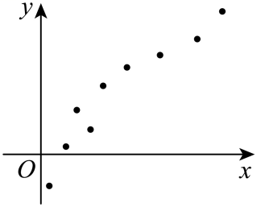

## 讲解

### 判据与流程

给散点图和若干候选模型时，先判观测范围里的总体形状，再核候选函数定义域、值域与参数条件。图上趋势是模型选择证据，不是精确数据表，也不自动证明模型在图外正确。

先看上升或下降、变化是否大致恒定、是否先快后慢/先慢后快、有无拐弯。近直线可候选a+bx，增长放缓可候选a+b ln x，正响应指数模型可能适合加速或趋近固定水平的形状；必须连同参数符号讨论，不能只见“指数”就断言增长。

其次看观测符号和范围。x>0时固定a的a xᵇ、a e^{bx}等符号由a决定；若图有正负响应，它们不能用同一a跨符号。ln x要求x>0，√x要求x≥0。k aˣ+b在k>0、0<a<1时递减并趋近b，与直线恒速下降不同。

最后结合题给统计量或残差评价候选；若题目只让选模型类型，就在图所支持的层面结论，不从无刻度散点补造精确坐标。若变换参数未知，先固定/估计它再作线性化，不能假装整列变换数据已知。

## 例题

### 原例：HSMA-B5-C8-Dc61681467287-P0074–P0079

**原题、原答案、原思路与原详解**（原次序保留，按原XML恢复表格；公式等价规范转写）：

【例2】（24-25高二下·全国·课后作业）若两个变量的散点图如图，可考虑用如下函数进行拟合比较合理的是（    ）

  

A．$y=a\cdot {x}^{b}$  B．$y=a\cdot {e}^{bx}$  C．$y=a+b\ln x$  D．$y=a\cdot {e}^{\frac{b}{x}}$

【解题思路】由图可知函数的函数值既可以为正，也可为负，结合选项分析即可得到答案.

【解答过程】由散点图可知，此曲线类似对数函数型曲线，因此可用函数$y=a+b\ln x$模型进行拟合，而选项A、B、D中函数值只能为负或只能为正，所以不符合散点图.

故选：C.

**补讲与条件核验**

原图中的观测x均为正，y既有负值也有正值，且整体呈先快后缓的上升形状。A的a xᵇ在x>0的实数幂意义下，xᵇ>0，符号由固定a决定；B、D的指数因子也恒正，符号同样只能由a决定，所以不能同时拟合图中的正负响应。C的a+b ln x允许平移跨过0，并在b>0时递增且增长放缓，因而原选C。

图只支持该样本范围内的模型类型判断，并未给足精确坐标来求a、b；不从图上捏造数据。对数模型要求x>0；即便类型合适，也还需计算系数和看残差来评价实际拟合。

### 原例：HSMA-B5-C8-Dc61681467287-P0501–P0514

**原题、原答案、原思路与原详解**（原次序保留，按原XML恢复表格；公式等价规范转写）：

【变式8-1】（2025高三·全国·专题练习）中国茶文化博大精深，茶水的口感与茶叶类型和水的温度有关为了建立茶水温度$y$随时间$x$变化的函数模型，小明每隔$1$分钟测量一次茶水温度，得到若干组数据$\left( {x}_{1},{y}_{1}\right)$、$\left( {x}_{2},{y}_{2}\right)$、$\cdots $、$\left( {x}_{n},{y}_{n}\right)$，绘制了如图所示的散点图．小明选择了如下$2$个函数模型来拟合茶水温度$y$随时间$x$的变化情况，函数模型一：$y=kx+b\left( k<0,x\ge 0\right)$；函数模型二：$y=k{a}^{x}+b\left( k>0,0<a<1,x\ge 0\right)$，下列说法不正确的是（    ）

A．变量$y$与$x$具有负的相关关系

B．由于水温开始降得快，后面降得慢，最后趋于平缓，故模型二能更好的拟合茶水温度随时间的变化情况

C．若选择函数模型二，利用最小二乘法求得到$y=k{a}^{x}+b$的图象一定经过点$\left( \overline{x},\overline{y}\right)$

D．当$x=5$时，通过函数模型二计算得$y=65.1$，用温度计测得实际茶水温度为$65.2$，则残差为$0.1$

【解题思路】根据题中所给散点图，根据正负相关的概念即可判断A选项；根据水温的变化情况，以及指数函数的单调性，即可判断B选项；根据最小二乘法可求出的回归方程一定经过$\left( \overline{{a}^{x}},\overline{y}\right)$，即可判断C选项；根据残差的定义可判断D选项．

【解答过程】对于A选项，观察散点图，变量$x$与$y$具有负的相关关系，A对；

对于B选项，由于函数模型二中的函数$y=k{a}^{x}+b\left( k>0,0<a<1,x\ge 0\right)$，

在$x\ge 0$时，函数单调递减，且递减速度越来越慢，

所以，模型二能更好的拟合茶水温度随时间的变化情况，B对；

对于C选项，若选择函数模型二，利用最小二乘法求出的回归方程一定经过$\left( \overline{{a}^{x}},\overline{y}\right)$，C错；

对于D选项，根据残差的定义可知，残差$=$真实值$-$预测值，故残差为$65.2-65.1=0.1$，D对.

故选：C.

**补讲与条件核验**

A由原图的整体降温趋势判断为负相关；B描述开始降得较快、以后放慢，k>0且0<a<1的k aˣ+b在x增加时递减，并趋向b，符合这种形状。图只能初选模型，不能证明未来一直照此变化。D用观测减预测：65.2−65.1=0.1 ℃，符号正确。原答案C保留。

C不能把原变量均值点直接套到非线性曲线。若先固定a、设uᵢ=a^{xᵢ}，含截距OLS线是ŷ=k̂u+b̂，它通过(ū,ȳ)；还原到原x,y平面，对应横坐标应解a^{x_*}=ū，得到x_*=ln ū/ln a，并不是ū，更不必等于x̄。原P0507/P0512写“回归方程一定经过(mean(aˣ),ȳ)”未说明是u,y坐标平面；作为原x,y曲线上的点并不正确，原文与规范解释分列。

若a也未知，就不能把u=aˣ当作一列预先固定的解释数据一次套线性公式来估计全部k,a,b。需要先给a或另做参数搜索/非线性拟合；本题只辨析性质，不要求拟合三个参数。

## 易错

- 同一形状可有多种近似模型，题给参数/选项/范围共同决定当前答案。
- 原图与汇总表有冲突时记录疑点，不能重画或篡改表去让模型吻合。

## 来源

原件：专题8.2 一元线性回归模型及其应用【九大题型】（举一反三）（人教A版2019选择性必修第三册）（解析版）.docx。

知识与分类口径：HSMA-B5-C8-Dc61681467287-P0016–P0024；HSMA-B5-C8-Dc61681467287-P0157–P0182；相关题型的分类和所选原例见各例精确定位。

