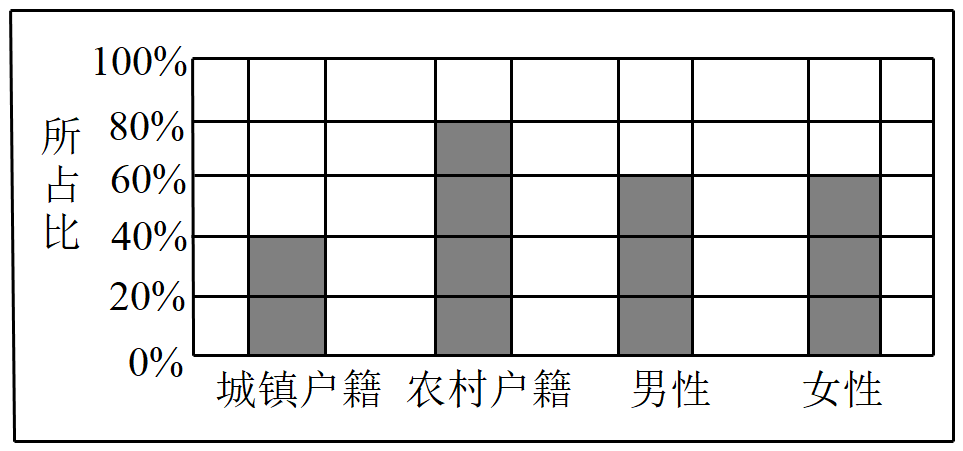

## 讲解

### 判据与流程

题目说“从全部样本任取”“已知来自某组”“某组中的比例”时，先定可选范围，再定分母。表中a同时属于X=x₁、Y=y₁，总数n，则a/n是联合频率，a/(a+b)是第一行组内频率。

1. 将文字事件完整写成“且”或“在……条件下”。满意且男性是交叉格；已知男性再看满意，先缩至男性行或列。
2. 数出该范围的总对象数。全体用n，特定组用该组边际。组边际0时，条件比例没有定义，不能填0代替。
3. 数满足目标条件的对象，以“目标频数/可选范围频数”计算。多个互斥格构成目标时先相加分子，原因是不会重复计人。
4. 判断这是固定名单中的等可能抽取，还是由样本估计总体概率。前者在所给名单上精确；后者需抽样代表性及估计误差说明。

不同组的组内比例要用各组自身分母，不能为了比较方便统一除n；统一除n会比较联合频率，与目标发生率不同。

## 易错

- “满意且男”的2/5、“是男”的1/2、“男性中满意”的4/5在同一原表里是三个不同量。
- 两组同频率且总数不同，目标人数仍不同。
- 没有随机选取机制时，不能把描述频率擅称一次随机试验的精确概率。

## 例题

### 原例：例7：满意且男性的选取范围

来源：HSMA-B5-C8-D9e1bd0cb65d9-P0599-P0626。原件：专题8.3 列联表与独立性检验【八大题型】（举一反三）（人教A版2019选择性必修第三册）（解析版）.docx。

#### 原题与原解（完整保留）

【例7】（2024高三·全国·专题练习）为了调查各参赛人员对主办方的满意程度，研究人员随机抽取了500名参赛运动员进行调查，所得数据如下表所示，现有如下说法：①在参与调查的500名运动员中任取1人，抽到对主办方表示满意的男性运动员的概率为$\frac{1}{2}$；②在犯错误的概率不超过$1\%$的前提下，可以认为“是否对主办方表示满意与运动员的性别有关”；③在犯错误的概率不超过$1\%$的前提下，不可以认为“是否对主办方表示满意与运动员的性别有关”；则正确命题的个数为（    ）

|  | 男性运动员（人） | 女性运动员（人） |
| --- | --- | --- |
| 对主办方表示满意 | 200 | 220 |
| 对主办方表示不满意 | 50 | 30 |

注：

| $P\left( {χ}^{2}\ge k\right)$ | 0.600 | 0.050 | 0.010 | 0.001 |
| --- | --- | --- | --- | --- |
| $k$ | 2.706 | 3.841 | 6.635 | 10.828 |

A．0  B．1  C．2  D．3

【解题思路】先根据表格计算满意的男性运动员的概率为$P=\frac{200}{500}=\frac{2}{5}$判断①，再根据${χ}^{2}=\frac{125}{21}\approx 5.952<6.635$判断②③即可.

【解答过程】因为对主办方表示满意的男性运动员的人数为$200$，

所以在参与调查的500名运动员中任取1人，抽到对主办方表示满意的男性运动员的概率为$P=\frac{200}{500}=\frac{2}{5}$，所以命题①错误，

又因为${χ}^{2}=\frac{500\times {(200\times 30-50\times 220)}^{2}}{420\times 80\times 250\times 250}=\frac{125}{21}\approx 5.952<6.635$，

所以在犯错误的概率不超过$1\%$的前提下，不可以认为“是否对主办方表示满意与运动员的性别有关”；所以命题②错误，命题③正确.

故选：B.

#### 补讲与资料勘误

随机从全部500名被调查者等可能取1人，满意且男性是200/500=2/5，所以①错误。1/2是男性占全部样本的比例250/500，既不是满意男性的联合概率，也不是“已知男性”的满意概率200/250=4/5。必须先写选取范围。

按四格200、220、50、30，χ²=500×(6000−11000)²/(420×80×250×250)=125/21≈5.952。它小于6.635，α=.01未拒绝H₀，所以②错误、③正确；③只说在此水平不能认为有关，不可延伸为证明无关，原答案B。

原表.600与2.706配对实际见XML，照留并提示：同源多数表为.100配2.706；这里的.600是误植，本题使用.010列，不受其影响。样本是随机抽取运动员，推论限定所研究参赛人员总体；“是否满意”差异不证明性别造成满意度差异。

### 原例：变式3-3：同频率和不同组总数

来源：HSMA-B5-C8-D9e1bd0cb65d9-P0301-P0312。原件：专题8.3 列联表与独立性检验【八大题型】（举一反三）（人教A版2019选择性必修第三册）（解析版）.docx。

#### 原题与原解（完整保留）

【变式3-3】（24-25高二下·吉林·阶段练习）为了解户籍性别对生育二胎选择倾向的影响，某地从育龄人群中随机抽取了容量为100的调查样本，其中城镇户籍与农村户籍各50人，男性40人，女性60人，绘制不同群体中倾向选择生育二胎与选择不生育二胎的人数比例图（如图所示），其中阴影部分表示倾向选择生育二胎的对应比例，则关于样本下列叙述中正确的是（    ）

A．是否倾向选择生育二胎与户籍无关

B．是否倾向选择生育二胎与性别有关

C．倾向选择生育二胎的人员中，男性人数与女性人数相同

D．倾向选择不生育二胎的人员中，农村户籍人数少于城镇户籍人数

【解题思路】结合所给比例图，依次分析判断4个选项即可.

【解答过程】对于A，城镇户籍中$40\%$选择生育二胎，农村户籍中$80\%$选择生育二胎，相差较大，则是否倾向选择生育二胎与户籍有关，A错误；

对于B，男性和女性中均有$60\%$选择生育二胎，则是否倾向选择生育二胎与性别无关，B错误；

对于C，由于男性和女性中均有$60\%$选择生育二胎，但样本中男性40人，女性60人，则倾向选择生育二胎的人员中，男性人数与女性人数不同，C错误；

对于D，倾向选择不生育二胎的人员中，农村户籍有$50\times 20\%=10$人，城镇户籍有$50\times 60\%=30$人，农村户籍人数少于城镇户籍人数，D正确.

故选：D.

#### 补讲与资料勘误

户籍两组各50人，选择生育二胎的样本人数分别50×0.4=20、50×0.8=40；不选择人数分别30、10，所以D正确，A与样本组内比例差异不符。性别两组总人数不同：男性40人、女性60人，两组选择比例都是0.6，因此对应人数24、36，C错误。B声称样本性别比例有差异，与图不符。

原解写“与性别无关”照留，补讲只说本样本两个性别组选择频率相同。样本表中比例相等（ad=bc）不等于总体概率已精确相等；原题未给抽样误差或检验水平，不能证明总体必然独立。户籍差异也只是关联线索，不是户籍造成选择的因果证据。
