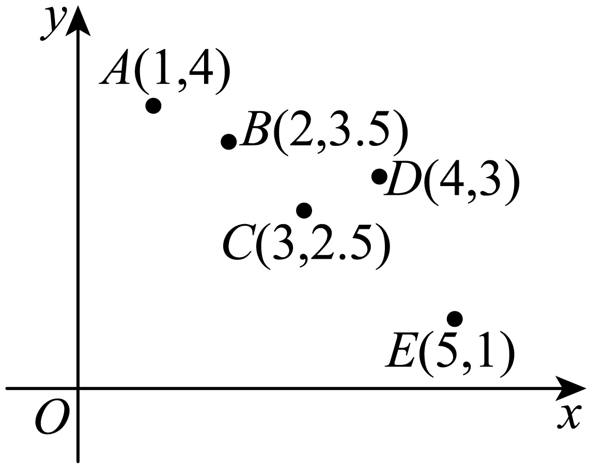

## 讲解

### 判据与流程

异常点是相对于样本主要模式明显偏离的观测。它可能是录入问题，也可能是真实有意义的情况，不能只为提高|r|随意删除。题目明确指定删某点时，应把删前删后的数据当作两套配对样本比较。每一套分别记两均值x̄、ȳ，定义Sxx=Σ(x_i−x̄)²、Syy=Σ(y_i−ȳ)²、Sxy=Σ(x_i−x̄)(y_i−ȳ)，再用r=Sxy/√(SxxSyy)。

1. 实际读取原图坐标，确认删除对象，再核剩余样本数≥2、两列不恒定。
2. 删前、删后分别求均值与三中心化和。删除一个点通常同时改变均值、分子、分母，不能只从旧乘积和减去该点旧偏差乘积。
3. 分别算r；方向比较符号，线性强弱比较|r|。负相关增强时，r会更负，即数值可能减小。
4. 原题涉及残差平方和时，用同一拟合口径另核。残差是实际y减直线预测y。对直线y=b x+a，固定b时，平方和可拆成Σ[(y_i−b x_i)−(ȳ−b x̄)]²+n[(ȳ−b x̄)−a]²，因为第一部分偏差之和为0，交叉项抵消。因此a=ȳ−b x̄使其最小。余下Syy−2bSxy+b²Sxx，再对b配方得最小值Syy−Sxy²/Sxx。

对同一数据删点，旧拟合线在余下数据上的平方和不会比原全数据更大，新拟合的最小平方和又不会比这条旧线在余下数据的平方和更大。这个理由与单位相同的删点过程有关，不能把不同样本的|r|大小直接当残差平方和大小的判据。

## 例题

### 原例（HSMA-B5-C8-D9f1692bb6096-P0196—P0206）

**原题与原解析（保留）**

【变式4-2】（23-24高二下·黑龙江哈尔滨·期末）已知5个成对数据$\left( x,y\right)$的散点图如下，若去掉点$D\left( 4,3\right)$，则下列说法正确的是（   ）

A．变量x与变量y呈正相关  B．变量x与变量y的相关性变强

C．残差平方和变大  D．样本相关系数r变大

【解题思路】根据已知条件，结合变量间的相关关系，结合图象分析判断即可.

【解答过程】由散点图可知，去掉点$D\left( 4,3\right)$后，$y$与$x$的线性相关加强，且为负相关，

所以B正确，A错误；

由于$y$与$x$的线性相关加强，所以残差平方和变小，所以C错误，

由于$y$与$x$的线性相关加强，且为负相关，所以相关系数的绝对值变大，

而相关系数为负的，所以样本相关系数r变小，所以D错误.

故选：B.

### 补讲

实际原图给出A(1,4)、B(2,3.5)、C(3,2.5)、D(4,3)、E(5,1)。删D前，均值为3、2.8，中心化平方和Sxx=10、Syy=5.3，乘积和Sxy=−6.5，故r=−6.5/√53，约−0.8928。

删D后，四对数据的均值变为2.75、2.75，Sxx=8.75、Syy=5.25、Sxy=−6.75，故r=−6.75/√(8.75×5.25)，约−0.9959。两次均为负，排除A；绝对值增大，B正确；r从约−0.8928降到约−0.9959，排除D。

C涉及竖直残差：对候选直线y=b x+a，先令它经过样本中心（这是固定b时使平方和最小的a），误差和变为Syy−2bSxy+b²Sxx。配方得到最小值Syy−Sxy²/Sxx。两批数据分别得43/40与3/70，确实变小，所以C错误。此解释只核本题选项；残差是“实际y−直线上预测y”，残差平方和有原y单位的平方。一般不能仅凭|r|较大就说不同数据集的残差平方和较小。

### 资料说明（与原解分开）

原P0203以“线性相关加强”直接推出残差平方和变小，这个理由一般不成立：|r|不受正单位缩放影响，残差平方和却会随y单位的平方变化。本题实际坐标的最小二乘平方和确由43/40降为3/70，因此原B答案可保留；用同一删点过程与实际计算说明C，而不沿用无条件的推断。

## 易错

r增加与|r|增加不是一件事；图形观察后仍按实际新样本核，删除真实点也须有题目或研究理由。

## 来源

原件：专题8.1 成对数据的统计相关性【六大题型】（举一反三）（人教A版2019选择性必修第三册）（解析版）.docx；来源 ID：D9f1692bb6096。

知识与分类定位：HSMA-B5-C8-D9f1692bb6096-P0175—P0214。

选用原例：HSMA-B5-C8-D9f1692bb6096-P0196—P0206。
