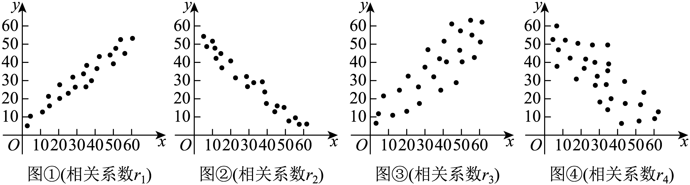

## 讲解

### 判据与流程

样本相关系数r在两列都不恒定时定义，范围[−1,1]。r的符号负责方向，|r|负责本章的线性强弱；两种比较不能混成一次大小比较。

1. 先核r是否有定义及数值是否在合法范围内，再按正负分组。r=0只说明样本线性积和为0，不判独立。
2. 比较强弱，把每个r换成|r|，更接近1的线性关系更强。
3. 需要把带符号的r排序时，正数绝对值越大越大，负数绝对值越大反而越小；最后合并为负数<0<正数。
4. 根据散点图定性比较时，要看是否贴近直线、读准横纵轴的范围和尺度，不从曲线很明显就推出|r|接近1，不从屏幕带宽捏造精确r。

|r|较大并不自动说明数据预测误差的原单位数值更小，更不能说明因果作用更强。诸如|r|>0.8称“强”的阈值应按题目或教材经验口径使用，不当通用定理。

## 例题

### 原例（HSMA-B5-C8-D9f1692bb6096-P0176—P0185）

**原题与原解析（保留）**

【例4】（23-24高二下·山西大同·期中）对两个变量$x,y$进行线性相关性检验，得线性相关系数${r}_{1}=0.958$，对两个变量$u,v$进行线性相关性检验，得线性相关系数${r}_{2}=-0.974$，则下列判断正确的是（    ）

A．变量$x$与变量$y$正相关，变量$u$与变量$v$负相关，变量$x$与变量$y$的线性相关性更强

B．变量$x$与变量$y$负相关，变量$u$与变量$v$正相关，变量$x$与变量$y$的线性相关性更强

C．变量$x$与变量$y$负相关，变量$u$与变量$v$正相关，变量$u$与变量$v$的线性相关性更强

D．变量$x$与变量$y$正相关，变量$u$与变量$v$负相关，变量$u$与变量$v$的线性相关性更强

【解题思路】根据相关系数的符号的正负决定两个变量的正相关、负相关，以及相关系数绝对值越大，两个变量的线性相关性越强，进而可得出结论.

【解答过程】由线性相关系数${r}_{1}=0.958>0$知$x$与$y$正相关，

由线性相关系数${r}_{2}=-0.974<0$知$u$与$v$负相关，

又$\left| {r}_{1}\right|<\left| {r}_{2}\right|$，所以变量$u$与变量$v$的线性相关性比变量$x$与变量$y$的线性相关性更强．

故选：D．

### 补讲

把问题拆成方向和强弱两次判断。r₁=0.958>0说明x、y正相关；r₂=−0.974<0说明u、v负相关。比较线性强弱则比较绝对值：0.974>0.958，所以u、v的线性相关更强，选D。

−0.974在数轴上比0.958小，并不表示关联更弱。“更强”是在本题用|r|衡量样本线性贴近程度的含义，不是因果更强，也不自动说明预测误差的绝对量更小。

### 原例（HSMA-B5-C8-D9f1692bb6096-P0186—P0195）

**原题与原解析（保留）**

【变式4-1】（23-24高二下·云南曲靖·阶段练习）对四组数据进行统计，获得如图散点图，关于其相关系数的比较，正确的是（    ）

A．${r}_{2}<{r}_{4}<0<{r}_{3}<{r}_{1}$  B．${r}_{4}<{r}_{2}<0<{r}_{1}<{r}_{3}$

C．${r}_{4}<{r}_{2}<0<{r}_{3}<{r}_{1}$  D．${r}_{2}<{r}_{4}<0<{r}_{1}<{r}_{3}$

【解题思路】根据散点图和相关系数的概念和性质辨析即可.

【解答过程】由散点图可知，相关系数${r}_{2},{r}_{4}$所在散点图呈负相关，${r}_{1},{r}_{3}$所在散点图呈正相关，所以${r}_{1},{r}_{3}$都为正数，${r}_{2},{r}_{4}$都为负数．

${r}_{1},{r}_{2}$所在散点图近似一条直线上，线性相关性比较强，相关系数的绝对值越接近$1$，

而${r}_{3},{r}_{4}$所在散点图比较分散，线性相关性比较弱，相关系数的绝对值越远离$1$．

综上可得：${r}_{2}<{r}_{4}<0<{r}_{3}<{r}_{1}$．

故选：A．

### 补讲

先按整体方向分组：r₁、r₃为正，r₂、r₄为负。然后在同方向内比较线性贴近程度：图1、图2的点更贴近一条直线，所以|r₁|>|r₃|、|r₂|>|r₄|。正数的绝对值大者数值大，故r₃<r₁；负数的绝对值大者数值反而小，故r₂<r₄。两组在0的两侧，合起来就是r₂<r₄<0<r₃<r₁，选A。

本题依据原图明显的集中程度作定性排序，不能从图片推造四个精确数值。不同坐标尺度的图不能只比屏幕上“带子有多窄”，应看数据中心化并标准化后的线性关系。

## 易错

负相关变强常表现为r更小而|r|更大；关联方向与强弱分别落笔。

## 来源

原件：专题8.1 成对数据的统计相关性【六大题型】（举一反三）（人教A版2019选择性必修第三册）（解析版）.docx；来源 ID：D9f1692bb6096。

知识与分类定位：HSMA-B5-C8-D9f1692bb6096-P0167—P0174, HSMA-B5-C8-D9f1692bb6096-P0175—P0214。

选用原例：HSMA-B5-C8-D9f1692bb6096-P0176—P0185, HSMA-B5-C8-D9f1692bb6096-P0186—P0195。
