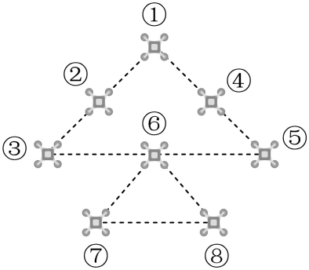

## 错法

甲喜欢2种礼物、乙喜欢3种、丙有10种可拿，直接写2×3×10；或三组无人机用4色，选完第一组、第二组后，最后一组都一律有3种。这里前面的选择实际改变了后面可用数，把不同历史混在一个统一因子里，计入了不合法过程或漏掉合法过程。

## 正解

乘法不是要求每步的候选集合相同，而是要求每个此前合法历史的候选数都相同。礼物各仅一个：甲取牛使乙只剩2种，甲取马使乙仍有3种，故按甲的两个选择先分类；每类丙都是从剩下10个中选，再得2×10+3×10=50。

无人机三色块中最后一组不能与前面任何组同色。前两组同色时只禁1色，余3种；前两组异色时禁2色，余2种，因此先分同色或异色，再数4×(1×3+3×2)=36。需要扣的是已用的不同颜色数，而不是无条件按前面有两组就扣2。

修正流程：记录一条合法前史，列下一步候选；改变可能影响候选数的前选，核候选大小是否仍一样。若改变，找出改变数目的条件作互斥分类，各类内再统一相乘。原题可能允许前后约束，这和概率独立不独立不是同一个问题。

## 例题

### 原例（HSMA-B5-C6-Db56fff5df4b6-P0182—P0189）

**原题与原解析（保留）**

【变式3-3】（23-24高二下·广东韶关·期中）中国有十二生肖，又叫十二属相，每一个人的出生年份对应了十二种动物（鼠､牛､虎､兔､龙､蛇､马､羊､猴､鸡､狗､猪）中的一种.现有十二生肖的吉祥物各一个，已知甲同学喜欢牛､马，乙同学喜欢牛､狗和羊，丙同学所有的吉祥物都喜欢，让甲乙丙三位同学依次从中选一个作为礼物珍藏，若各人所选取的礼物都是自己喜欢的，则不同的选法有（    ）

A．90种  B．80种  C．60种  D．50种

【解题思路】根据题意，按甲的选择不同分成2种情况讨论，求出确定乙，丙的选择方法，即可得每种情况的选法数目，由分类加法计数原理，即可求出答案.

【解答过程】根据题意，分2种情况讨论：

①若甲选择牛，此时乙的选择有2种，丙的选择有10种，此时有$2\times 10=20$种不同的选法：

②若甲选择马，此时乙的选择有3种，丙的选择有10种，此时有$3\times 10=30$种不同的选法：

则共有$20+30=50$种选法.

故选：D.

### 补讲

十二个吉祥物各仅一个，甲拿走的礼物不能再给乙。甲牛时，乙原先喜欢的牛已经被取走，只剩狗、羊2种；甲马时，乙喜欢的牛、狗、羊都还在，有3种。无论前两人如何合法选择，都取走了两个不同礼物，丙喜欢剩下的全部10个。故按甲牛与甲马这两个完整而互斥的分支相加，2×10+3×10=50。写2×3×10会把“甲取牛而乙仍取牛”的不合法过程计入。

### 原例（HSMA-B5-C6-Db56fff5df4b6-P0107—P0115）

**原题与原解析（保留）**

【变式2-2】（24-25高三上·重庆·阶段练习）如图，无人机光影秀中，有$8$架无人机排列成如图所示，每架无人机均可以发出$4$种不同颜色的光，$1$至$5$号的无人机颜色必须相同，$6$、$7$号无人机颜色必须相同，$8$号无人机与其他无人机颜色均不相同，则这$8$架无人机同时发光时，一共可以有（    ）种灯光组合.

A．$48$  B．$12$  C．$18$  D．$36$

【解题思路】对$6$、$7$号无人机颜色与$1$至$5$号的无人机颜色是否相同进行分类讨论，再由分类加法和分步乘法计数原理计算可得结果.

【解答过程】根据题意可知，$1$至$5$号的无人机颜色有4种选择；

当$6$、$7$号无人机颜色与$1$至$5$号的无人机颜色相同时，$8$号无人机颜色有3种选择；

当$6$、$7$号无人机颜色与$1$至$5$号的无人机颜色不同时，$6$、$7$号无人机颜色有3种选择，$8$号无人机颜色有2种选择；

再由分类加法和分步乘法计数原理计算可得共有$4\times \left( 1\times 3+3\times 2\right)=36$种.

故选：D.

### 补讲

把1至5号合并为色块U，把6、7号合并为色块V，8号记为W。同组的编号不同但颜色必须相同，所以选定U、V、W三种颜色便唯一确定8架飞机的全部发光状态。U有4种选择；V与U同色时V只有1种、W排除这1种颜色有3种；V与U异色时V有3种、W排除2种已用颜色有2种。两类互斥且覆盖所有V，故共有4×(1×3+3×2)=36种。W的候选数会随前两组是否同色改变，不能在未分类时一律写3或2。图中连线仅示队形；限制来自题干的同组同色与8号异色，不是所有连线两端异色。

## 来源

原件：专题6.1 分类加法计数原理与分步乘法计数原理【八大题型】（举一反三）（人教A版2019选择性必修第三册）（解析版）.docx；来源 ID：Db56fff5df4b6。

知识与分类定位：HSMA-B5-C6-Db56fff5df4b6-P0015—P0056, HSMA-B5-C6-Db56fff5df4b6-P0107—P0115, HSMA-B5-C6-Db56fff5df4b6-P0182—P0189。

选用原例：HSMA-B5-C6-Db56fff5df4b6-P0182—P0189, HSMA-B5-C6-Db56fff5df4b6-P0107—P0115。
