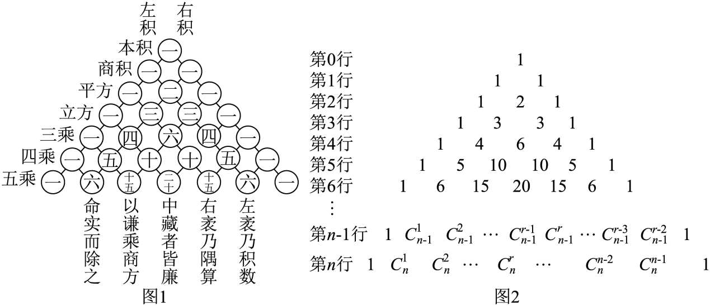

## 错法

不看原图行号，把第一条可见行当第 1 行；把“第 r 个数”写成 Cₙʳ；用递推式时在两端写出负阶乘或下标大于 n 的阶乘式；连续三数比解方程后不查它们是否真的存在。

## 正解

先固定原图约定。所选原例图2明确第 0 行单个 1，第 n 行 n+1 个数，第 r 个数是 Cₙʳ⁻¹。第三个数 Cₙ² 从 n=2 才存在；中央最大下标转项序仍需加 1。

递推 Cₙʳ=Cₙ₋₁ʳ⁻¹+Cₙ₋₁ʳ 在内部 1≤r≤n−1 使用，两端另为 1。若为求和说明方便定义越界组合数为 0，要标这是扩展记号，不写负阶乘。跨行第三个数求和的规范起点可从 C₂²=C₃³ 开始，逐次用 Cₙ³+Cₙ²=Cₙ₊₁³；从较高行起则减去被省略的低行部分。

连续三数设 Cₙᵏ⁻¹、Cₙᵏ、Cₙᵏ⁺¹ 时，合法条件是 n≥2、1≤k≤n−1。原题给比 3:8:14，解得 n=10,k=3 后回代三数 45,120,210；正整数范围与原比例都满足，才说明存在。

行号约定可以不同，计算本身并不矛盾；错的是换了约定却未相应改组合数下标和求和首尾。

## 例题

### 【变式11-3】：杨辉三小问

来源：HSMA-B5-C6-D8ee685bf3cd9-P0414-P0431。原件：专题6.3 二项式定理【十一大题型】（举一反三）（人教A版2019选择性必修第三册）（解析版）.docx。

#### 原题与原解（完整保留）

【变式11-3】（24-25高二上·上海浦东新·期中）杨辉是中国南宋末年的一位杰出的数学家、教育家，杨辉三角是杨辉的一项重要研究成果.杨辉三角中蕴藏了许多优美的规律，它的许多性质与组合数的性质有关，图1为杨辉三角的部分内容，图2为杨辉三角的改写形式

(1)求图2中第11行的各数之和；

(2)从图2第2行开始，取每一行的第3个数一直取到第100行的第3个数，求取出的所有数之和；

(3)在杨辉三角中是否存在某一行，使该行中三个相邻的数之比为3:8:14？若存在，试求出这三个数；若不存在，请说明理由.

【解题思路】（1）利用二项式系数的性质求和即可；

（2）利用${C}_{n}^{k}+{C}_{n}^{k-1}{=C}_{n+1}^{k}$的性质进行化简求和，得到答案；

（3）设在第$n$行存在三个相邻的数之比为3:8:14，从而得到方程组，求出答案.

【解答过程】（1）第11行的各数之和为${C}_{11}^{0}+{C}_{11}^{1}+{C}_{11}^{2}+\cdots +{C}_{11}^{11}={2}^{11}=2048$；

（2）杨辉三角中第2行到第100行，各行第3个数之和为

${C}_{2}^{2}+{C}_{3}^{2}+{C}_{4}^{2}+\cdots +{C}_{100}^{2}={C}_{3}^{3}+{C}_{3}^{2}+{C}_{4}^{2}+\cdots +{C}_{100}^{2}={C}_{4}^{3}+{C}_{4}^{2}+\cdots +{C}_{100}^{2}={C}_{101}^{3}$

$={C}_{101}^{3}=\frac{101\times 100\times 99}{3\times 2\times 1}=166650$；

（3）存在，理由如下：

设在第$n$行存在三个相邻的数${C}_{n}^{k-1}{,C}_{n}^{k}{,C}_{n}^{k+1}$，其中$k,n\in {N}^{\ast}$，且$k+1\le n$，$n\ge 2$，

${C}_{n}^{k-1}{,C}_{n}^{k}{,C}_{n}^{k+1}$之比为3:8:14，

故$\frac{{C}_{n}^{k-1}}{{C}_{n}^{k}}=\frac{3}{8},\frac{{C}_{n}^{k}}{{C}_{n}^{k+1}}=\frac{8}{14}$，化简得$\frac{k}{n-k+1}=\frac{3}{8},\frac{k+1}{n-k}=\frac{8}{14}$，

即$\left\{ \begin{aligned}8k=3n-3k+3\\14k+14=8n-8k\end{aligned}\right.$，解得$\left\{ \begin{aligned}k=3\\n=10\end{aligned}\right.$，

所以这三个数为${C}_{10}^{2}{=45,C}_{10}^{3}{=120,C}_{10}^{4}=210$.

#### 补讲与必要修正

原图2 从第 0 行的单个 1 开始，因此第 n 行为 Cₙ⁰,…,Cₙⁿ，第 r 个数对应下标 r−1。三问都按这一定义，而不按第一条画出来的行称第 1 行。原图第 n−1 行右侧末两个内项写为 $C_{n-1}^{r-3},C_{n-1}^{r-2}$，与该行标准尾项的下标不一致；规范尾项应为 $C_{n-1}^{n-3},C_{n-1}^{n-2}$。原图保留，此标记疑点不作为三问计算依据。

（1）令 (1+x)¹¹ 中 x=1，得到第 11 行和=2¹¹=2048。

（2）第 n 行第三个数是 Cₙ²，n≥2。利用 Cₙ³+Cₙ²=Cₙ₊₁³，作差得 Cₙ²=Cₙ₊₁³−Cₙ³。对 n=2,…,100 相加，中间的相邻项逐个抵消，剩 C₁₀₁³−C₂³；为避免下标超界，也可先用 C₂²=C₃³ 再逐步合并，得到 C₁₀₁³=166650。这里只在差分说明中约定越界组合数 C₂³=0；不把它写进阶乘式。

（3）连续三项必须有 1≤k≤n−1，n≥2。两个比式的分母均为正，可分别用阶乘消去公共因子：Cₙᵏ⁻¹/Cₙᵏ=k/(n−k+1)，Cₙᵏ/Cₙᵏ⁺¹=(k+1)/(n−k)。由给定比得 8k=3n−3k+3、14k+14=8n−8k；联立解得 k=3、n=10，整数范围满足。回代 C₁₀²=45、C₁₀³=120、C₁₀⁴=210，约去 15 得 3:8:14，证明存在。仅解方程而不回验正整数范围，不能作存在性结论。
