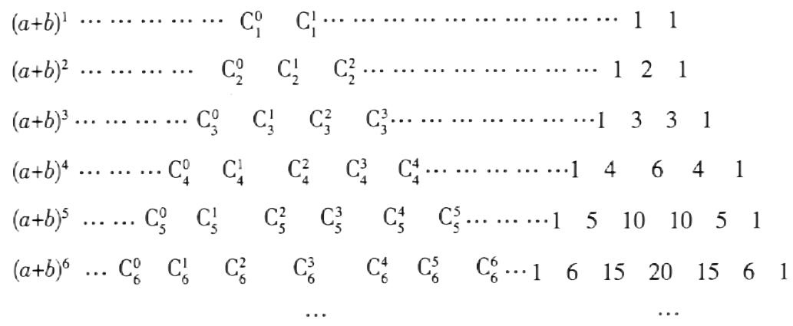

## 讲解

### 是什么

第 n 行二项式系数是 Cₙ⁰,Cₙ¹,…,Cₙⁿ，n 为非负整数。这组数左右对称，两端为 1，相邻两行内部的数等于上一行肩上两数之和；按这种排列形成杨辉三角。本条及所选原例约定第 0 行是单个 1，第 n 行有 n+1 个数，第 r 个数是 Cₙʳ⁻¹。

原知识表（HSMA-B5-C6-D8ee685bf3cd9-P0110-P0111）从 n=1 展示，但每行左列幂指数说明行号；不能把“画出的第一行”自动改称第 1 行后又改变指数。

### 怎么来的

对称性 Cₙʳ=Cₙⁿ⁻ʳ，来自“选 r 个”与“留下 n−r 个”的一一对应。递推式

$$C_n^r=C_{n-1}^{r-1}+C_{n-1}^{r}\quad(n\ge2,\ 1\le r\le n-1)$$

来自按一个指定元素选入或不选入分成两类：选入后从剩下 n−1 个再选 r−1 个，不选入则从剩下 n−1 个选 r 个，类不重叠且覆盖全部。两端 Cₙ⁰=Cₙⁿ=1 单独处理，不把不存在的阶乘写进公式。

相邻比为

$$\frac{C_n^{r+1}}{C_n^r}
=\frac{n!}{(r+1)!(n-r-1)!}\cdot\frac{r!(n-r)!}{n!}
=\frac{n-r}{r+1}\quad(0\le r\le n-1).$$

比例大于、等于、小于 1 分别对应 r<(n−1)/2、r=(n−1)/2、r>(n−1)/2。因此 n 为偶数时只有中央 Cₙⁿ⁄² 最大，项序 n/2+1；n 为奇数时中央两个相等且最大，下标 (n−1)/2、(n+1)/2，项序 (n+1)/2、(n+3)/2。n=0 时只有一个 1。

令 (1+x)ⁿ 中 x=1，得全行和 2ⁿ；n≥1 时再令 x=−1，得交替和 0，与全行和相加、相减得到偶、奇下标和各 2ⁿ⁻¹。

### 什么时候能用

用于读表、求行和、用连续三数之比反求行号，以及递推累加。原 P0120 的 (n+1)/2 可用来比较 Cₙᵏ 与前项 Cₙᵏ⁻¹；本条比较后项与当前项，因指标换了 1，阈值变为 (n−1)/2，并非两结论冲突。

中央最大只针对二项式系数，实际系数带常数幂或符号须另比较。奇偶和等分要求 n≥1；n=0 时偶下标和 1、奇下标和 0。若为便于求和约定越界组合数为 0，应说明这是记号扩展，不能代入含负阶乘的表达式。

## 易错

- “第 r 个数”误写 Cₙʳ，正确下标是 r−1。
- 混用两种相邻比的阈值；先写清比的是哪两项。
- 行号是幂指数，项序是位置编号，二者不能互换。

## 例题

### 【变式11-3】：杨辉三小问

来源：HSMA-B5-C6-D8ee685bf3cd9-P0414-P0431。原件：专题6.3 二项式定理【十一大题型】（举一反三）（人教A版2019选择性必修第三册）（解析版）.docx。

#### 原题与原解（完整保留）

【变式11-3】（24-25高二上·上海浦东新·期中）杨辉是中国南宋末年的一位杰出的数学家、教育家，杨辉三角是杨辉的一项重要研究成果.杨辉三角中蕴藏了许多优美的规律，它的许多性质与组合数的性质有关，图1为杨辉三角的部分内容，图2为杨辉三角的改写形式

(1)求图2中第11行的各数之和；

(2)从图2第2行开始，取每一行的第3个数一直取到第100行的第3个数，求取出的所有数之和；

(3)在杨辉三角中是否存在某一行，使该行中三个相邻的数之比为3:8:14？若存在，试求出这三个数；若不存在，请说明理由.

【解题思路】（1）利用二项式系数的性质求和即可；

（2）利用${C}_{n}^{k}+{C}_{n}^{k-1}{=C}_{n+1}^{k}$的性质进行化简求和，得到答案；

（3）设在第$n$行存在三个相邻的数之比为3:8:14，从而得到方程组，求出答案.

【解答过程】（1）第11行的各数之和为${C}_{11}^{0}+{C}_{11}^{1}+{C}_{11}^{2}+\cdots +{C}_{11}^{11}={2}^{11}=2048$；

（2）杨辉三角中第2行到第100行，各行第3个数之和为

${C}_{2}^{2}+{C}_{3}^{2}+{C}_{4}^{2}+\cdots +{C}_{100}^{2}={C}_{3}^{3}+{C}_{3}^{2}+{C}_{4}^{2}+\cdots +{C}_{100}^{2}={C}_{4}^{3}+{C}_{4}^{2}+\cdots +{C}_{100}^{2}={C}_{101}^{3}$

$={C}_{101}^{3}=\frac{101\times 100\times 99}{3\times 2\times 1}=166650$；

（3）存在，理由如下：

设在第$n$行存在三个相邻的数${C}_{n}^{k-1}{,C}_{n}^{k}{,C}_{n}^{k+1}$，其中$k,n\in {N}^{\ast}$，且$k+1\le n$，$n\ge 2$，

${C}_{n}^{k-1}{,C}_{n}^{k}{,C}_{n}^{k+1}$之比为3:8:14，

故$\frac{{C}_{n}^{k-1}}{{C}_{n}^{k}}=\frac{3}{8},\frac{{C}_{n}^{k}}{{C}_{n}^{k+1}}=\frac{8}{14}$，化简得$\frac{k}{n-k+1}=\frac{3}{8},\frac{k+1}{n-k}=\frac{8}{14}$，

即$\left\{ \begin{aligned}8k=3n-3k+3\\14k+14=8n-8k\end{aligned}\right.$，解得$\left\{ \begin{aligned}k=3\\n=10\end{aligned}\right.$，

所以这三个数为${C}_{10}^{2}{=45,C}_{10}^{3}{=120,C}_{10}^{4}=210$.

#### 补讲与必要修正

原图2 从第 0 行的单个 1 开始，因此第 n 行为 Cₙ⁰,…,Cₙⁿ，第 r 个数对应下标 r−1。三问都按这一定义，而不按第一条画出来的行称第 1 行。原图第 n−1 行右侧末两个内项写为 $C_{n-1}^{r-3},C_{n-1}^{r-2}$，与该行标准尾项的下标不一致；规范尾项应为 $C_{n-1}^{n-3},C_{n-1}^{n-2}$。原图保留，此标记疑点不作为三问计算依据。

（1）令 (1+x)¹¹ 中 x=1，得到第 11 行和=2¹¹=2048。

（2）第 n 行第三个数是 Cₙ²，n≥2。利用 Cₙ³+Cₙ²=Cₙ₊₁³，作差得 Cₙ²=Cₙ₊₁³−Cₙ³。对 n=2,…,100 相加，中间的相邻项逐个抵消，剩 C₁₀₁³−C₂³；为避免下标超界，也可先用 C₂²=C₃³ 再逐步合并，得到 C₁₀₁³=166650。这里只在差分说明中约定越界组合数 C₂³=0；不把它写进阶乘式。

（3）连续三项必须有 1≤k≤n−1，n≥2。两个比式的分母均为正，可分别用阶乘消去公共因子：Cₙᵏ⁻¹/Cₙᵏ=k/(n−k+1)，Cₙᵏ/Cₙᵏ⁺¹=(k+1)/(n−k)。由给定比得 8k=3n−3k+3、14k+14=8n−8k；联立解得 k=3、n=10，整数范围满足。回代 C₁₀²=45、C₁₀³=120、C₁₀⁴=210，约去 15 得 3:8:14，证明存在。仅解方程而不回验正整数范围，不能作存在性结论。
