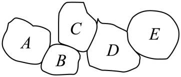
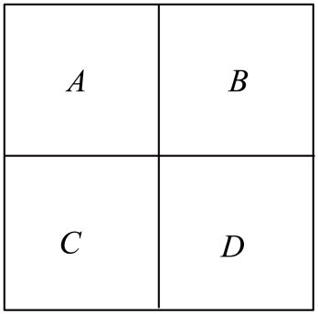

## 讲解

### 是什么

区域涂色先根据题目判定哪些区域相邻：常用的“相邻”是有公共边，仅有公共点通常不算。顶点涂色则按题干指定的棱或连线来禁止两端同色。把每个待涂位置记为一个点，必须异色的两位置用一条边连接，这种邻接记录只记限制关系，不以形状面积决定方案数。

可用q种可区分颜色。为某位置选色时，设已经涂色且与它相邻的位置实际用了s种不同颜色，则它有q−s种可用颜色。“邻点有几个”与“禁掉几种颜色”不能混为一谈：若多个邻点同色，它们共同只禁一种。

### 怎么来的

所选颜色不在这s种禁色中便满足它与已涂邻点的要求，所以从q种中排除这s种，剩q−s；后续还须检验它与后来位置的限制。若对每个既有合法历史s都相同，这步可以统一用q−s；若s可能不同，应按使s不同的颜色相等关系分类。

链由n个不同位置顺次连接，且只含相邻前后位置的边。q≥2、n≥1时按链序涂：第一个q种，余下每个只排除前一个的1种，因此共有q(q−1)ⁿ⁻¹。n=1且q≥1时就是q种，包含只有1色时的1种，不通过0⁰取值判断；q=1且n≥2时没有合法涂法。这个推导不能直接搬到环，因为环最后一个位置还与开头相邻，禁色数可能由前面两位置的同异色改变。

### 什么时候能用

先把所有必须异色的边列全；选择邻接简单的位置开始，逐位记录禁色。两邻点是否同色影响下一位可用数时，分“相同/不同”两个互斥分支，各分支分步计数后相加。重复用某颜色、是否必须用满某几色、旋转或镜像后是否算同种，都须依题意分别检查。没有“恰好使用全部颜色”的限制时，部分颜色可以不用。

通常原题中固定区域名或固定几何位置都可区分，颜色名称也可区分。旋转等价若另有约定，需要重新定义最终结果，不能盲除一个旋转数。

## 例题

### 原例（HSMA-B5-C6-Db56fff5df4b6-P0310—P0316）

**原题与原解析（保留）**

【例7】（23-24高二下·广东清远·期中）已知五个区域A，B，C，D，E依次相邻，如图所示，现在给这5个区域涂色，要求相邻的两个区域不能涂相同的颜色，现有5种不同的颜色可供选择，则不同的涂色方法有（    ）

A．1140  B．1200  C．1280  D．1400

【解题思路】根据给定条件，利用分步乘法计数原理列式计算即得.

【解答过程】依题意，分5步依次对$A,B,C,D,E$涂色，

所以不同的涂色方法有$5\times 4\times 4\times 4\times 4=1280$（种）.

故选：C.

### 补讲

实际公共边关系为A—B—C—D—E，不另有首尾公共边。固定按这个顺序涂，A有5种；之后每一个区域只需避开前一区域的1种颜色，均有4种，因此为5×4⁴=1280。较远区域可以同色，题目没有要求五区五色全用。原图B与D之间有间隙，不把它们额外当成相邻。各区域位置已固定、五种颜色可区分，涂好后某个区域变色便是不同结果；题目没有把旋转后或交换颜色名后的方案视为同一种，所以不另除旋转数或5的阶乘。

### 原例（HSMA-B5-C6-Db56fff5df4b6-P0317—P0328）

**原题与原解析（保留）**

【变式7-1】（2024高二下·江苏·学业考试）用红、黄、蓝、白、黑五种颜色在“田”字型的4个小方格内涂色，每格涂一种颜色，相邻两格涂不同的颜色，则不同的涂色方法共有（   ）

A．120  B．260  C．280  D．320

【解题思路】利用分类分步计数原理，分4步分别计算即可求得结果.

【解答过程】将“田”字型的4个小方格分别编号为$A,B,C,D$，如下图所示：

根据题意，将问题分成4步进行，

第一步：涂方格A，共有5种颜色选择，

第二步：涂方格B，需与A不同，共有4种颜色选择，

第三步：涂方格C，若方格C与方格B颜色相同，只有1种选择；若方格C与方格B颜色不同，则有3种选择；

第四步：涂方格D，当方格C与方格B颜色相同，方格D有4种颜色选择；当方格C与方格B颜色不同，方格D有3种颜色选择，

因此可得不同的涂色方法共有$5\times 4\times \left( 1\times 4+3\times 3\right)=260$种.

故选：B.

### 补讲

依原图A在左上、B右上、C左下、D右下，公共边关系是AB、AC、BD、CD；BC与AD只在中心点接触。A有5种、B有4种。C必须异于A，但可以同于B。

若C=B，C有1种，D只排除B这一个已用颜色，有4种；若C≠B，C也不能等于A，所以有3种，D必须排除B与C两个不同颜色，有3种。故5×4×(1×4+3×3)=260。这个环的最后一格同时接触两个前格，其禁色数依赖那两格是否同色，不能按链一律乘4。D与A可以同色，也不用强求用满五种颜色。

## 易错

- 区域点接触与公共边区别会改变邻接记录；原“田”字题的对角两格可同色。
- 数已涂邻点的不同颜色数，再扣候选数；不按邻点个数机械扣除。
- 无人机队形图的连线未必代表异色约束；本原理所用边应来自题目明确限制。
- 环的闭合边和三棱柱侧棱等都必须核入，不能只看某个底面或局部链。

## 来源

原件：专题6.1 分类加法计数原理与分步乘法计数原理【八大题型】（举一反三）（人教A版2019选择性必修第三册）（解析版）.docx；来源 ID：Db56fff5df4b6。

原件：专题6.6 计数原理全章十一大压轴题型归纳（拔尖篇）（举一反三）（人教A版2019选择性必修第三册）（解析版）.docx；来源 ID：D35338147471d。

原件：专题6.4 排列、组合的综合应用大题专项训练【七大题型】（举一反三）（人教A版2019选择性必修第三册）（解析版）.docx；来源 ID：Dc6e58dc87464。

知识与分类定位：HSMA-B5-C6-Db56fff5df4b6-P0028—P0056, HSMA-B5-C6-Db56fff5df4b6-P0310—P0345, HSMA-B5-C6-D35338147471d-P0017—P0032, HSMA-B5-C6-Dc6e58dc87464-P0409—P0423。

选用原例：HSMA-B5-C6-Db56fff5df4b6-P0310—P0316, HSMA-B5-C6-Db56fff5df4b6-P0317—P0328。
