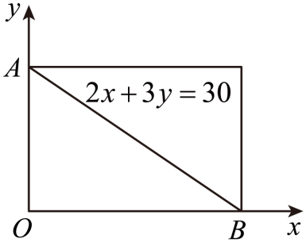

## 讲解

### 判据与流程

整点是横纵坐标均为整数的点。计数时先把图形内与边界的条件写成坐标范围，不能仅凭画出的网格估算；边界是否计入决定端点的取舍。

1. 解边界与坐标轴的交点，确定包含图形的有限矩形。整数横坐标从L到U且包含两端时有U−L+1种，纵坐标同理；矩形内两坐标任选一对便是一个点，能相乘。
2. 若图形是x≥0、y≥0、ax+by≤c，且a、b、c均正，逐行固定整数y=0,…,⌊c/b⌋。该行的整数x从0到⌊(c−by)/a⌋，所以行点数为⌊(c−by)/a⌋+1。⌊t⌋是不超过t的最大整数；每行互斥，所有行相加覆盖图形。
3. 或核是否存在把两侧非边界整点一一配对的对称变换。必须明确写出坐标映射，证它保整数、保总范围，并将一侧条件变为另一侧条件；图形视觉上“对称”不足以证明整点相等。
4. 对称法先从总数中剥离被两侧共享的分界线整点，再平分两側，最后根据题目是否含边界加回。分界线上点要解整数方程，不能用线段长直接代替点数。

若边界是严格不等式，不能原样使用闭区间取整公式；例如x<t且t是整数时，最大允许整数是t−1。非整数对称中心或坐标交换也需检查是否仍将整数点映到整数点。

## 例题

### 原例（HSMA-B5-C6-Db56fff5df4b6-P0225—P0233）

**原题与原解析（保留）**

【例5】（23-24高二下·安徽合肥·期中）在直角坐标系$xOy$中，已知$\triangle AOB$三边所在直线的方程分别为$x=0,y=0,2x+3y=30$，则$\triangle AOB$内部和边上整点（即横、纵坐标均为整数的点）的总数是（    ）

A．95  B．91  C．88  D．75

【解题思路】首先确定以$AB$为对角线的矩形中整点的个数，再确定$2x+3y=30$上的整点数，最后根据对称性求出△$AOB$中整点的个数.

【解答过程】由题设，直线$2x+3y=30$分别交x、y轴于$(15,0)$、$(10,0)$，

以高为10，宽为15的矩形内（含边）整数点有176个，其中直线$2x+3y=30$上的整数点有$(15,0)$、$(12,2)$、$(9,4)$、$(6,6)$、$(3,8)$、$(0,10)$，共6个，

所以，矩形对角线$AB$两侧的三角形中整点的个数为$\frac{176-6}{2}=85$个，

综上，△$AOB$中整点的个数为$85+6=91$个.

故选：B.

### 补讲

先由两轴上的截距得到0≤x≤15，0≤y≤10；三角形内与边界的条件是2x+3y≤30。矩形中整数横坐标有16个、整数纵坐标有11个，所以有176点；边界端点要算进去，不能只乘15×10。斜边上2x+3y=30使y为偶数，y=0,2,4,6,8,10，对应x=15,12,9,6,3,0，恰有6点。

原解的“对称性”具体是矩形中心的半周旋转T(x,y)=(15−x,10−y)。它把整数点仍映成整数点，连续施行两次回到原来的点；且2(15−x)+3(10−y)=60−(2x+3y)，因此把斜边一侧的非边界整点一一映到另一侧。除掉斜边6点后两侧各(176−6)/2=85，所求包含斜边，故85+6=91。

不使用对称性时，可逐行固定整数y=0,…,10，再数x=0,…,⌊(30−3y)/2⌋，该行有⌊(30−3y)/2⌋+1点；各行互斥且覆盖三角形，也能求同一个总数。这里⌊t⌋指不超过t的最大整数。

### 资料说明（与原解分开）

原P0228及document.xml对应OMML均把y轴交点写为(10,0)，这是原文误植，规范应为(0,10)：令x=0得3y=30。原图与P0230列举末点(0,10)均支持规范坐标，原最终91正确。上方原块保留(10,0)，本补讲使用规范式。

## 易错

- y轴点横坐标必须0；原例的(10,0)另列为原误植，不把误植当公式依据。
- 从0至15含端点有16个坐标值；点数不是线段单位长度。
- 对角线两侧加共同边界需防重复；所求含边界时只加回一次。

## 来源

原件：专题6.1 分类加法计数原理与分步乘法计数原理【八大题型】（举一反三）（人教A版2019选择性必修第三册）（解析版）.docx；来源 ID：Db56fff5df4b6。

知识与分类定位：HSMA-B5-C6-Db56fff5df4b6-P0015—P0056, HSMA-B5-C6-Db56fff5df4b6-P0224—P0233。

选用原例：HSMA-B5-C6-Db56fff5df4b6-P0225—P0233。
