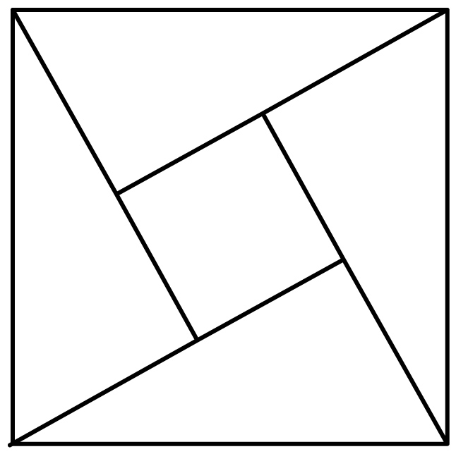
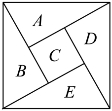
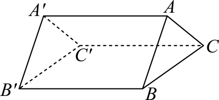

## 讲解

### 判据与流程

两个已涂邻点是否同色，会决定后续位置禁掉1种还是2种颜色。若按全图共用几种颜色分类，也必须使各类互斥完整，并在每类内部算清颜色分配到有名位置的数目。

1. 从题干或公共边列全异色关系，确定相邻位置不得同色、非相邻位置可能同色，后者只是“允许”而非“必须”。先选约束多且易确定的位置。
2. 涂一个位置前，列出其已经涂色邻点实际用过的不同颜色。没有共同颜色时逐一排除；有共同颜色时只排除一次。
3. 若后面可用数改变，按能改变禁色数的同色关系划类，如D=B或D≠B。相等分支通常有1种具体颜色；不同分支还须扣掉所有已禁颜色，而不只是扣掉B。
4. 每类逐步构造完整涂色，数清后对类相加；若按用几种颜色分类，须证明图的邻接限制使合法颜色数只能落在这些类，不能漏掉可少用的类。
5. 同图有不同小问时重新读约束。只约束两个三角形底面，不等于约束全部侧棱；后者新增三条禁色关系，所以方法数会减少。

排列记号若在原解析出现，可在本条补讲中直接解释为逐个有名位置选不同颜色的乘积。这里的任务是验证颜色约束和分类，不把一张图的所有颜色都强行视为互异。

## 例题

### 原例（HSMA-B5-C6-D35338147471d-P0017—P0032）

**原题与原解析（保留）**

2．（23-24高二下·安徽池州·期中）如图为我国数学家赵爽（约3世纪初）在为《周髀算经》作注时验证勾股定理的示意图，现在提供5种颜色给其中5个小区域涂色，规定每个区域只涂一种颜色，相邻区域颜色不相同，则不同的涂色方案种数为（    ）

A．120  B．26

C．340  D．420

【解题思路】根据题意，分4步依次分析区域A、B、C、D、E的涂色方法数目，由分步计数原理计算答案．

【解答过程】根据题意，如图，设5个区域依次为A、B、C、D、E，

分4步进行分析：

①，对于区域A，有5种颜色可选；

②，对于区域B，与A区域相邻，有4种颜色可选；

③，对于区域C，与A、B区域相邻，有3种颜色可选；

④，对于区域D、E，若D与B颜色相同，E区域有3种颜色可选，

若D与B颜色不相同，D区域有2种颜色可选，E区域有2种颜色可选，

则区域D、E有$3+2\times 2=7$种选择，

所以不同的涂色方案有$5\times 4\times 3\times 7=420$种.

故选：D.

### 补讲

按原标注图，中心区域C分别邻接A、B、D、E，四个外区的公共边组成A—B—E—D—A这个环。先涂A有5种，B要异于A有4种，C要异于A、B有3种。

接着D邻接A、C，故不能用这两种颜色。B色是它可以使用的一种：若D=B，D只有1种，E须避开B(=D)与C这两种颜色，尚有3种。若D≠B，则D已避开A、B、C三种颜色，仅2种；E要避开B、C、D三种不同颜色，也有2种。每种合法A、B、C选法都产生1×3+2×2=7种后续，故5×4×3×7=420。D与B没有公共边，不能先把它们强行规定异色。

### 原例（HSMA-B5-C6-Dc6e58dc87464-P0409—P0423）

**原题与原解析（保留）**

26．（2025高三·全国·专题练习）如图，用四种不同的颜色给三棱柱$ABC-{A}^{\prime}{B}^{\prime}{C}^{\prime}$的六个顶点涂色，要求每个点涂一种颜色．

(1)若每个底面的顶点涂色所使用的颜色不相同，则不同的涂色方法共有多少种？

(2)若每条棱的两个端点涂不同的颜色，则不同的涂色方法共有多少种？

【解题思路】（1）第一步，$A$、$B$、$C$三点所涂颜色各不相同，第二步，${A}^{\prime}$、${B}^{\prime}$、${C}^{\prime}$三点所涂颜色各不相同，结合分步乘法即可求得结果.

（2）分别研究${B}^{\prime},{A}^{\prime},A,C$用四种颜色或三种颜色或两种颜色涂色方法，结合分类计数、分步计数原理计算即可.

【解答过程】（1）由题得每个底面的顶点涂色所使用的颜色不相同，第一步，$A$、$B$、$C$三点所涂颜色各不相同的方法有${A}_{4}^{3}=24$（种），第二步，${A}^{\prime}$、${B}^{\prime}$、${C}^{\prime}$三点所涂颜色各不相同的方法有${A}_{4}^{3}=24$（种），

所以由分步计数原理，不同的涂色方法共有${A}_{4}^{3}\cdot {A}_{4}^{3}=24\times 24=576$（种）.

（2）若${B}^{\prime},{A}^{\prime},A,C$用四种颜色，即${B}^{\prime}$，${A}^{\prime}$，$A$，$C$各涂一种颜色，${C}^{\prime}$与$A$同色，$B$与${A}^{\prime}$同色，所以有${A}_{4}^{4}=24$（种）；

若${B}^{\prime},{A}^{\prime},A,C$用三种颜色，即第一类： ${B}^{\prime}$与$A$同色、${A}^{\prime}$、$C$各涂一种颜色，则${C}^{\prime}$只能涂剩余那种颜色，$B$可以与${A}^{\prime}$或${C}^{\prime}$同色，所以有${A}_{4}^{3}\times 1\times 2=48$（种），

第二类：${A}^{\prime}$与$C$同色、$A$、${B}^{\prime}$各涂一种颜色，则$B$只能涂剩余那种颜色，${C}^{\prime}$可以与$A$或$B$同色，所以有${A}_{4}^{3}\times 1\times 2=48$（种），

第三类：${B}^{\prime}$与$C$同色、${A}^{\prime}$、$A$各涂一种颜色，则${C}^{\prime}$可以涂剩余那种颜色或与$A$同色，$B$可以与${A}^{\prime}$同色或涂剩余那种颜色，所以有${A}_{4}^{3}\times 2\times 2=96$（种），

所以${B}^{\prime},{A}^{\prime},A,C$用三种颜色，有${A}_{4}^{3}\times 1\times 2\times 2+{A}_{4}^{3}\times 2\times 2=192$（种）；

若${B}^{\prime},{A}^{\prime},A,C$用两种颜色，即${B}^{\prime}$与$A$同色、${A}^{\prime}$与$C$同色各涂一种颜色，$B$可以涂剩余剩余两种颜色，$C$也可以涂剩余剩余两种颜色，所以有${A}_{4}^{2}\times 2\times 2=48$（种）．

所以由分类加法计数原理，共有$24+192+48=264$（种）．

### 补讲

排列数记号A₄³在此等于按三个有名位置依次取不同颜色的4×3×2=24；A₄⁴=4×3×2×1=24，A₄²=4×3=12，不需要先学更多排列公式就可理解原解。

第一问只要求每个底面内部三顶点异色，没有要求同一侧棱两端異色，所以两个底面各有24种，得24²=576。

第二问还要AA′、BB′、CC′两端異色。先给A、B、C三种不同颜色，有24种；把这三色分别记为1、2、3，剩余色为4。下面三点也必须两两异色。若不用4，A′、B′、C′须从1、2、3作无同位匹配，只能(2,3,1)或(3,1,2)，2种。若用4，因为三点异色，4恰出现一次，其位置有3种。固定4在A′，剩余B′、C′从1、2、3取不同颜色且B′≠2、C′≠3，只能(1,2)、(3,1)、(3,2)三对；4在别的位置时重新对应上面三色，有同样3种。因此后续2+3×3=11种，每一种上底面涂法都一样，得24×11=264。

这两个小问的约束不同，不能因同一个图而一律让上下对应顶点异色。原解另一种四边形分类也保留在上方；其使用颜色数的分类互斥，最后24+192+48同得264。

### 资料说明（与原解分开）

原P0422及document.xml对应OMML写“B可以涂剩余两种颜色，C也可以涂剩余两种颜色”。该步的C已确定，与A′同色，需要再涂的是C′，故后一个C应为C′。原式A₄²×2×2=48及最终264不受这处指代误植影响；原块按载体保留，规范解释单列。

## 易错

- 不相邻的两区同色可能使后续多一种选择，提前规定它们异色会漏解。
- q种候选颜色未必全被使用；“可供选择”不能改读为“全部使用”。
- 原三棱柱解中的C/C′标记误植已另列；实际逐顶点补讲按对应侧棱限制推理。

## 来源

原件：专题6.1 分类加法计数原理与分步乘法计数原理【八大题型】（举一反三）（人教A版2019选择性必修第三册）（解析版）.docx；来源 ID：Db56fff5df4b6。

原件：专题6.6 计数原理全章十一大压轴题型归纳（拔尖篇）（举一反三）（人教A版2019选择性必修第三册）（解析版）.docx；来源 ID：D35338147471d。

原件：专题6.4 排列、组合的综合应用大题专项训练【七大题型】（举一反三）（人教A版2019选择性必修第三册）（解析版）.docx；来源 ID：Dc6e58dc87464。

知识与分类定位：HSMA-B5-C6-Db56fff5df4b6-P0015—P0056, HSMA-B5-C6-Db56fff5df4b6-P0309—P0345, HSMA-B5-C6-D35338147471d-P0017—P0032, HSMA-B5-C6-Dc6e58dc87464-P0409—P0423。

选用原例：HSMA-B5-C6-D35338147471d-P0017—P0032, HSMA-B5-C6-Dc6e58dc87464-P0409—P0423。
