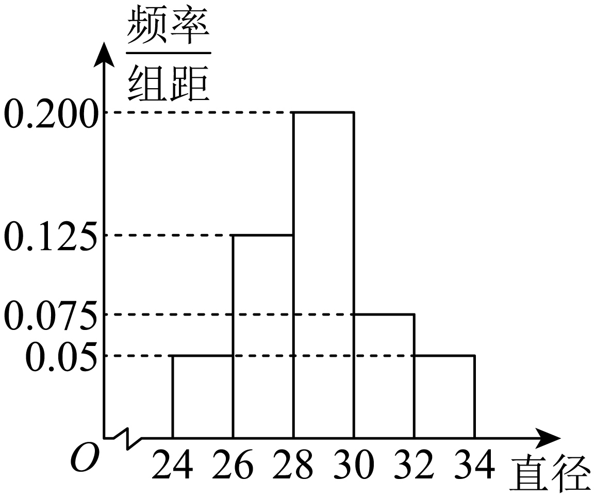

## 讲解

### 是什么

统计应用常分三层：已观察样本给出频率和样本参数；采用正态模型估计总体区间概率；再按后续试验机制建立新的随机变量。样本平均数、标准差分别可作为μ、σ的估计，但不是总体参数已被精确知道；只有均值方差相同，也不能保证分布形状或尾概率相同。

### 怎么来的

频率分布直方图纵轴是“频率/组距”。第i组宽度wᵢ、柱高hᵢ，所以面积hᵢwᵢ给该组频率fᵢ。取组中点mᵢ代表组内各数据，估计均值为各mᵢ按fᵢ加权的和：

$$\overline x\approx\sum_i m_i f_i,\qquad f_i=h_iw_i,\qquad\sum_i f_i=1.$$

这个近似是因为同组真实数值未逐个给出，组中点替代会丢失组内位置，不能倒称为精确原始数据平均。若原题再规定取整，将取整后的μ用于模型，需保留其近似性质。

设模型给某区间概率p，对N个对象估计该区间人数为Np。若有可重复随机抽取的同模型，将每人是否达标写成0—1变量，期望之和Np不需要独立；若进一步称人数服从二项分布，则必须N次相互独立且同概率p。若后续改成固定有限名单不放回抽取，需用实际总体达标数与超几何机制，而不是继续用正态概率充当每步不变的成功率。

### 什么时候能用

题目明确正态/近似正态前提，或有合理拟合证据并声明采用此模型；不能从一张直方图或两个参数自动证明正态。有限、非负、有满分的实际数据与整个实轴的正态模型不同，使用的是题给近似。若样本抽取机制不明，须把原解采用的独立或不放回解释分开说明。

## 易错

- 密度柱高漏乘组距会使各组频率和不为1，平均也错。
- 估计Np可能不是整数，按题取整的数仍是估计，不是名单实数。
- 对已经给出实际分组的样本，用总体正态估计替代样本实际组数，会同时改对象与抽样机制。

## 例题

### 原例：总体正态估计与样本不放回抽取

来源：HSMA-B5-C7-Db56d4f6a4a18-P0998-P1024。原件：专题7.8 随机变量及其分布全章十一大压轴题型归纳（拔尖篇）（举一反三）（人教A版2019选择性必修第三册）（解析版）.docx。

#### 原题与原解（完整保留）

4．（24-25高三下·重庆·阶段练习）智利的车厘子在中国市场上非常受欢迎，尤其是在春节前后，成为果品市场的“销售冠军”.进口水果办会对智利车厘子进行了分级，标准主要依据果实直径进行划分，通常分为以下几个等级：0级；直径在24mm到26mm之间；J级：直径在26mm到28mm之间；JJ级：直径在28mm到30mm之间；JJJ级：直径在30mm到32mm之间；JJJJ级：直径在32mm以上.某商贸公司根据长期检测结果，发现每批次进口车厘子的直径$X$服从正态分布$N\left( \mu ,{\sigma }^{2}\right)$并把直径不小于$30 mm$的车厘子称为一等品，其余称为二等品.现从某批次的车厘子中随机抽取100颗（直径位于24mm至34mm之间）作为样本，统计得到如图所示的频率分布直方图.

(1)根据长期检测结果，车厘子直径的标准差$s\approx 1$，用标准差$s$作为$\sigma $的估计值，用样本平均数$\overline{x}$（$\overline{x}$按四舍五入取整数）作为$\mu $的近似值.若从该批次中任取一颗，试估计该颗车厘子为一等品的概率（保留小数点后两位数字）；（①同一组中的数据用该组区间的中点值代表；②参考数据：若随机变量$ξ$服从正态分布$N\left( \mu ,{\sigma }^{2}\right)$，则$P\left( \mu -\sigma <ξ<\mu +\sigma \right)\approx 0.6827$，$P\left( \mu -2\sigma <ξ<\mu +2\sigma \right)\approx 0.9545$，$P\left( \mu -3\sigma <ξ<\mu +3\sigma \right)\approx 0.9973$）

(2)若从样本中直径在$[24,26)$和$\left[ 32,34\right]$的车厘子中随机抽取3颗，记其中直径在$\left[ 32,34\right]$的个数为$η$，求$η$的分布列和数学期望.

【解题思路】（1）先利用频率分布直方图求出样本平均数，再根据正态分布的性质求解即可；

（2）根据频率分布直方图可知所取样本$20$个，直径在$[32,  34)$的车厘子有$10$个，得到$η$的所有可能取值，根据古典概型的概率公式求分布列，再根据分布列和期望公式求期望即可.

【解答过程】（1）由题意，估计从该批次的车厘子中随机抽取$100$颗的平均数为：

$\overline{x}=2\times (0.05\times 25+0.125\times 27+0.2\times 29+0.075\times 31+0.05\times 33)=28.8\approx 29$，

即$\mu \approx \overline{x}\approx 29$，$\sigma =s\approx 1$，所以$X\sim N(29,{1}^{2})$，

则$P(X\ge 30)=\frac{1-P(29-1<X<29+1)}{2}\approx \frac{1-0.6827}{2}=0.15865\approx 0.16$，

所以从车厘子中任取一颗，该车厘子为一等品的概率约为$0.16$.

（2）由频率分布直方图可知$(0.05+0.05)\times 2\times 100=20$，所以所取样本$20$个，

直径在$[32,34)$的车厘子有$10$个，故$η$可能取的值为$0,1,2,3$，相应的概率为：

$P(η=0)=\frac{{C}_{10}^{3}{C}_{10}^{0}}{{C}_{20}^{3}}=\frac{2}{19}$，$P(η=1)=\frac{{C}_{10}^{2}{C}_{10}^{1}}{{C}_{20}^{3}}=\frac{15}{38}$，

$P(η=2)=\frac{{C}_{10}^{1}{C}_{10}^{2}}{{C}_{20}^{3}}=\frac{15}{38}$，$P(η=3)=\frac{{C}_{10}^{0}{C}_{10}^{3}}{{C}_{20}^{3}}=\frac{2}{19}$，

随机变量$η$的分布列为：

| η | 0 | 1 | 2 | 3 |
| --- | --- | --- | --- | --- |
| P | $2/19$ | $15/38$ | $15/38$ | $2/19$ |

所以$η$的数学期望$E(η)=0\times \frac{2}{19}+1\times \frac{15}{38}+2\times \frac{15}{38}+3\times \frac{2}{19}=\frac{3}{2}$.

#### 补讲与必要修正

（1）原直方图组距2，频率是各高乘2，依次0.10、0.25、0.40、0.15、0.10。中点加权均值28.8mm；按原题规定先四舍五入到整数29，再估计μ=29、σ=1，30=μ+σ，右尾≈(1−0.6827)/2=0.15865，按题保留两位得0.16。必须说明μ、σ是估计；原题给正态模型作为前提，不是由一张直方图自动证明正态。果实分级只是原题的数学规则，不作当前行业标准断言。

（2）对象换成已抽到的100颗样本中两个外侧组的20颗，原图各10颗。不放回抽3颗，恰抽到k颗大直径组的概率为 C₁₀ᵏC₁₀³⁻ᵏ/C₂₀³，k=0,1,2,3；四项为2/19、15/38、15/38、2/19，和1，E=3/2。不能把第1问总体正态概率0.16当这20颗抽取的成功率，样本外侧两组大直径比例其实1/2，且仍是不放回。

原题上端组为[32,34]，原解几处写[32,34)，原块照留。按图将该末组10颗全部计入，含34端点；精确连续模型单点概率为0不等于实际样本一定没有恰为34的测量值，样本计数以题给分组为准。

### 原例：同均值方差的正态与非正态群体

来源：HSMA-B5-C7-Dfc05bf056238-P0672-P0688。原件：专题7.7 随机变量及其分布全章十一大基础题型归纳（基础篇）（举一反三）（人教A版2019选择性必修第三册）（解析版）.docx。

#### 原题与原解（完整保留）

4．（24-25高三上·浙江·阶段练习）在一次联考中，经统计发现，甲乙两个学校的考生人数都为1000人，数学均分都为94，标准差都为12，并且根据统计密度曲线发现，甲学校的数学分数服从正态分布，乙学校的数学分数不服从正态分布.

(1)甲学校为关注基础薄弱学生的教学，准备从70分及以下的学生中抽取10人进行访问，学生小A考分为68分，求他被抽到的概率大约为多少；

(2)根据统计发现学校乙得分不低于130分的学生有25人，得分不高于58分的有1人，试说明乙学校教学的特点；

参考数据：若$X~N\left( \mu ,{\sigma }^{2}\right)$，则$P(\mu -\sigma \le X\le \mu +\sigma )\approx 0.68$，$P(\mu -2\sigma \le X\le \mu +2\sigma )\approx 0.95$，$P(\mu -3\sigma \le X\le \mu +3\sigma )\approx 0.99$.

【解题思路】（1）由正态分布确定70分及以下的学生人数，再由古典概率模型即可求解；

（2）由正态分布确定甲校130以上及58分以下人数，对比乙校数据即可判断.

【解答过程】（1）由题意可知甲校学生数学得分$X~N\left( 94,{12}^{2}\right)$，

由$P(\mu -2\sigma \le X\le \mu +2\sigma )\approx 0.95$，

可得$P(70\le X\le 118)\approx 0.95$，则$P(X\le 70)\approx \frac{1-0.95}{2}=0.025$，

所以分数在70分及以下的学生有$1000\times 0.025=25$，

所以学生小A被抽到的概率$P=\frac{10}{25}=0.4$

（2）由$P(\mu -3\sigma \le X\le \mu +3\sigma )\approx 0.99$，

可得：$P(58\le X\le 130)\approx 0.99$

所以甲校不低于130分的概率为$\frac{1-0.99}{2}=0.005$，

得分不高于58分的概率为$\frac{1-0.99}{2}=0.005$，

所以甲校不低于130分有$1000\times 0.005=5$人，得分不高于58分有$1000\times 0.005=5$人，

故乙校教学高分人数更多，130分以上学生更多，低分人数更少.

#### 补讲与必要修正

原题明确甲服从正态、乙不服从正态，即使均值94与标准差12相同，两分布尾部也可能不同。甲70=μ−2σ，按题给0.95中央概率左尾约0.025，1000倍估计25人，若从这约25人中均匀不放回抽10人，每个已知在组内的人入样概率约10/25=0.4。均匀抽取的对称性给“每人同入样概率”，不是0.025乘10。

第2问甲的58、130为μ±3σ，按本题粗略0.99参考数据估计两尾各5人；乙实际统计高尾25、低尾1，说明给定分数分布中高分尾较多、低分尾较少。原解“乙校教学…”按讲义原载保留；这些分数统计不能单独证明教学造成差别，也不是全部教学质量评价。人数25、5等为正态估计，不冒称实际精确名单；若实际70以下人数另为K，条件抽取概率是10/K（且K≥10）。
