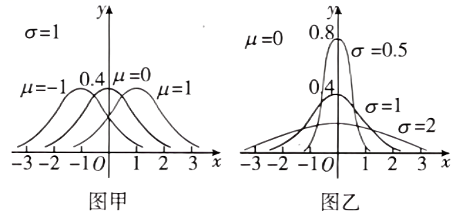

## 讲解

### 是什么

X∼N(μ,σ²)中，μ决定曲线的位置，σ>0决定横向尺度。期望E(X)=μ，方差D(X)=σ²。σ与X同单位，方差单位是原单位的平方；密度纵轴单位是横轴单位的倒数。固定σ改变μ，整条曲线平移；固定μ改变σ，峰中心不动但宽高改变。

图源：HSMA-B5-C7-Dfa54efcefb20-P0023-P0025。原件：专题7.5 正态分布【八大题型】（举一反三）（人教A版2019选择性必修第三册）（解析版）.docx。

### 怎么来的

密度式中的x总以x−μ出现，所以把μ加上同一个数，峰位和所有等高横坐标也同样平移。再记标准化距离z=(x−μ)/σ：同一z对应离中心|z|个标准差。σ增大时，同一z的横向距离变大；同时峰高1/(σ√(2π))变小，故更宽、更矮。σ缩小时则更窄、更高。面积始终为1，不能因峰变高就说总概率变大。

在正态族中，对称中心同时是均值μ，方差为σ²是该模型的数字特征；其严格连续加权计算需要拓展工具，本章使用给定模型结论。读图时由峰的横坐标比较μ，由峰高比较σ；当同为正确正态密度时，同峰高即同σ，低峰即较大σ。

### 什么时候能用

比较的曲线必须同属正态密度，且坐标刻度相同。任意非正态图不能仅靠“宽、矮”套用这两参数规则。从N(μ,v)读取时应先核v>0，再取σ=√v；不能把方差v直接当标准差。不同单位的变量先统一单位，才比较绝对离散程度。

## 易错

- 两条峰横坐标一样只给均值相同，不给方差相同；两条峰同高只给σ相同，不给μ相同。
- 曲线更高并不表示峰点更易以正概率出现，单点仍为0。
- 比方案不能只用平均与离散性替代目标事件，给定截止时间的达标概率另算。

## 例题

### 原例：比较三条正态曲线

来源：HSMA-B5-C7-Dfa54efcefb20-P0064-P0074。原件：专题7.5 正态分布【八大题型】（举一反三）（人教A版2019选择性必修第三册）（解析版）.docx。

#### 原题与原解（完整保留）

【例2】（2025高三·全国·专题练习）已知三个随机变量的正态密度函数${f}_{i}\left( x\right)\left( x\in R,i=1,2,3\right)$的图象如图所示，则（   ）

A．${\mu }_{1}<{\mu }_{2}={\mu }_{3},{\sigma }_{1}={\sigma }_{2}>{\sigma }_{3}$  B．${\mu }_{1}>{\mu }_{2}={\mu }_{3},{\sigma }_{1}={\sigma }_{2}<{\sigma }_{3}$

C．${\mu }_{1}={\mu }_{2}<{\mu }_{3},{\sigma }_{1}<{\sigma }_{2}={\sigma }_{3}$  D．${\mu }_{1}<{\mu }_{2}={\mu }_{3},{\sigma }_{1}={\sigma }_{2}<{\sigma }_{3}$

【解题思路】根据正态密度函数的对称轴的位置可得$\mu $的大小关系，根据正态密度函数的扁平程度可得$\sigma $的大小关系.

【解答过程】因为正态密度函数${f}_{2}\left( x\right)$和${f}_{3}\left( x\right)$的图象关于同一条直线对称，所以${\mu }_{2}={\mu }_{3}$.

又${f}_{2}\left( x\right)$的图象的对称轴在${f}_{1}\left( x\right)$的图象的对称轴的右边，所以${\mu }_{1}<{\mu }_{2}={\mu }_{3}$.

因为$\sigma $越大，曲线越“矮胖”.$\sigma $越小，曲线越“瘦高”，

由图可知，正态密度函数${f}_{1}\left( x\right)$和${f}_{2}\left( x\right)$的图象一样“瘦高”，${f}_{3}\left( x\right)$的图象明显“矮胖”，

所以${\sigma }_{1}={\sigma }_{2}<{\sigma }_{3}$.

故选：D.

#### 补讲与必要修正

峰的横坐标给 μ：图中第1条峰在左，第2、3条峰共用横坐标，所以 μ₁<μ₂=μ₃。峰高为 1/(σ√(2π))，第1、2条峰同高，故 σ₁=σ₂；第3条峰较低且更宽，故 σ₃更大，D正确。A 把宽度方向反过来；B 把位置和宽度都反了；C 错把第1、2条的中心视为相同。图上读的是密度形状，不是峰处点概率。

### 原例：比较两种上学方式的准时概率

来源：HSMA-B5-C7-Dfa54efcefb20-P0216-P0226。原件：专题7.5 正态分布【八大题型】（举一反三）（人教A版2019选择性必修第三册）（解析版）.docx。

#### 原题与原解（完整保留）

【变式6-2】（23-24高二下·广东广州·期末）小明上学有时坐公交车，有时骑自行车，他记录多次数据，分析得到：坐公交车平均用时30min，样本方差为36；骑自行车平均用时34min，样本方差为4，假设坐公交车用时$X~N(30,{6}^{2})$，骑自行车用时$Y~N(34,{2}^{2})$，则（    ）

A．$P(X\le 38)>P(Y\le 38)$   B．$P(X\le 34)>P(Y\le 34)$

C．如果有38分钟可用，小明应选择坐公交车  D．如果有34分钟可用，小明应选择自行车

【解题思路】利用正态分布曲线的意义以及对称性，对四个选项逐一分析判断即可．

【解答过程】因为$X~N(30,{6}^{2})$，$Y~N(34,{2}^{2})$，

将$X,Y$化为标准正态分布，则$\frac{X-30}{6}\sim N\left( 0,1\right),\frac{Y-34}{2}\sim N\left( 0,1\right)$，

因为$\frac{38-30}{6}<\frac{38-34}{2}$，所以$P(X\le 38)<P(Y\le 38)$，故A错误；

又$P(X\le 34)>\frac{1}{2},P(Y\le 34)=\frac{1}{2}$，$P(X\le 34)>P(Y\le 34)$，故B正确；

因为$P(X\le 38)<P(Y\le 38)$，所以如果有38分钟可用，小明应选择自行车，故C错误；

因为$P(X\le 34)>P(Y\le 34)$，所以如果有34分钟可用，小明应选择坐公交车，故D错误.

故选：B．

#### 补讲与必要修正

“更合适”在本题按给定时间内到达的概率比较。可用时间38时，公交标准化阈值(38−30)/6=4/3，自行车阈值(38−34)/2=2；同一个严格递增Φ给公交概率较小。可用34时，公交阈值2/3>0、自行车阈值0，公交概率较大，只有B正确。不能只看平均公交用时较短而对所有截止时间都选公交，也不能只看自行车波动较小而对所有截止时间都选自行车。
