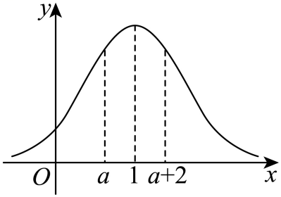

## 讲解

### 判据与流程

端点或μ、σ未知，而题给相等累计概率、相等两侧尾概率时，利用对称与正态累计函数的严格递增建立方程。

1. 先用总概率1和区间加法，把题给条件改成明确的尾概率。某区间概率c、其左尾u，右尾为1−u−c；需端点有序且正态单点概率0。
2. 两尾概率相等时，左尾端点a的镜像2μ−a有同样右尾概率。因为每个非空区间密度正，右尾概率随端点严格减小，端点唯一，所以右端点b=2μ−a，得到a+b=2μ。仅“曲线对称”还没说明为何这两个特定端点必须配对，唯一性补上这一步。
3. 不同正态分布的累计概率相等时，分别标准化，用同一严格增Φ将概率等式化为标准化阈值等式；除数必须是正标准差。
4. 解后回验参数正性、端点顺序、原概率区间，不能只解代数方程。给定概率0或1时，非退化正态分布没有有限累计端点，需先查是否题设可满足。

## 易错

- 相同概率不意味着原端点相同，除非同一个分布、同向累计。
- 同分布左右尾比较需先反射，再用严格性；不能无条件将左右端点设相等。
- σ为正根，不留负标准差分支。

## 例题

### 原例：由两侧尾概率反求端点

来源：HSMA-B5-C7-Dfa54efcefb20-P0130-P0137。原件：专题7.5 正态分布【八大题型】（举一反三）（人教A版2019选择性必修第三册）（解析版）.docx。

#### 原题与原解（完整保留）

【例4】（2025·福建厦门·一模）已知随机变量X服从正态分布$N\left( 1,{\sigma }^{2}\right)$，若$P\left( X\le a\right)=0.3$，且$P\left( a\le X\le a+2\right)=0.4$，则$a=$（   ）

A．-1  B．$-\frac{1}{2}$  C．0  D．$\frac{1}{2}$

【解题思路】根据正态分布的对称性，即可求得答案.

【解答过程】由题意知随机变量X服从正态分布$N\left( 1,{\sigma }^{2}\right)$，$P\left( X\le a\right)=0.3$，

如图所示，结合$P\left( a\le X\le a+2\right)=0.4$，得$P\left( X\ge a+2\right)=0.3$，

可知$a,a+2$关于$x=1$对称，所以$a+a+2=2\times 1$，解得$a=0$，

故选：C．

#### 补讲与必要修正

先把实轴分成 X<a、a≤X≤a+2、X>a+2 三块，单点概率0，右尾为1−0.3−0.4=0.3。正态密度在每个非空区间都为正，所以累计概率严格递增：每个给定尾概率只对应一个端点。左尾端点 a 的镜像 2−a 与右尾端点 a+2 因尾面积相同而相等，故 a+a+2=2，a=0，选C。A/B/D都使两端偏离均值的距离不等。不能仅凭一张图“看起来对称”代替这个唯一性理由。

### 原例：把两个正态区间变为标准分布区间

来源：HSMA-B5-C7-Dfa54efcefb20-P0203-P0209。原件：专题7.5 正态分布【八大题型】（举一反三）（人教A版2019选择性必修第三册）（解析版）.docx。

#### 原题与原解（完整保留）

【例6】（2024·江苏徐州·模拟预测）随机变量$ξ$服从正态分布$N\left( 1,{\sigma }^{2}\right)$，随机变量$η$服从标准正态分布$N\left( 0,1\right)$，若$P\left( η<1\right)=P\left( ξ<4\right)=a$，则$P\left( 1<ξ<1+\sigma \right)=$  $a-\frac{1}{2}$  ．（用字母$a$表示）

【解题思路】根据随机变量$η$服从标准正态分布$N\left( 0,1\right)$，得到$P\left( \mu <η<\mu +\sigma \right)=a-\frac{1}{2}$，再结合随机变量$ξ$服从正态分布$N\left( 1,{\sigma }^{2}\right)$可得答案.

【解答过程】随机变量$η$服从标准正态分布$N\left( 0,1\right)$，根据对称性可知$P\left( η<0\right)=\frac{1}{2}$，

因为$P\left( η<1\right)=a$，所以$P\left( 0<η<1\right)=a-\frac{1}{2}$，即$P\left( \mu <η<\mu +\sigma \right)=a-\frac{1}{2}$，

随机变量$ξ$服从正态分布$N\left( 1,{\sigma }^{2}\right)$，根据对称性可知$P\left( ξ<1\right)=\frac{1}{2}$，

$P\left( ξ<4\right)=a$，则$P\left( 1<ξ<4\right)=a-\frac{1}{2}$，即$P\left( 1<η<1+\sigma \right)=a-\frac{1}{2}$.

故答案为：$a-\frac{1}{2}$.

#### 补讲与必要修正

η为标准正态，记 Φ(t)=P(η<t)。ξ的标准化为 Z=(ξ−1)/σ，σ>0；事件 ξ<4 等价于 Z<3/σ，所以 Φ(1)=Φ(3/σ)。标准正态密度处处正，每个正宽度区间都有正面积，故 Φ严格递增，推出3/σ=1、σ=3。于是 ξ的区间 (1,1+σ) 是 (1,4)，其概率 a−1/2；或直接标准化为 (0,1)，答案相同。

原解P0208末行实际OMML写的是 P(1<η<1+σ)，原块保留。该式应写 ξ；若写η，区间成为(1,4)，并不是目标区间。原解还省了 σ=3 的标准化与严格单调理由，以上补齐，不把两个不同分布的变量直接互换。此项复用父级已执行核验。
