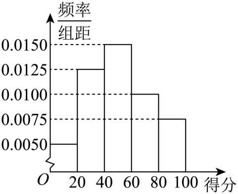

## 讲解

### 判据与流程

同一原题先由直方图拟合正态，再抽样计算次数或分布时，每问可能研究不同对象，必须重新核抽样机制。

1. 由柱面积求样本频率、中点加权求平均，按题取整后确定估计μ、σ；题给正态前提才可计算总体单次事件概率p。
2. 给事件起名字并写清对象。例如“总体中随机一颗为一等品”与“已抽样本外侧20颗里抽到大直径组”不是同一个事件，前者p≈0.16不能替换后者实际10/20。
3. 后续是固定N次独立同p抽取时，按二项模型；若从固定有限总体不放回，按总体供给数求超几何。一个单次边际p不足以确定N次联合分布。若原解补用了独立，须明说模型解释。
4. 最后根据后续变量求题问量。分布列须覆盖合法值、概率和1；众数、期望、实际观察数三者不同。完整二项/超几何通法见所依赖知识，不能把每种模型混成同一个公式。

## 易错

- 正态是总体单个连续测量值模型；后续“达标人数/抽到几颗”是离散变量，形式不会仍然正态。
- 原题正态近似不自动给任何有限样本的正态近似，不擅套中心极限定理。
- 组中点及μ取整误差须保留近似口径；有限样本真实组数可直接按题给图计数。

## 例题

### 原例：企业评分的拟合、人数与后续抽样

来源：HSMA-B5-C7-Dfa54efcefb20-P0300-P0321。原件：专题7.5 正态分布【八大题型】（举一反三）（人教A版2019选择性必修第三册）（解析版）.docx。

#### 原题与原解（完整保留）

【例8】（24-25高二下·全国·课后作业）为加大自然生态系统和环境保护力度，加强企业对尊重自然、顺应自然、保护自然的生态文明理念，某市对化工企业的排污情况进行调查，并出台相应的整治措施．相关部门对1000家化工企业所排污水的质量及周围空气质量进行了综合检测，得分情况如频率分布直方图所示．

(1)计算该市化工企业的平均得分$\overline{x}$（同一组中的数据以这组数据的中间值为代表）；

(2)已知化工企业的得分情况$X$近似服从正态分布$N\left( \mu ,{\sigma }^{2}\right)$，其中$\mu =\overline{x},{\sigma }^{2}={16}^{2}$，则得分在$\left[ 67,83\right]$内的企业大约有多少家；

(3)按照（2）中概率分布随机抽取100家化工企业，分数不低于19分的企业有多少家时概率最大．

参考数据：若随机变量$X$服从正态分布$N\left( \mu ,{\sigma }^{2}\right)$，则$P(\mu -\sigma <X<\mu +\sigma )=0.6826$，$P(\mu -2\sigma <X<\mu +2\sigma )=0.9544$，$P(\mu -3\sigma <X<\mu +3\sigma )=0.9974$．

【解题思路】（1）利用平均数的定义求解；

（2）由（1）知化工企业的得分情况$X~N(51$，${16}^{2})$，再利用正态分布曲线的对称性求解；

（3）由（2）可知得分不低于19分的企业数$ξ~B(100,0.9772)$，再利用二项分布的概率公式求解．

【解答过程】（1）该市被调查的化工企业的污染情况得分的平均值为$\overline{x}=\left( 10\times 0.0050+30\times 0.0125+50\times 0.0150+70\times 0.0100+90\times 0.0075\right)\times 20=51$．

（2）由（1）知化工企业的得分情况$X\sim N\left( 51,{16}^{2}\right)$．因为$67=51+16,83=51+16\times 2$，

所以$P\left( 67\le X\le 83\right)=P\left( 0\le X\le 83\right)-P(0\le X<67)$

$=P\left( 0\le X\le 51+16\times 2\right)-P\left( 0\le X<51+16\right)$

$=\frac{1}{2}\left[ P\left( \mu -2\sigma \le X\le \mu +2\sigma \right)-P\left( \mu -\sigma \le X\le \mu +\sigma \right)\right]\approx \frac{0.9544-0.6826}{2}=0.1359$．

可得所求企业大约有$0.1359\times 1000\approx 136$家．

（3）由（2）得$P\left( X\ge 19\right)=P\left( X\ge \mu -2\sigma \right)\approx 0.5+\frac{0.9544}{2}=0.9772$，

所以每家企业得分不低于19分的概率为0.9772，

则得分不低于19分的企业数$ξ\sim B\left( 100,0.9772\right)$．

其中恰有$k$家企业得分不低于19分的概率为$P\left( ξ=k\right)={C}_{100}^{k}{p}^{k}{(1-p)}^{100-k}$，

令$\frac{P\left( ξ=k\right)}{P\left( ξ=k-1\right)}=\frac{\left( 101-k\right)p}{\left( 1-p\right)k}>1$，$\frac{P\left( ξ=k\right)}{P\left( ξ=k+1\right)}=\frac{\left( k+1\right)\left( 1-p\right)}{\left( 100-k\right)p}>1$，

可得$101p-1<k<101p,101p=98.6972$，解得$k=98$，

故在走访的100家化工企业中，分数不低于19分的企业有98家时概率最大．

#### 补讲与必要修正

（1）每组频率是柱高×组距20，不是柱高本身。依次为0.10、0.25、0.30、0.20、0.15；乘各组中点10、30、50、70、90再相加为51。这是按中点代表组内数据的估计，不保证等于1000条原始评分的精确平均。

（2）σ=16，67=μ+σ、83=μ+2σ，目标是同侧两中央半区的差：(0.9544−0.6826)/2=0.1359，估计136家。原解以0为共同减去端点作两区间差是合法的（0<67<83），但0不是此分布的对称中心；化成半中央概率真正用的是 μ=51的对称性。

（3）19=μ−2σ，达标概率p≈0.9772。在每次独立、相同正态模型抽取的解释下，100次达标数为二项变量；原题“按照（2）中概率分布随机抽取”未明确放回与独立，原解采用该解释，须单列此模型条件。若从固定1000家中不放回抽100家，知道总体真实达标数K后应为超几何，不能直接断言二项。

在原二项模型中，(101p)=98.6972，不是整数，最大概率下标98。相邻比判断峰值的完整方法见[二项最可能取值](知识-二项分布的期望方差与最可能取值.md)；若(101p)为整数会并列，不能普遍使用原解两侧严格号。这里只保留原完整第三问与其模型结果，不重新开二项通法。

### 原例：总体正态估计与样本不放回抽取

来源：HSMA-B5-C7-Db56d4f6a4a18-P0998-P1024。原件：专题7.8 随机变量及其分布全章十一大压轴题型归纳（拔尖篇）（举一反三）（人教A版2019选择性必修第三册）（解析版）.docx。

#### 原题与原解（完整保留）

4．（24-25高三下·重庆·阶段练习）智利的车厘子在中国市场上非常受欢迎，尤其是在春节前后，成为果品市场的“销售冠军”.进口水果办会对智利车厘子进行了分级，标准主要依据果实直径进行划分，通常分为以下几个等级：0级；直径在24mm到26mm之间；J级：直径在26mm到28mm之间；JJ级：直径在28mm到30mm之间；JJJ级：直径在30mm到32mm之间；JJJJ级：直径在32mm以上.某商贸公司根据长期检测结果，发现每批次进口车厘子的直径$X$服从正态分布$N\left( \mu ,{\sigma }^{2}\right)$并把直径不小于$30 mm$的车厘子称为一等品，其余称为二等品.现从某批次的车厘子中随机抽取100颗（直径位于24mm至34mm之间）作为样本，统计得到如图所示的频率分布直方图.

(1)根据长期检测结果，车厘子直径的标准差$s\approx 1$，用标准差$s$作为$\sigma $的估计值，用样本平均数$\overline{x}$（$\overline{x}$按四舍五入取整数）作为$\mu $的近似值.若从该批次中任取一颗，试估计该颗车厘子为一等品的概率（保留小数点后两位数字）；（①同一组中的数据用该组区间的中点值代表；②参考数据：若随机变量$ξ$服从正态分布$N\left( \mu ,{\sigma }^{2}\right)$，则$P\left( \mu -\sigma <ξ<\mu +\sigma \right)\approx 0.6827$，$P\left( \mu -2\sigma <ξ<\mu +2\sigma \right)\approx 0.9545$，$P\left( \mu -3\sigma <ξ<\mu +3\sigma \right)\approx 0.9973$）

(2)若从样本中直径在$[24,26)$和$\left[ 32,34\right]$的车厘子中随机抽取3颗，记其中直径在$\left[ 32,34\right]$的个数为$η$，求$η$的分布列和数学期望.

【解题思路】（1）先利用频率分布直方图求出样本平均数，再根据正态分布的性质求解即可；

（2）根据频率分布直方图可知所取样本$20$个，直径在$[32,  34)$的车厘子有$10$个，得到$η$的所有可能取值，根据古典概型的概率公式求分布列，再根据分布列和期望公式求期望即可.

【解答过程】（1）由题意，估计从该批次的车厘子中随机抽取$100$颗的平均数为：

$\overline{x}=2\times (0.05\times 25+0.125\times 27+0.2\times 29+0.075\times 31+0.05\times 33)=28.8\approx 29$，

即$\mu \approx \overline{x}\approx 29$，$\sigma =s\approx 1$，所以$X\sim N(29,{1}^{2})$，

则$P(X\ge 30)=\frac{1-P(29-1<X<29+1)}{2}\approx \frac{1-0.6827}{2}=0.15865\approx 0.16$，

所以从车厘子中任取一颗，该车厘子为一等品的概率约为$0.16$.

（2）由频率分布直方图可知$(0.05+0.05)\times 2\times 100=20$，所以所取样本$20$个，

直径在$[32,34)$的车厘子有$10$个，故$η$可能取的值为$0,1,2,3$，相应的概率为：

$P(η=0)=\frac{{C}_{10}^{3}{C}_{10}^{0}}{{C}_{20}^{3}}=\frac{2}{19}$，$P(η=1)=\frac{{C}_{10}^{2}{C}_{10}^{1}}{{C}_{20}^{3}}=\frac{15}{38}$，

$P(η=2)=\frac{{C}_{10}^{1}{C}_{10}^{2}}{{C}_{20}^{3}}=\frac{15}{38}$，$P(η=3)=\frac{{C}_{10}^{0}{C}_{10}^{3}}{{C}_{20}^{3}}=\frac{2}{19}$，

随机变量$η$的分布列为：

| η | 0 | 1 | 2 | 3 |
| --- | --- | --- | --- | --- |
| P | $2/19$ | $15/38$ | $15/38$ | $2/19$ |

所以$η$的数学期望$E(η)=0\times \frac{2}{19}+1\times \frac{15}{38}+2\times \frac{15}{38}+3\times \frac{2}{19}=\frac{3}{2}$.

#### 补讲与必要修正

（1）原直方图组距2，频率是各高乘2，依次0.10、0.25、0.40、0.15、0.10。中点加权均值28.8mm；按原题规定先四舍五入到整数29，再估计μ=29、σ=1，30=μ+σ，右尾≈(1−0.6827)/2=0.15865，按题保留两位得0.16。必须说明μ、σ是估计；原题给正态模型作为前提，不是由一张直方图自动证明正态。果实分级只是原题的数学规则，不作当前行业标准断言。

（2）对象换成已抽到的100颗样本中两个外侧组的20颗，原图各10颗。不放回抽3颗，恰抽到k颗大直径组的概率为 C₁₀ᵏC₁₀³⁻ᵏ/C₂₀³，k=0,1,2,3；四项为2/19、15/38、15/38、2/19，和1，E=3/2。不能把第1问总体正态概率0.16当这20颗抽取的成功率，样本外侧两组大直径比例其实1/2，且仍是不放回。

原题上端组为[32,34]，原解几处写[32,34)，原块照留。按图将该末组10颗全部计入，含34端点；精确连续模型单点概率为0不等于实际样本一定没有恰为34的测量值，样本计数以题给分组为准。
