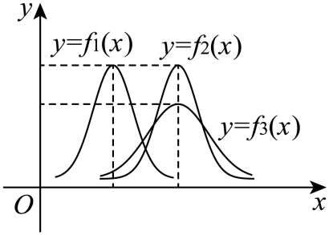

## 讲解

### 判据与流程

同坐标系给多条正态密度图时，可由峰的位置与高度比较参数，前提是图中每条确为正态密度、刻度一致。

1. 逐条找对称轴或最高点的横坐标，它就是μ。左右次序给均值大小，共用横坐标才给均值相同。
2. 另看最高点的纵坐标。峰高1/(σ√(2π))，σ>0，所以峰高相同给σ相同，峰更低给σ更大。σ²与σ同向比较，不要把数值视为同一个量。
3. 宽度是尺度的直观辅助证据；固定中心时较宽较矮，中心不同也可比较峰高。某一非峰点两曲线高度相同不能推出σ相同，因为x−μ不同。
4. 将位置与尺度两条结论合并，再逐项核选项。若图示与标注不够明确，不凭视觉猜精确参数值。

## 易错

- 两条曲线面积都为1，不能说“高的总概率更大”。
- 相同中心不等于相同波动；相同波动也不等于相同中心。
- 绝对离散尺度需要单位和刻度一致，不能跨单位只比较峰高。

## 例题

### 原例：比较三条正态曲线

来源：HSMA-B5-C7-Dfa54efcefb20-P0064-P0074。原件：专题7.5 正态分布【八大题型】（举一反三）（人教A版2019选择性必修第三册）（解析版）.docx。

#### 原题与原解（完整保留）

【例2】（2025高三·全国·专题练习）已知三个随机变量的正态密度函数${f}_{i}\left( x\right)\left( x\in R,i=1,2,3\right)$的图象如图所示，则（   ）

A．${\mu }_{1}<{\mu }_{2}={\mu }_{3},{\sigma }_{1}={\sigma }_{2}>{\sigma }_{3}$  B．${\mu }_{1}>{\mu }_{2}={\mu }_{3},{\sigma }_{1}={\sigma }_{2}<{\sigma }_{3}$

C．${\mu }_{1}={\mu }_{2}<{\mu }_{3},{\sigma }_{1}<{\sigma }_{2}={\sigma }_{3}$  D．${\mu }_{1}<{\mu }_{2}={\mu }_{3},{\sigma }_{1}={\sigma }_{2}<{\sigma }_{3}$

【解题思路】根据正态密度函数的对称轴的位置可得$\mu $的大小关系，根据正态密度函数的扁平程度可得$\sigma $的大小关系.

【解答过程】因为正态密度函数${f}_{2}\left( x\right)$和${f}_{3}\left( x\right)$的图象关于同一条直线对称，所以${\mu }_{2}={\mu }_{3}$.

又${f}_{2}\left( x\right)$的图象的对称轴在${f}_{1}\left( x\right)$的图象的对称轴的右边，所以${\mu }_{1}<{\mu }_{2}={\mu }_{3}$.

因为$\sigma $越大，曲线越“矮胖”.$\sigma $越小，曲线越“瘦高”，

由图可知，正态密度函数${f}_{1}\left( x\right)$和${f}_{2}\left( x\right)$的图象一样“瘦高”，${f}_{3}\left( x\right)$的图象明显“矮胖”，

所以${\sigma }_{1}={\sigma }_{2}<{\sigma }_{3}$.

故选：D.

#### 补讲与必要修正

峰的横坐标给 μ：图中第1条峰在左，第2、3条峰共用横坐标，所以 μ₁<μ₂=μ₃。峰高为 1/(σ√(2π))，第1、2条峰同高，故 σ₁=σ₂；第3条峰较低且更宽，故 σ₃更大，D正确。A 把宽度方向反过来；B 把位置和宽度都反了；C 错把第1、2条的中心视为相同。图上读的是密度形状，不是峰处点概率。
