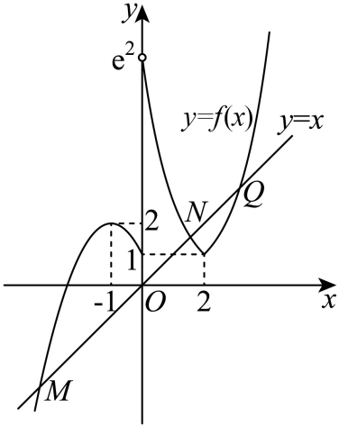
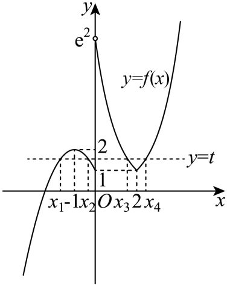

## 错法

题问“若P成立，则参数属于B”。先求出使P成立的精确解集A，发现B比A宽，就把整个命题判成假。这样容易出错，是把题目的一个推出方向改读成“P当且仅当参数属于B”，或者把“给出正确的必要范围”误当成“给出完整充要范围”。

## 正解

用参数集合表达：若P成立，其参数一定属于A。题目给的单向命题“P成立⇒参数属于B”只要求A包含于B，不要求A与B相等。B可能还含有不能使P成立的参数；这些参数只能反驳逆向“属于B⇒P成立”，不能反驳原方向。

反例必须满足前提P而违反结论“属于B”。拿一个属于B但不使P成立的参数去反驳，改变了前提和结论的角色。若题确实写“全部参数范围恰为B”“当且仅当”，则要检查A=B，遗漏或额外加入的端点都使完整范围不准确。先判断题目要单向推出还是精确等价，再检查端点，不能只看开闭括号。

本条原题的四根高度精确范围是(1,2)，所以“四根⇒t∈[1,2]”仍真；t=1、2不能四根，只说明逆向失败。原书因此排除B而只选D的说法完整保留并纠正。完整原像计数与每个选项的理由见同一道原题的展开解析。

## 例题

### 原题 P0822

> 来源ID HSMA-B1-C4-D346ae0ec44bc-P0822；原件 `第四章 指数函数与对数函数（举一反三讲义·培优篇）数学人教A版必修第一册（解析版）.docx`；DOCX正文段落 P0822—P0826；答案与详解 P0827—P0849。年份、地区和试题标签沿原资料记载，未独立核实。

**原资料题干与选项：**

2．（24-25高一上·陕西渭南·期末）已知函数

$$f(x)=\left\{ \begin{aligned}{e}^{\left| x-2\right|},x>0\\-{x}^{2}-2x+1,x\le 0\end{aligned}\right.$$

，则下列结论正确的是（    ）

A．函数$y=f\left( x\right)-x$有两个零点

B．若函数$y=f\left( x\right)-t$有四个零点，则$t\in \left[ 1,2\right]$

C．若关于$x$的方程$f\left( x\right)=t$有四个不等实根${x}_{1},{x}_{2},{x}_{3},{x}_{4}$，则${x}_{1}+{x}_{2}+{x}_{3}+{x}_{4}=1$

D．若关于$x$的方程${f}^{2}\left( x\right)-3f\left( x\right)+\alpha =0$有8个不等实根，则$\alpha \in \left( 2,\frac{9}{4}\right)$

**原资料答案与详解（完整保留，公式转写为LaTeX）：**

【答案】D

【解题思路】分析函数$f(x)$的性质，作出函数图象，再结合图象与性质逐项判断即得.

【解答过程】函数$y={e}^{|x-2|}$的图象关于直线$x=2$对称，函数$y=-{x}^{2}-2x+1$的图象开口向下，关于直线$x=-1$对称，

当$x\ge 2$时，$f(x)={e}^{x-2}$单调递增，当$0<x<2$时，$f\left( x\right)={e}^{2-x}$单调递减，

当$x<-1$时，$f(x)=-{x}^{2}-2x+1$单调递增，当$-1\le x\le 0$时，$f(x)=-{x}^{2}-2x+1$单调递减，

函数$y=f\left( x\right)-x$的零点，即函数$y=f(x)$的图象与直线$y=x$交点的横坐标，

在同一坐标系内作出函数$y=f(x)$的图象与直线$y=x$，如图，

   

观察图象知，函数$y=f(x)$的图象与直线$y=x$有3个公共点，因此函数$y=f\left( x\right)-x$有3个零点，A错误；

函数$y=f\left( x\right)-t$的零点，即方程$f\left( x\right)=t$的根，亦即函数$y=f(x)$的图象与直线$y=t$交点的横坐标，

在同一坐标系内作出函数$y=f(x)$的图象与直线$y=t$，如图，

 

观察图象知，当$1<t<2$时，函数$y=f(x)$的图象与直线$y=t$有4个公共点，

因此函数$y=f\left( x\right)-t$有四个零点，则$t\in (1,2)$，B错误；

关于$x$的方程$f\left( x\right)=t$有四个不等实根${x}_{1},{x}_{2},{x}_{3},{x}_{4}$，不妨设${x}_{1}<{x}_{2}<{x}_{3}<{x}_{4}$，

显然有${x}_{1}+{x}_{2}=-2,{x}_{3}+{x}_{4}=4$，因此${x}_{1}+{x}_{2}+{x}_{3}+{x}_{4}=2$，C错误；

令$f(x)=m$，由选项B知，当且仅当$m\in (1,2)$时，方程$f(x)=m$有4个不等实根，

要关于$x$的方程${f}^{2}\left( x\right)-3f\left( x\right)+\alpha =0$有8个不等实根，

则当且仅当方程${m}^{2}-3m+\alpha =0$在$(1,2)$上有2个不相等的实数根，令这两个实根为${m}_{1},{m}_{2}$，${m}_{1},{m}_{2}\in \left( 1,2\right)$，

且${m}_{1}+{m}_{2}=3$，$\alpha ={m}_{1}{m}_{2}$，则$\alpha =3{m}_{2}-{m}_{2}^{2}=-{({m}_{2}-\frac{3}{2})}^{2}+\frac{9}{4}$，

由${m}_{2}\in \left( 1,2\right)$，得$\alpha \in (2,\frac{9}{4}]$，而当$\alpha =\frac{9}{4}$时，${m}^{2}-3m+\alpha =0$的两根相等，不符合题意，

所以$\alpha $的取值范围是$\alpha \in (2,\frac{9}{4})$，D正确.

故选：D.

**展开解析与核验（依据原详解补足，勘误另标）：**

先按分支数水平线f(x)=t的原像。负支写成$2-(x+1)^2$，且x≤0；正支$e^{|x-2|}$且x>0。恰有四点的高度是1<t<2：负支的两个根均≤0（和−2），正支的两根$2\pm\ln t$均>0（和4）。t=1时负支−2、0加正支2共3点；t=2时负支−1一根加正支两根共3点；t<1正支无根，t>2负支无根，均不能四点。
A错：f(x)=x在负支解$x^2+3x-1=0$，仅$(-3-\sqrt{13})/2$合法；0<x≤2时$e^{2-x}-x$严格减，两端变号有一根；x>2时也有一根。最后一支的唯一性可用后续导数作为拓展：$h(x)=e^{x-2}-x$有$h'(x)=e^{x-2}-1>0$，h(2)=−1、$h(4)=e^2-4>0$。共3根，非2。此处导数结论明确属于后续工具，没有凭两个增图强判交点数。
B按原文字“若有四个零点，则t∈[1,2]”应为真：四根确实推出1<t<2，也必推出较宽的闭区间。不能因闭区间还含无四根的端点就否定这个单向命题。若问“恰有四根的全部t范围是否为[1,2]”，答案才是假。
C错：四根分支各和−2与4，总和2，非1。
D对：设z=f(x)，要$z^2-3z+\alpha=0$有8个不同x，须两个不同z根都落在(1,2)，每个提供4个原像。两根和3，可写1<z₁<3/2、z₂=3−z₁；乘积$\alpha=z_1(3-z_1)=9/4-(z_1-3/2)^2$完整落在(2,9/4)。α=2根1、2各仅3点；α=9/4根重合只4点，均删。
**原书勘误：** 原答案只列D，原页34以精确开区间排B，混淆必要与充要。按现有B单向句式，B、D都真；保留原答案D并标出漏选，未静默改题。
