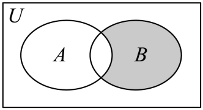

## 错法

原例题给 $A=(-2,1]$、$U=(-3,3)$。错法只否定A的区间条件，写 $x\le-2$ 或 $x>1$，就把它当作相对U的补集。这会放入不属于U的数，例如原题端点3。容易这样想，是只记“开变闭、闭变开”，忽略补集定义还要求 $x\in U$。

## 正解

补集成员须同时满足“属于U”与“不属于A”：

$$\complement_U A=\{x\mid x\in U\text{且}x\notin A\}.$$

否定A条件只是得到一个候选范围，再与U的条件同时筛选。原例题中 $-3<x<3$ 始终要保留；结合 $x\le-2$ 或 $x>1$，得到 $(-3,-2]\cup(1,3)$。$-2$ 不在A但在U，应进入补集；1已在A，应排除；$-3,3$ 都不在U，不能因取补而补回来。

关键差别是：端点取反决定U内的对象属于A还是补A，不能扩大U。最后检查原集合与所得补集交为空、并为U；这两个检查同时保证没把A成员留下、也没把U成员漏掉。第二道原图题把U换成实数全集，按它自己的下标与区域重新判断。

## 例题

### 原题 5-2

> 来源ID HSMA-B1-C1-De0726b060358-P0209；原件 `专题1.3 集合的基本运算（举一反三讲义）数学人教A版2019必修第一册（解析版）.docx`；DOCX正文段落 P0209—P0211；答案与详解 P0212—P0215。年份、地区和试题标签沿原资料记载，未独立核实。

**原资料题干与选项：**

【变式5-2】（24-25高一上·天津河西·期中）已知全集$U=\left\{ x\mid -3<x<3\right\}$，集合$A=\left\{ x\mid -2<x\le 1\right\}$，则${∁}_{U}A=$（    ）

A．$\left( -2,1\right]$  B．$\left( -3,-2\right)\cup \left[ 1,3\right)$

C．$\left( -3,-2\right]\cup \left( 1,3\right]$  D．$\left( -3,-2\right]\cup \left( 1,3\right)$

**原资料答案与详解（完整保留，公式转写为LaTeX）：**

【解题思路】根据补集的定义求解即可.

【解答过程】解：因为集$U=\left\{ x\mid -3<x<3\right\}$，集合$A=\left\{ x\mid -2<x\le 1\right\}$，

所以${∁}_{U}A=\{x|-3<x\le -2$或$1<x<3\}$.

故选：D.

**展开解析与核验（依据原详解补足，勘误另标）：**

先守住 $U=(-3,3)$ 的范围：两端 $-3,3$ 均不属于U，补集也不能取到。$A=(-2,1]$ 中，$-2$ 不在A但在U，应放入补集；1已经在A，应排除。因此剩下 $(-3,-2]\cup(1,3)$，D对。

A表示A自身；B同时反错 $-2$ 和1的开闭；C多入不属于U的端点3。核验时，所得集合与A的交集为空，并集恰为U。

### 原题 8-1

> 来源ID HSMA-B1-C1-De0726b060358-P0314；原件 `专题1.3 集合的基本运算（举一反三讲义）数学人教A版2019必修第一册（解析版）.docx`；DOCX正文段落 P0314—P0317；答案与详解 P0318—P0323。年份、地区和试题标签沿原资料记载，未独立核实。

**原资料题干与选项：**

【变式8-1】（24-25高一上·河北张家口·阶段练习）已知全集$U=R$，集合$A=\left\{ x|x<-3\text{或}x>2\right\}$，$B=\left\{ x|-4\le x\le 2\right\}$，那么阴影部分表示的集合为（   ）

A．$\left\{ x|-4\le x<-3\right\}$  B．$\left\{ x|-3\le x\le 2\right\}$

C．$\left\{ x|x\le -3\text{或}x\ge 2\right\}$  D．$\left\{ x|-3<x\le 2\right\}$

**原资料答案与详解（完整保留，公式转写为LaTeX）：**

【解题思路】根据$Venn$图和集合之间的关系进行判断．

【解答过程】由$Venn$图可知，阴影部分的元素为属于$B$但不属于$A$的元素构成，

所以用集合表示为$B\cap ({∁}_{U}A)$．

因为集合$A=\left\{ x|x<-3\text{或}x>2\right\}$，$B=\left\{ x|-4\le x\le 2\right\}$，

则${∁}_{U}A=\{x|-3\le x\le 2\}$，所以$B\cap ({∁}_{U}A)=\{x|-3\le x\le 2\}$，

故选：B．

**展开解析与核验（依据原详解补足，勘误另标）：**

先从原图读成员条件：阴影在B中且不在A中，所以表示 $B\cap\complement_U A$。这里 $U=\mathbb R$；A要求 $x<-3$ 或 $x>2$，在实数全集中取反面，须同时满足 $x\ge-3$ 与 $x\le2$，故 $\complement_U A=[-3,2]$。

再与 $B=[-4,2]$ 相交，得到 $[-3,2]$，B正确。A算的是 $A\cap B$；C错误取了外侧；D误删 $-3$，但它不属于A且属于B，必须进入阴影。这里没有有限全集的额外截断，仍不能忽略原集合严格边界取反后的等号。
