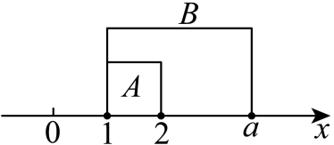
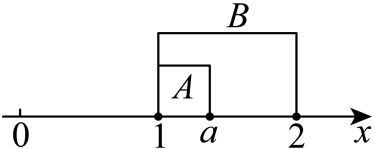

## 错法

为证明闭区间A是B的真子集，把左右端比较都改成严格不等式。这样把一端相等、另一端扩大的情形排掉；它们其实已使B多出成员，符合真包含。

下例一中，错法会要求$m+1<9$且$2m-1>13$，只留$7<m<8$，漏掉原合法边界$7,8$。错误是把“至少一侧多出”改成“每侧都多出”。

## 正解

先证明全部A成员在B中，再排除A与B完全相同。对于非空闭区间，至少一个外侧端点比内侧伸得更远，就有额外成员；另一端可以相同。也可以解两端同时相等所需条件，若没有同时成立的参数，就说明包含范围内已全部真包含。

空集和单点仍按定义处理，不直接套有长度区间的图形规则。闭区间非空允许左右端相等；在本例A有两个不同端点，所以包含它的B才确实有正长度。另一个原例的左端始终相等，直接显示真包含不需两端全严格。

## 例题

### 原题 8-2

> 来源ID HSMA-B1-C1-D7b6407ccc879-P0324；原件 `专题1.2 集合间的基本关系（举一反三讲义）数学人教A版2019必修第一册（解析版）.docx`；DOCX正文段落 P0324—P0326；答案与详解 P0327—P0333。年份、地区、题目身份沿原资料记载，未独立核实。

**原资料题干与选项：**

【变式8-2】（2025高一上·全国·专题练习）已知集合$A=\left[ 9,13\right]$，$B=\left[ m+1,2m-1\right]$．

(1)若$A\subseteq B$，求实数$m$的取值范围；

(2)若$A\subsetneq B$，求实数$m$的取值范围．

**原资料答案与详解（完整保留，公式转写为LaTeX）：**

【解题思路】（1）由$B=\left[ m+1,2m-1\right]$为非空数集，得$m+1<2m-1$，即$m>2$，结合子集的概念，得到不等式，算出实数$m$的取值范围；

（2）由$B=\left[ m+1,2m-1\right]$为非空数集，得$m+1<2m-1$，即$m>2$，结合真子集的概念，得到不等式，算出实数$m$的取值范围；

【解答过程】（1）因为$B=\left[ m+1,2m-1\right]$为非空数集，得$m+1<2m-1$，解得$m>2$，

若$A\subseteq B$，则$\left\{ \begin{aligned}m+1\le 9\\2m-1\ge 13\end{aligned}\right.$，解得$7\le m\le 8$，即实数$m$的取值范围是$\left[ 7,8\right]$；

（2）因为$B=\left[ m+1,2m-1\right]$为非空数集，得$m+1<2m-1$，解得$m>2$，

若$A\subsetneq B$，则$\left\{ \begin{aligned}m+1\le 9\\2m-1>13\end{aligned}\right.$或$\left\{ \begin{aligned}m+1<9\\2m-1\ge 13\end{aligned}\right.$，

解得$7\le m\le 8$，即实数$m$的取值范围是$\left[ 7,8\right]$．

**展开解析与核验（依据原详解补足，勘误另标）：**

（1）**先用真正成员确定方向。** A含$9$和$13$，两者都要在B中，所以$m+1\le9$且$2m-1\ge13$；前式减$1$得$m\le8$，后式加$1$再除正数$2$得$m\ge7$。因此必要范围$7\le m\le8$。

在此范围中，任一$x\in[9,13]$都满足$m+1\le9\le x\le13\le2m-1$，故在B中，充分性也成立。这个范围使B非空且有正长度，没有额外退化参数。

（2）真包含只需在上面包含范围内排除相等。两非空闭区间相等须$m+1=9$与$2m-1=13$同时成立；分别给$m=8$与$m=7$，不可能同时，故全部$[7,8]$已经真包含。

**边界怎样检验。** $m=7$时B为$[8,13]$，右端相同，额外成员$8$说明真包含；$m=8$时B为$[9,15]$，左端相同，额外成员$15$说明真包含；中间参数两侧都扩展。若把两条端点条件全写严格，会漏这两个边界。

**原解析的依据缺口。** 原解从“B非空”直接写$m+1<2m-1$，这不能仅由非空推出；闭区间在$m=2$时可为单点$\{3\}$。本题B必须包含A的两个不同成员$9,13$，才另有正长度依据；更强的最终$[7,8]$已排$m=2$，因此原最终两问答案正确，原中间说法仍须纠正。

### 原题 P0281

> 来源ID HSMA-B1-C1-De4c375404d2d-P0281；原件 `第一章 集合与常用逻辑用语（举一反三讲义·培优篇）数学人教A版2019必修第一册（解析版）.docx`；DOCX正文段落 P0281—P0284；答案与详解 P0285—P0298。年份、地区和试题标签沿原资料记载，未独立核实。

**原资料题干与选项：**

5．（24-25高一上·河南驻马店·阶段练习）已知集合$A=\left\{ x\left| 1\le x\le 2\right.\right\}$，$B=\left\{ x\left| 1\le x\le a,a\ge 1\right.\right\}$.

(1)若$A$是$B$的真子集，求$a$的取值范围；

(2)若$B$是$A$的子集，求$a$的取值范围；

(3)若$A=B$，求$a$的值.

**原资料答案与详解（完整保留，公式转写为LaTeX）：**

【答案】(1)$\left( 2,+\infty \right)$

(2)$\left[ 1,2\right]$

(3)$2$

【解题思路】（1）由真子集的定义，确定$a$的取值范围；

（2）由子集的定义，确定$a$的取值范围；

（3）由集合相等求出$a$的值.

【解答过程】（1）  

若$A$是$B$的真子集，则由图知，$a>2$，

故$a$的取值范围为$\left( 2,+\infty \right)$.

（2）  

若$B$是$A$的子集，已知$a\ge 1$，则$B\ne \varnothing $，

则由图知，$1\le a\le 2$，

故$a$的取值范围为$\left[ 1,2\right]$.

（3）若$A=B$，则$a=2$.

**展开解析与核验（依据原详解补足，勘误另标）：**

（1）A为$[1,2]$，B为$[1,a]$且题设$a\ge1$，左端始终相同。先要求$2$这个A成员在B中，得到$a\ge2$；这也充分保证全部A成员在B。再排$a=2$的相等情况，得到$a>2$；此时成员$a$在B却不在A，证明真包含。不能要求左端$1$也严格向外扩展，那样没有任何参数可留。

（2）B被包含于A。$a\ge1$保证B非空；B闭右端$a$须在A中，给$a\le2$。与原参数范围合并$1\le a\le2$，任一B成员满足$1\le x\le a\le2$，都在A中，必要充分。$a=1$时B为单点$\{1\}$，也包含于A，保留。

（3）两非空闭区间左端相同，全部成员相同需要右端也同，即$a=2$，回代两边均为$[1,2]$。三个小问都不能删掉原参数$a\ge1$。

**原配图的集合标记错误。** 原第（2）问把$a$画在$2$左边，这个端点顺序可以表示$1<a<2$；但图中标为B的段从$1$延到$2$，标为A的段却只到$a$，与实际$A=[1,2]$、$B=[1,a]$对调。图原样保留，不能从错标的B较长就判断反向包含；应依据成员条件和原详解的文字结果，得到$1\le a\le2$，并另核$a=1$的单点及$a=2$的相等情形。

