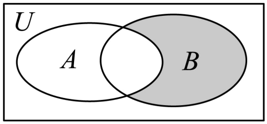

## 讲解

### 是什么

在固定全集U内，且 $A\subseteq U$、$B\subseteq U$，并集的补集等于两个补集的交集；交集的补集等于两个补集的并集：

$$\complement_U(A\cup B)=(\complement_U A)\cap(\complement_U B),$$

$$\complement_U(A\cap B)=(\complement_U A)\cup(\complement_U B).$$

U限定对象范围，A、B是其中的两个集合，补集收集U内不属于相应集合的对象。取整个运算结果的反面时，不但每个归属条件取反，“或”与“且”也交换。只给A、B分别加上补集符号而保留原运算，是不同的条件。

### 怎么来的

从交、并、补的成员定义出发，不凭韦恩图的画法推断。要证明两个集合相等，需证明其中的成员条件完全一致。

任取 $x\in U$。不属于并集，就是“属于A或属于B”这个条件失败。只要属于任何一边，条件就成立，因此要失败，必须两边都不属于。这又正是同时属于补A、补B的条件：

$$x\in\complement_U(A\cup B)\Longleftrightarrow
(x\notin A\text{且}x\notin B)\Longleftrightarrow
x\in(\complement_U A)\cap(\complement_U B).$$

从左读到右说明并集的补集没有额外成员；从右读到左说明两补集的公共成员也不会漏掉。因任意U内对象都满足同一判据，第一式成立。

再看不属于交集。“同时属于A和B”失败，只需至少一边不属于，不要求两边都不属于；换成补集归属，就是至少在补A或补B的一边：

$$x\in\complement_U(A\cap B)\Longleftrightarrow
(x\notin A\text{或}x\notin B)\Longleftrightarrow
x\in(\complement_U A)\cup(\complement_U B).$$

这条链也能双向读。因此第二式既没有多收成员，也没有少收成员。区别的根源是：“至少一个条件成立”失败需要两者都失败；“两个条件同时成立”失败只需要其中一个失败。

### 什么时候能用

先确认全集一致，再交换交并并对每个集合取补。有限集、实数范围、点集都适用，因为证明只用成员归属；集合为空、相等或相包含时也成立。计算区间时仍要检查对象范围与端点，法则不会自动替你完成这些判断。

韦恩图中，并集的补集只包含两集合都不属于的外部；交集的补集还包含A独有与B独有的区域。图用于帮助辨别题设区域，法则的依据是上面的成员条件。原题6-2可分别按定义和法则算同一结果；原题8-2可把B独有区改写为一个补集，验证“且”变“或”的作用。

## 例题

### 原题 6-2

> 来源ID HSMA-B1-C1-De0726b060358-P0234；原件 `专题1.3 集合的基本运算（举一反三讲义）数学人教A版2019必修第一册（解析版）.docx`；DOCX正文段落 P0234—P0236；答案与详解 P0237—P0242。年份、地区和试题标签沿原资料记载，未独立核实。

**原资料题干与选项：**

【变式6-2】（2025·四川眉山·三模）设全集$U=\left\{ -3,-2,-1,0,1,2,3\right\}$，集合$A=\left\{ -2,-1,0,1\right\},B=\left\{ -1,1,3\right\}$，则$\left\{ -3,2\right\}=$（    ）

A．$\left( {∁}_{U}A\right)\cap B$  B．$\left( {∁}_{U}A\right)\cup B$

C．${∁}_{U}\left( A\cap B\right)$  D．${∁}_{U}\left( A\cup B\right)$

**原资料答案与详解（完整保留，公式转写为LaTeX）：**

【解题思路】根据集合的交并补运算逐项判断即可.

【解答过程】对A,由$\left( {∁}_{U}A\right)\cap B=\left\{ -3,2,3\right\}\cap \left\{ -1,1,3\right\}=\left\{ 3\right\}$，选项A错误；

对B,$\left( {∁}_{U}A\right)\cup B=\left\{ -3,2,3\right\}\cup \left\{ -1,1,3\right\}=\left\{ -3,-1,1,2,3\right\}$，选项B错误；

对C,${∁}_{U}\left( A\cap B\right)={∁}_{U}\left\{ -1,1\right\}=\left\{ -3,-2,0,2,3\right\}$，选项C错误；

对D,因为$A\cup B=\left\{ -2,-1,0,1,3\right\}$，所以${∁}_{U}\left( A\cup B\right)=\left\{ -3,2\right\}$，所以选项D正确.

故选：D.

**展开解析与核验（依据原详解补足，勘误另标）：**

目标 $\{-3,2\}$ 中的成员既不在A也不在B，应想到“并集外”，即并集的补集。先按原选项独立计算：$\complement_U A=\{-3,2,3\}$，所以A得 $\{3\}$；B得 $\{-3,-1,1,2,3\}$。C先交得 $A\cap B=\{-1,1\}$，再取补得 $\{-3,-2,0,2,3\}$。D先并得 $A\cup B=\{-2,-1,0,1,3\}$，从U删去后得 $\{-3,2\}$，故只有D。

再用德摩根律交叉检验D：$\complement_U B=\{-3,-2,0,2\}$，与补A相交，公共成员恰为 $\{-3,2\}$。C则是两补集的并集，会把只属于A或只属于B的成员也收入；这正说明“交集外”与“并集外”的差别。

### 原题 8-2

> 来源ID HSMA-B1-C1-De0726b060358-P0324；原件 `专题1.3 集合的基本运算（举一反三讲义）数学人教A版2019必修第一册（解析版）.docx`；DOCX正文段落 P0324—P0326；答案与详解 P0327—P0330。年份、地区和试题标签沿原资料记载，未独立核实。

**原资料题干与选项：**

【变式8-2】（24-25高一上·四川眉山·期中）如图，已知矩形$U$表示全集，$A,B$是$U$的两个子集，则阴影部分可表示为（    ）

A．${∁}_{U}\left( A\cup B\right)$  B．${∁}_{U}\left( A\cap B\right)$  C．$A\cap \left( {∁}_{U}B\right)$  D．$B\cap \left( {∁}_{U}A\right)$

**原资料答案与详解（完整保留，公式转写为LaTeX）：**

【解题思路】根据集合韦恩图的表示方法，利用集合的运算法则，结合选项，即可求解.

【解答过程】解：由题意得，阴影部分的区域内的元素$x\notin A$且$x\in B$，

所以阴影部分可表示为$B\cap \left( {∁}_{U}A\right)$或${∁}_{B}(A\cap B)$或${∁}_{A\cup B}(A)$.

故选：D.

**展开解析与核验（依据原详解补足，勘误另标）：**

原图涂色的是B独有区；A独有区、交叠区及两个集合外均未涂色。因此其成员条件是 $x\in B$ 且 $x\notin A$，对应D。A表示两个集合外；B表示整个交集外，额外加入A独有区和外部；C表示A独有区，均不符合涂色。

还可用本条法则验证D的区域：先取“补B与A的并集”的补集，由并变交并分别取补，再用同一U的两次补集恢复B，得

$$\complement_U\bigl((\complement_U B)\cup A\bigr)
=\bigl(\complement_U(\complement_U B)\bigr)\cap(\complement_U A)
=B\cap(\complement_U A).$$

每一步都在同一U中，且 $A,B\subseteq U$。原解另外给出的 $\complement_B(A\cap B)$、$\complement_{A\cup B}A$ 也合法：各自从指定全集删去交叠区或A，剩下B独有区。它们的下标分别是B、$A\cup B$，不能省略下标后把这些补集当作相同操作。

## 易错

- 写成补A并补B等于补并集：错把需要“两边都不属于”写成“至少一边不属于”。
- 只反不等号而未互换“或”“且”：端点与连接词必须一起核对。
- 不同全集的补集强行合并：上面证明从任意同一U内对象出发，换范围后不能直接套。
