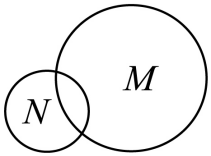
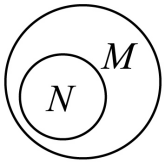
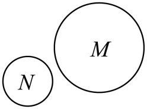
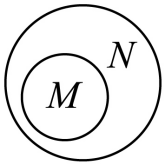
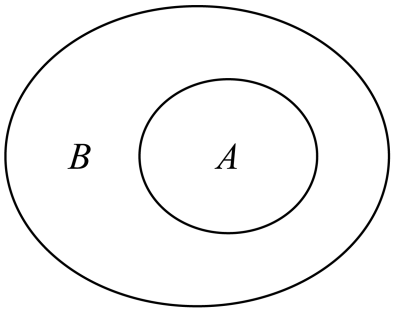
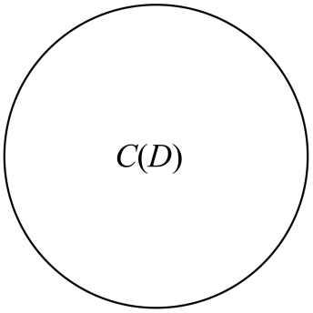

## 讲解

### 判据

题目让用韦恩图表示两个集合，或从几幅图中选正确关系，先由题设求实际成员和关系，再读图的字母及区域。曲线圈住的是抽象成员范围，图的几何面积、圆心位置和圈的大小不是元素个数或数量比例。以下方法为按数学规范补写。

证明包含要每个成员都进入另一边；证明真包含还要有一个外集合额外成员；证明相等要两个方向都成立。“互不包含”也不等于“无共同成员”：前者只否定两向包含，后者要求交集为空，它们可能相交，也可能分离，须查真实成员。

### 流程

1. **先确定对象与成员。** 方程集合先求所有解，几何类型按定义判，输入和输出集合不能混淆。若原题依赖家庭身份等背景，不把未给出的背景当数学条件。空集单独处理，空集可包含于任意集合。
2. **查两个包含方向。** 有限集合逐个验全，无限集合对任意成员推出另一边条件。两向成立是相等；一向成立后找外集合额外成员，才是真包含；每向都找到越界成员则互不包含。
3. **需要时另查交叠。** 有共同成员说明交集非空；若画成部分交叠，还应确认两边各有独有成员。完全分离须没有共同成员，不能由互不包含直接推出分离。
4. **把已证明关系映射到图。** 相等用同一成员区域并标两个名称；包含把内集合区域放入外集合区域；真包含要表示外集合仍有额外成员。共同区域表示同时属于，独有区域表示只在一边。图所表达的关系来自前面的成员证据，不能反过来靠面积猜成员。
5. **逐项核字母与位置。** 内圈是谁、外圈是谁要读标签；两幅长得相似的套圈图，交换名称就改变包含方向。若有全集框，各集合在框内，但不据框的大小增加题设限制。
6. **用成员证据否定错图。** 选一个题设确实有的共同成员或独有成员，说明某图会把它放在哪种错误区域；相等用定义两向核，真包含用额外对象排相等。这里的小区域表示关系，不要求成员之间有几何距离。

下面原例先以方程解集选择正确套圈图，再用原资料已有例子说明包含与相等两种画法。

## 例题

### 原题 6-0

> 来源ID HSMA-B1-C1-D7b6407ccc879-P0227；原件 `专题1.2 集合间的基本关系（举一反三讲义）数学人教A版2019必修第一册（解析版）.docx`；DOCX正文段落 P0227—P0229；答案与详解 P0230—P0233。年份、地区、题目身份沿原资料记载，未独立核实。

**原资料题干与选项：**

【例6】（24-25高一上·福建南平·期末）下列Venn图能正确表示集合$M=\{0,1,2\}$和$N=\left\{ x\left| {x}^{2}-2x=0\right.\right\}$关系的是（    ）

A．    B．  

C．    D．  

**原资料答案与详解（完整保留，公式转写为LaTeX）：**

【解题思路】确定集合$M$，$N$的关系，然后选择合适的图象即可.

【解答过程】$N=\left\{ x\left| {x}^{2}-2x=0\right.\right\}=\left\{ 0,2\right\}$，又$M=\{0,1,2\}$，

所以$N\subsetneq M$，选项B符合，

故选：B.

**展开解析与核验（依据原详解补足，勘误另标）：**

**先求关系，再看四幅图。** $x^2-2x=x(x-2)$，原方程乘积为$0$，故$x=0$或$x=2$，N恰为$\{0,2\}$。两个成员均在M的$\{0,1,2\}$中，说明$N\subseteq M$；M还含$1$而N不含，说明$N\ne M$，所以$N\subsetneq M$。

- A图两圈部分交叠，N还有区域在M外，表示N有不在M的成员；实际N的$0,2$全在M，故错。
- B图N内圈完整在M内，M还有外圈区域，表示N真包含于M；与共同$0,2$及M独有$1$对应，正确。
- C图两圈分离，表示没有共同成员；但$0,2$都是共同成员，故错。
- D图把M放在N内，方向反了；M独有$1$不在N，是这个包含方向的反例，故错。

选B。四图的圆面积并不表示M有三个、N有两个成员；这些数量来自实际列举，图只表达已证关系。

### 原题 6-3

> 来源ID HSMA-B1-C1-D7b6407ccc879-P0244；原件 `专题1.2 集合间的基本关系（举一反三讲义）数学人教A版2019必修第一册（解析版）.docx`；DOCX正文段落 P0244—P0244；答案与详解 P0245—P0252。年份、地区、题目身份沿原资料记载，未独立核实。

**原资料题干与选项：**

【变式6-3】（24-25高一·全国·随堂练习）举例说明集合间的包含关系与相等关系，并用Venn图直观表示．

**原资料答案与详解（完整保留，公式转写为LaTeX）：**

【解题思路】根据集合间的包含关系与相等的定义，给合Venn图直观表示即可.

【解答过程】集合之间的包含关系：

例如$A=\left\{ 1,2\right\}$，$B=\left\{ 1,2,3\right\}$，显然$A\subseteq B$，Venn图表示如下图：

    

集合之间的相等关系：

例如：$C=\left\{ x\left| x\right.\right.$是两条边相等的三角形$\}$，$D=\left\{ x\left| x\right.\right.$是等腰三角形$\}$，

Venn图表示如下图：

**展开解析与核验（依据原详解补足，勘误另标）：**

**完整保留原资料的两组例子，分别证明画法。** 第一组A为$\{1,2\}$，B为$\{1,2,3\}$。A每个成员$1,2$都在B，故$A\subseteq B$；B还含$3$而A不含，所以实际上$A\subsetneq B$。原图A圈在B圈内，B额外部分对应这种成员差别，不是通过画得大就证明包含。

第二组C收“两条边相等的三角形”，D收“等腰三角形”。按原资料采用的等腰定义，两条边相等的三角形就是等腰三角形：任取C的三角形，满足等腰定义，在D中；任取D的三角形，也有两边相等，在C中。两向成立，所以$C=D$，原图用同一圈标C(D)表示。

这里“两条边相等”按至少有两边相等读取，三边相等也符合，两个集合均包括这种三角形；不要擅自读成“恰好两边相等”。这两个原书例子分别给额外成员和定义两向对应，不能只从两张圈的形状认结论。

## 易错

- **只看大圈小圈，不看标签。** 内外圈名称交换便反转包含方向，必须逐项读字母。
- **互不包含就画成分离。** 另查有没有共同成员；部分交叠要求共同与两边独有都存在。
- **用曲线大小算元素多少。** 圈的面积仅为示意，实际成员数由题设决定。
- **套圈图留白就强加真包含。** 题设只有子集时还可能相等或为空；真包含的额外成员须由题设证明。
- **几何集合靠图形外观认类型。** 定义决定成员，两种名称是否指同类对象须两向解释。
