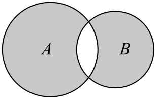
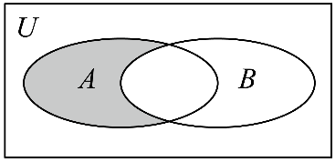

## 讲解

### 判据

题目给韦恩图阴影，要求集合表达式、实际数值范围或判断几个表示正确，先读每一块的归属条件，再计算题设集合。阴影是哪些成员被选中的说明，不是数轴区间，也不能从阴影面积求成员数。以下方法为按数学规范补写。

在同一全集U内，先按一个对象是否属于A、是否属于B分成四种互不重叠的区域：

| 区域 | 一个成员须满足什么 | 集合表达式 |
|---|---|---|
| A独有 | 在A且不在B | $A\cap\complement_U B$ |
| 交叠 | 同时在A、B | $A\cap B$ |
| B独有 | 在B且不在A | $B\cap\complement_U A$ |
| 两边外 | 在U内，A、B都不在 | $\complement_U(A\cup B)$ |

每个U成员对A、B只有在或不在两种判断，四种组合全部覆盖且彼此不能同时成立，因此可以据它们逐块翻译。补集所用全集必须明示；没有全集框时，未画出的圈外不能擅自说是阴影。

### 流程

1. **辨标签、全集和阴影块。** 沿原图看每块是否涂色，特别查交叠有没有涂、两个独有是否都涂、U内两边外有没有涂。灰色深浅不是数值条件，边界数仍由原题决定。
2. **每块先说成员条件。** 在两边同时成立用交，至少一块入选用并；排另一边用其相对已知全集的补。把“在A且不在B”写全，不能漏掉在A而把整个B补集都涂上。
3. **合并全部阴影并核全集。** 多块用并。如果阴影是两圈独有而共有处不涂，可写$(A\cup B)\setminus(A\cap B)$，亦即相对$A\cup B$补掉交集；这里全集是两圈并集，不能无说明换成U。若用U内补集表达，要再限制在相应原集合内。
4. **求A、B实际成员后运算。** 方程、不等式及整数条件先求全，确认A、B在U中；区间核严格符号与等号端点。圆的左右位置不表示数值大小，不能沿图读数字范围。
5. **逐个表示核验。** 表达式可能写法不同而成员相同，用归属条件或完整实际集合证明；多个说法逐一检查，不能从其中两个正确推其余也正确。计数题最后才统计正确说法数。
6. **查入选与排除边界。** 共同成员是否被正确留或删，独有成员是否留，两边外是否误进；有限全集可把每个成员分区，区间查各段及所有临界数。单个检验只用于排错误，一般等价仍由成员条件证明。

原例依次展示两圈独有的并、一边独有，以及同一阴影的三种正确表示与一个错误区域。

## 例题

### 原题 8-0

> 来源ID HSMA-B1-C1-De0726b060358-P0306；原件 `专题1.3 集合的基本运算（举一反三讲义）数学人教A版2019必修第一册（解析版）.docx`；DOCX正文段落 P0306—P0309；答案与详解 P0310—P0313。年份、地区和试题标签沿原资料记载，未独立核实。

**原资料题干与选项：**

【例8】（24-25高一上·吉林长春·期末）已知集合$A=\left\{ x\left| 0\le x\le 2\right.\right\}$，$B=\left\{ x\left| x<0\right.\right.$或$\left. x>1\right\}$，则图中的阴影部分表示的集合为（   ）

A．$\left\{ x\left| x\le 1\right.\right.$或$\left. x>2\right\}$  B．$\left\{ x\left| x<0\right.\right.$或$\left. 1<x<2\right\}$

C．$\left\{ x\left| 1\le x<2\right.\right\}$  D．$\left\{ x\left| 1<x\le 2\right.\right\}$

**原资料答案与详解（完整保留，公式转写为LaTeX）：**

【解题思路】由题可知图中阴影部分表示${∁}_{A\cup B}\left( A\cap B\right)$，结合集合的交运算、并运算求解即可.

【解答过程】由题意知，$A\cup B=R$，$A\cap B=\{x|1<x\le 2\}$，

所以图中阴影部分表示${∁}_{A\cup B}\left( A\cap B\right)=\{x|x\le 1$或$x>2\}$.

故选：A.

**展开解析与核验（依据原详解补足，勘误另标）：**

**先读灰色块。** 原图A独有和B独有都涂灰，共有处留白，圈外没有标为阴影。因此要“在至少一边但不同时在两边”，为$(A\cup B)\setminus(A\cap B)=\complement_{A\cup B}(A\cap B)$；不是只取交叠，也不是一开始就把未标明的圈外加入。

**再求原数值范围。** A为$[0,2]$，B为$(-\infty,0)\cup(1,+\infty)$。任一实数若$x<0$在B，若$0\le x\le1$在A，若$x>1$在B，所以并集为全部实数。交集须在A且在B：A内没有$x<0$的数，余下须$x>1$，且A仍要求$x\le2$，故$A\cap B=(1,2]$。

相对并集$\mathbb R$排掉$(1,2]$，留下$(-\infty,1]\cup(2,+\infty)$。端点核验：$0,1$只在A，入阴影；$2$同时在A、B，应排除；小于$0$或大于$2$的数只在B，入阴影。

A项正是结果；B项把$(1,2)$这样的共有区放进来，又漏合法$0,1$及大于$2$的成员；C项混入共有区并漏负数和大于$2$的独有成员；D项恰为未涂色交集$(1,2]$。四项完整判断，选A。

### 原题 8-1

> 来源ID HSMA-B1-C1-De0726b060358-P0314；原件 `专题1.3 集合的基本运算（举一反三讲义）数学人教A版2019必修第一册（解析版）.docx`；DOCX正文段落 P0314—P0317；答案与详解 P0318—P0323。年份、地区和试题标签沿原资料记载，未独立核实。

**原资料题干与选项：**

【变式8-1】（24-25高一上·河北张家口·阶段练习）已知全集$U=R$，集合$A=\left\{ x|x<-3\text{或}x>2\right\}$，$B=\left\{ x|-4\le x\le 2\right\}$，那么阴影部分表示的集合为（   ）

A．$\left\{ x|-4\le x<-3\right\}$  B．$\left\{ x|-3\le x\le 2\right\}$

C．$\left\{ x|x\le -3\text{或}x\ge 2\right\}$  D．$\left\{ x|-3<x\le 2\right\}$

**原资料答案与详解（完整保留，公式转写为LaTeX）：**

【解题思路】根据$Venn$图和集合之间的关系进行判断．

【解答过程】由$Venn$图可知，阴影部分的元素为属于$B$但不属于$A$的元素构成，

所以用集合表示为$B\cap ({∁}_{U}A)$．

因为集合$A=\left\{ x|x<-3\text{或}x>2\right\}$，$B=\left\{ x|-4\le x\le 2\right\}$，

则${∁}_{U}A=\{x|-3\le x\le 2\}$，所以$B\cap ({∁}_{U}A)=\{x|-3\le x\le 2\}$，

故选：B．

**展开解析与核验（依据原详解补足，勘误另标）：**

**先把图译成一句话。** 全集框标U，灰色只在B圈内且A圈外，所以成员要“属于B且不属于A”，即$B\cap\complement_U A$。A、B共同区和两圈外都没有被选中，不能只写B补集或A补集。

U为实数，A要求$x<-3$或$x>2$；不在A的实数同时满足$x\ge-3$与$x\le2$，故$\complement_U A=[-3,2]$。与B的$[-4,2]$相交，任一$[-3,2]$成员都在B，交集就是$[-3,2]$。

关键边界：$-4$在B但也在A，因为$-4<-3$，应排除；$-3$在B却不在A，因原小于为严格，保留；$2$在B却不在A，因原大于严格，也保留。B项给这个闭区间正确。A项$[-4,-3)$恰为共有区，不是阴影；C项包含A中的外侧成员且无在B内限制，错；D项漏合法$-3$。选B，端点依据来自原条件。

### 原题 8-3

> 来源ID HSMA-B1-C1-De0726b060358-P0331；原件 `专题1.3 集合的基本运算（举一反三讲义）数学人教A版2019必修第一册（解析版）.docx`；DOCX正文段落 P0331—P0333；答案与详解 P0334—P0340。年份、地区和试题标签沿原资料记载，未独立核实。

**原资料题干与选项：**

【变式8-3】（24-25高一上·重庆·期中）已知全集$U=\left\{ -2,-1,0,1,2,3,4\right\}$，集合$A=\left\{ x\in Z\left| {x}^{2}-x<6\right.\right\}$，$B=\left\{ -2,0,1,3\right\}$，给出下列4种方式表示图中阴影部分：①$\left\{ -1,2\right\}$②${∁}_{\left( A\cup B\right)}B$③$A\cap \left( {∁}_{U}B\right)$④$\left( {∁}_{U}A\right)\cap \left( {∁}_{U}B\right)$，正确的有几个？（   ）

A．1个  B．2个  C．3个  D．4个

**原资料答案与详解（完整保留，公式转写为LaTeX）：**

【解题思路】根据阴影部分对应的集合分别判断①②③④即可.

【解答过程】由图可知阴影部分所表示的集合为${∁}_{\left( A\cup B\right)}B$，$A\cap \left( {∁}_{U}B\right)$，故②③正确；

因为$A=\left\{ x\in Z\left| -2<x<3\right.\right\}=\left\{ -1,0,1,2\right\}$，${∁}_{U}B=\left\{ -1,2,4\right\}$，

所以$A\cap \left( {∁}_{U}B\right)=\left\{ -1,2\right\}$，故①正确；

$\left( {∁}_{U}A\right)\cap \left( {∁}_{U}B\right)=\left\{ 4\right\}$，故④错误.

所以正确的有3个.

故选：C.

**展开解析与核验（依据原详解补足，勘误另标）：**

**先定位同一目标区域。** 原图U框内A独有涂灰，交叠、B独有和两圈外未涂，故目标为“在A且不在B”。四种表示都必须与这一完整条件一致。

**求真实有限成员。** A要求整数且$x^2-x<6$，两边减$6$得$x^2-x-6<0$。因式$(x-3)(x+2)$乘开为$x^2+2x-3x-6=x^2-x-6$；两根为$-2,3$，两根之间一正一负，乘积负，外侧同号乘积正，端点乘积为$0$不允许。所以$-2<x<3$；取整数得A为$\{-1,0,1,2\}$，均在U。

B为$\{-2,0,1,3\}$，四区完整列为：A独有$\{-1,2\}$，共同$\{0,1\}$，B独有$\{-2,3\}$，U内两边外$\{4\}$。每个U成员恰入一块，没有漏或重。

①直接列$\{-1,2\}$，正确。②相对$A\cup B=\{-2,-1,0,1,2,3\}$补掉B的$-2,0,1,3$，余$\{-1,2\}$，正确；这里全集不含$4$。③$\complement_U B=\{-1,2,4\}$再交A，排掉A外的$4$，余$\{-1,2\}$，正确。④$\complement_U A=\{-2,3,4\}$与$\complement_U B=\{-1,2,4\}$相交只剩$\{4\}$，是两边外，不是A独有，错误。

三个说法正确，选C项$3$个；A项$1$个、B项$2$个均少计已证正确表示，D项$4$个把错误④也计入。相同阴影可以有不同合法补集下标，但必须证明实际成员一致，不能仅看都有补集符号。

## 易错

- **把独有区当整个一边。** 独有意味着必须排另一边，交叠处不能一起保留。
- **把一边独有区当另一边的完整补集。** 补集还可能包含两边外，须再交所要保留的集合。
- **擅自更换补集全集。** 相对两圈并集取补与相对U取补可能多出圈外成员，先读下标。
- **从圈的示意位置读开闭端点。** 数值边界来自题设严格或非严格条件，不来自圆弧。
- **多个表示只验两个。** 每个表示完整求成员或证条件，再统计正确个数。
