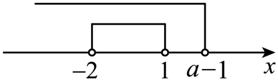
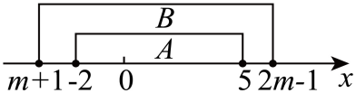

## 讲解

### 判据

两集合由实数不等式规定，要求包含、真包含或相等并求参数时，先把包含方向译成“哪一边的每个成员必须在另一边”，再检查有没有成员。参数可能让描述式成为空集、单点或有长度的区间，不能预先把它画成一段。以下方法为按数学规范补写。

端点比较来自成员包含：内集合的成员不能伸到外集合之外，取到的端点也必须被外集合接纳。示意图只帮助记录这些条件，不能从画出的间隔擅自推出端点严格不等。

### 流程

1. **先定方向与原范围。** 写清$A\subseteq B$表示A每个成员都在B；$B\subseteq A$反过来。参数原有正数、整数等限制要一直保留，描述式与已经合法给定的区间也要分清。
2. **按描述条件判空与退化。** $l\le x\le r$在$l>r$无解，$l=r$只有该点，$l<r$是闭段；两端至少一开时，$l=r$也无成员，$l>r$更无解。不要把非空等同于有正长度。
3. **先解决空集分支。** 被包含方为空时，子集成立，因为没有越界成员；若题干另要求其非空，就必须排除此支。被包含方非空而外集合为空，包含不成立。真子集还要求两边不同，空集只有对非空外集合才是真子集。
4. **两边非空时比较界限和开闭。** 左界不能越出外集合左侧，右界不能越出右侧；端点重合时，内集合包含该点就要求外集合也包含它。内集合不取该点时可以允许界限相等，但两边都取不到同一端点不意味着两个集合相等，还要比较其余范围。
5. **给端点条件的必要与充分依据。** 内集合的每个成员在两界之间，界限合适便保证它入外集合；界限不合适则能找到内集合的越界成员，不能只说“由图”。闭端可直接用端点作反例，开端不能拿未入选的端点作反例，要从越界段内取点。
6. **真包含或相等另验。** 真包含是在已包含的前提下，至少有一个外集合额外成员；不用两侧都严格退让。相等要求范围与所有端点开闭一致；有长度的有限区间可以据其左右界和开闭判断，单点、空集分支分别处理。
7. **解各支、合并、回代。** 每支先与该支的非空、单点等条件相交，再合并所有合法参数。复查端点、零值、退化值。原集合为空和“没有参数能满足题意”是不同结论，分别说明。

以下原题包括空集自动符合、开端允许相等、真包含只须一侧额外，以及反向包含和相等无解。

## 例题

### 原题 8-0

> 来源ID HSMA-B1-C1-D7b6407ccc879-P0309；原件 `专题1.2 集合间的基本关系（举一反三讲义）数学人教A版2019必修第一册（解析版）.docx`；DOCX正文段落 P0309—P0310；答案与详解 P0311—P0315。年份、地区、题目身份沿原资料记载，未独立核实。

**原资料题干与选项：**

【例8】（25-26高一上·全国·课后作业）已知集合$A=\{x\mid 0<x<a\},B=\{x\mid 0<x<2\}$．若$A\subseteq B$，则实数a的取值范围是（   ）

A．$\{a\mid 0<a\le 2\}$  B．$\{a\mid 0\le a\le 2\}$  C．$\{a\mid a<2\}$  D．$\{a\mid a\le 2\}$

**原资料答案与详解（完整保留，公式转写为LaTeX）：**

【解题思路】分$A=\varnothing $和$A\ne \varnothing $，根据集合的包含关系分别研究参数范围.

【解答过程】若$A=\varnothing $，则$a\le 0$，即当$a\le 0$时，满足$A\subseteq B$；

若$A\ne \varnothing $，则$a>0$，即当$a>0$时，由$A\subseteq B$得$a\le 2$，所以$0<a\le 2$．

综上，$a\le 2$．

故选：D.

**展开解析与核验（依据原详解补足，勘误另标）：**

**看到什么、想到什么。** 描述式$0<x<a$未保证存在成员，先查$a$正、零、负，再判断包含。

$a\le0$时，不可能同时有$x>0$与$x<a\le0$，A为空；因为没有A成员越出B，包含成立。$a>0$时，A为$(0,a)$。若$a\le2$，任一A成员满足$0<x<a\le2$，故$x<2$，在B中，充分性成立。

若$a>2$，取$x=(a+2)/2$，则$x-2=(a-2)/2>0$且$a-x=(a-2)/2>0$，所以$0<x<a$而$x>2$。这个实际A成员不在B，包含失败，说明$a\le2$必要。合并空集和非空两支得$a\le2$。

A漏$a\le0$，B漏负参数，C漏合法$a=2$（此时A=B），D完整，选D。开区间在$a=0$时为空，不是含$0$的单点。

### 原题 8-1

> 来源ID HSMA-B1-C1-D7b6407ccc879-P0316；原件 `专题1.2 集合间的基本关系（举一反三讲义）数学人教A版2019必修第一册（解析版）.docx`；DOCX正文段落 P0316—P0317；答案与详解 P0318—P0323。年份、地区、题目身份沿原资料记载，未独立核实。

**原资料题干与选项：**

【变式8-1】（24-25高一上·广东东莞·期末）设集合$A=\{x|-2<x<1\}$，$B=\{x|x<a-1\}$，满足$A\subseteq B$，则实数a的取值范围是（    ）

A．$\{a|a\le -1\}$  B．$\{a|a\ge -1\}$  C．$\{a|a\ge 2\}$  D．$\{a|a\le 2\}$

**原资料答案与详解（完整保留，公式转写为LaTeX）：**

【解题思路】利用集合包含关系得不等关系，从而求解．

【解答过程】$\because A\subseteq B$，$A=\{x|-2$ $<x$ $<1\}$，$B=\{x|x$ $<a-1\}$，

由题意如图：

  

$\therefore a-1$ $\ge 1$，解得a $\ge 2.$

故选：C．

**展开解析与核验（依据原详解补足，勘误另标）：**

**看到什么、想到什么。** A的所有成员小于$1$，B要求小于$a-1$；A不取端点$1$，因此两条右界允许相等。

若$a-1\ge1$，任一A成员$x<1\le a-1$，所以$x<a-1$而在B中。两边减常数或加常数保持等价，$a-1\ge1$即$a\ge2$。特别$a=2$时B为$(-\infty,1)$，A每个成员都在其中，不能因B右端开而错排等号。

**为何更小的参数都不行。** 令$t=a-1<1$，再令$u=\max(t,-2)$，即$t,-2$中的较大者。二者都小于$1$，故$u<1$；取$x=(u+1)/2$，有$u<x<1$，因此$-2<x<1$而$x>t$。它属于A，却不满足B的$x<t$，证明每个$a<2$都失败。

C是完整$a\ge2$。A只给不合格参数；B包含$a=0$这样的不合格值，范围过宽；D也包含不合格值并漏$a>2$的合法值。原数轴图把$a-1$画在$1$右边，是一种允许情形，不能从示意位置读成必须严格大于。

### 原题 8-2

> 来源ID HSMA-B1-C1-D7b6407ccc879-P0324；原件 `专题1.2 集合间的基本关系（举一反三讲义）数学人教A版2019必修第一册（解析版）.docx`；DOCX正文段落 P0324—P0326；答案与详解 P0327—P0333。年份、地区、题目身份沿原资料记载，未独立核实。

**原资料题干与选项：**

【变式8-2】（2025高一上·全国·专题练习）已知集合$A=\left[ 9,13\right]$，$B=\left[ m+1,2m-1\right]$．

(1)若$A\subseteq B$，求实数$m$的取值范围；

(2)若$A\subsetneq B$，求实数$m$的取值范围．

**原资料答案与详解（完整保留，公式转写为LaTeX）：**

【解题思路】（1）由$B=\left[ m+1,2m-1\right]$为非空数集，得$m+1<2m-1$，即$m>2$，结合子集的概念，得到不等式，算出实数$m$的取值范围；

（2）由$B=\left[ m+1,2m-1\right]$为非空数集，得$m+1<2m-1$，即$m>2$，结合真子集的概念，得到不等式，算出实数$m$的取值范围；

【解答过程】（1）因为$B=\left[ m+1,2m-1\right]$为非空数集，得$m+1<2m-1$，解得$m>2$，

若$A\subseteq B$，则$\left\{ \begin{aligned}m+1\le 9\\2m-1\ge 13\end{aligned}\right.$，解得$7\le m\le 8$，即实数$m$的取值范围是$\left[ 7,8\right]$；

（2）因为$B=\left[ m+1,2m-1\right]$为非空数集，得$m+1<2m-1$，解得$m>2$，

若$A\subsetneq B$，则$\left\{ \begin{aligned}m+1\le 9\\2m-1>13\end{aligned}\right.$或$\left\{ \begin{aligned}m+1<9\\2m-1\ge 13\end{aligned}\right.$，

解得$7\le m\le 8$，即实数$m$的取值范围是$\left[ 7,8\right]$．

**展开解析与核验（依据原详解补足，勘误另标）：**

（1）**先用真正成员确定方向。** A含$9$和$13$，两者都要在B中，所以$m+1\le9$且$2m-1\ge13$；前式减$1$得$m\le8$，后式加$1$再除正数$2$得$m\ge7$。因此必要范围$7\le m\le8$。

在此范围中，任一$x\in[9,13]$都满足$m+1\le9\le x\le13\le2m-1$，故在B中，充分性也成立。这个范围使B非空且有正长度，没有额外退化参数。

（2）真包含只需在上面包含范围内排除相等。两非空闭区间相等须$m+1=9$与$2m-1=13$同时成立；分别给$m=8$与$m=7$，不可能同时，故全部$[7,8]$已经真包含。

**边界怎样检验。** $m=7$时B为$[8,13]$，右端相同，额外成员$8$说明真包含；$m=8$时B为$[9,15]$，左端相同，额外成员$15$说明真包含；中间参数两侧都扩展。若把两条端点条件全写严格，会漏这两个边界。

**原解析的依据缺口。** 原解从“B非空”直接写$m+1<2m-1$，这不能仅由非空推出；闭区间在$m=2$时可为单点$\{3\}$。本题B必须包含A的两个不同成员$9,13$，才另有正长度依据；更强的最终$[7,8]$已排$m=2$，因此原最终两问答案正确，原中间说法仍须纠正。

### 原题 8-3

> 来源ID HSMA-B1-C1-D7b6407ccc879-P0334；原件 `专题1.2 集合间的基本关系（举一反三讲义）数学人教A版2019必修第一册（解析版）.docx`；DOCX正文段落 P0334—P0337；答案与详解 P0338—P0349。年份、地区、题目身份沿原资料记载，未独立核实。

**原资料题干与选项：**

【变式8-3】（2024高一上·全国·专题练习）已知集合$A=\left\{ \left. x\right|-2\le x\le 5\right\}$．

(1)若$B\subseteq A$，$B=\{x\left| m+1\le x\le 2m-1,m\right.$为常数$\}$，求实数m的取值范围．

(2)若$A\subseteq B$，$B=\{x\left| m+1\le x\le 2m-1,m\right.$为常数$\}$，求实数m的取值范围．

(3)若$B=\{x\left| m+1\le x\le 2m-1,m\right.$为常数$\}$，是否存在实数m，使得$A=B$？若存在，求出m的值；若不存在，说明理由．

**原资料答案与详解（完整保留，公式转写为LaTeX）：**

【解题思路】（1）由集合的包含关系，分$B=\varnothing $和$B\ne \varnothing $两种情况，列不等式求实数m的取值范围；

（2）由集合的包含关系，列不等式求实数m的取值范围；

（3）由集合的相等关系，列方程组求实数m的值.

【解答过程】（1）①若$B=\varnothing $，满足$B\subseteq A$，则$m+1>2m-1$，解得$m<2$．

②若$B\ne \varnothing $，满足$B\subseteq A$，则$\left\{ \begin{aligned}2m-1\ge m+1,\\m+1\ge -2,\\2m-1\le 5,\end{aligned}\right.$解得$2\le m\le 3$．

由①②可得，符合题意的实数m的取值范围为$\left\{ m|m\le 3\right\}$．

（2）若$A\subseteq B$，数轴表示如下：

依题意有$\left\{ \begin{aligned}m+1\le -2,\\2m-1\ge 5,\\m+1\le 2m-1,\end{aligned}\right.$即$\left\{ \begin{aligned}m\le -3,\\m\ge 3,\\m\ge 2\end{aligned}\right.$

此时m的取值范围是$\varnothing $．

（3）假设存在满足题意的实数m．若$A=B$，

则必有$m+1=-2$且$2m-1=5$，此时无解，即不存在使得$A=B$的实数m．

**展开解析与核验（依据原详解补足，勘误另标）：**

（1）**被包含方是B，先查B有没有成员。** 当$m+1>2m-1$，两边减$m$再加$1$得$m<2$，B为空，自动满足$B\subseteq A$。当$m\ge2$时B非空；其两个闭端在A内就保证整段在A内，须$m+1\ge-2$与$2m-1\le5$。前式得$m\ge-3$，后式得$m\le3$；与本支$m\ge2$相交是$2\le m\le3$。

合并得到$m\le3$。$m=2$时B为$\{3\}$，这个点在A中；$m=3$时B为$[4,5]$，右端$5$也在A中；$m>3$时B的闭右端$2m-1>5$越出A，必失败。

（2）**反向时A非空，B不能为空。** A的闭端$-2,5$都要进入B，所以$m+1\le-2$即$m\le-3$，同时$2m-1\ge5$即$m\ge3$；两者不能同时满足，因此没有参数解。原配图表示假设包含所需位置，不表示某个实际$m$能使两端同时达到该位置。

（3）A非空，相等须B也非空且两端一致；左端$m+1=-2$给$m=-3$，右端$2m-1=5$给$m=3$，不能同时。故不存在使A=B的实数$m$。第（1）问的B空集分支和第（2）问的参数解集为空不同，不能混写成同一种“空”。

## 易错

- **直接比较端点而漏空集。** 被包含方可能为空时先处理，不能用非空区间的端点规则排掉这支。
- **把$l=r$都当空集。** 两端闭时有一个成员；至少一端开时才空。单点的归属仍须实际检查。
- **开端一律用严格参数条件。** 内集合不取该端点，可以与外集合边界重合；必要性反证要用实际入选的点。
- **真包含要求两端全严格。** 先包含再找一个额外成员，或排除完全相等；一侧相等仍可能真包含。
- **从示意图读出可行参数。** 图示满足包含所需位置，但同一参数决定的两端条件可能互相矛盾，须解出全部条件再判是否有解。
