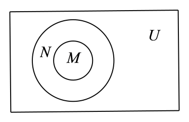

## 讲解

### 判据

同一个式子含交、并、补，且运算结果继续作为下一层的输入，就要按括号和补集作用对象逐层处理。目的不是背一个符号先后口令，而是每次确认“两个哪些集合在运算”“补的是哪个完整集合”。以下方法为按数学规范补写。

对全集U内任意成员，交要求两边同时接纳，并要求至少一边接纳，补要求它在U内且不在被补的整个集合中。每一步都产出新集合，下一步只能接着处理这个结果，不能把其中一个字母擅自换掉。不同括号一般改变成员条件；原式混写交并而未明确分组时，要记录歧义，不能替原书悄悄补括号。

### 流程

1. **先确定全集和各输入集合。** 方程先求实际解集，整数或正整数范围先列成员；确认各集合在同一U内。补集是在U中排除，不能把不在U的对象放进结果。
2. **读出最内层的完整操作数。** 括号里的结果先算；例如补一个并集，要先得到整个并集再从U排掉它，不能只补第一个集合。可给复杂中间集合另记一个字母，并写清它等于原式哪一块。
3. **每层按成员条件执行。** 交取所有共同成员，并取全部两边成员且去重，补取U内剩余成员。列出中间结果及所用定义，再向外处理；区间逐端核开闭，有限集不因书写重复多计成员。
4. **若用性质改写，保留适用条件及依据。** 同一个U内可用德摩根律把“不在并集”改成“两边都不在”，把“不在交集”改成“至少一边不在”；不要把交并符号照原样搬到补集之间。包含关系可用来消去重复范围，但要指出谁的每个成员已经由谁接纳。
5. **按所问方式验证。** 求具体集合就查全部成员；选择题逐项算或逐项给一般判据。问由题设必然成立的结论，证明要覆盖任意合法集合，某个特殊相等或空集不能代替一般证明，也不能把“不必然”说成“永不成立”。
6. **用原式成员条件复查。** 有限U可逐个检查入选与排除；区间查各段和端点；一般恒等式任取U成员分它在或不在相关集合的情形，并说明结果不会增加U外成员。

下面原例依次展示四种补集作用对象、一般包含关系下的必然结论，以及先求全部成员再完成多个小问。

## 例题

### 原题 6-2

> 来源ID HSMA-B1-C1-De0726b060358-P0234；原件 `专题1.3 集合的基本运算（举一反三讲义）数学人教A版2019必修第一册（解析版）.docx`；DOCX正文段落 P0234—P0236；答案与详解 P0237—P0242。年份、地区和试题标签沿原资料记载，未独立核实。

**原资料题干与选项：**

【变式6-2】（2025·四川眉山·三模）设全集$U=\left\{ -3,-2,-1,0,1,2,3\right\}$，集合$A=\left\{ -2,-1,0,1\right\},B=\left\{ -1,1,3\right\}$，则$\left\{ -3,2\right\}=$（    ）

A．$\left( {∁}_{U}A\right)\cap B$  B．$\left( {∁}_{U}A\right)\cup B$

C．${∁}_{U}\left( A\cap B\right)$  D．${∁}_{U}\left( A\cup B\right)$

**原资料答案与详解（完整保留，公式转写为LaTeX）：**

【解题思路】根据集合的交并补运算逐项判断即可.

【解答过程】对A,由$\left( {∁}_{U}A\right)\cap B=\left\{ -3,2,3\right\}\cap \left\{ -1,1,3\right\}=\left\{ 3\right\}$，选项A错误；

对B,$\left( {∁}_{U}A\right)\cup B=\left\{ -3,2,3\right\}\cup \left\{ -1,1,3\right\}=\left\{ -3,-1,1,2,3\right\}$，选项B错误；

对C,${∁}_{U}\left( A\cap B\right)={∁}_{U}\left\{ -1,1\right\}=\left\{ -3,-2,0,2,3\right\}$，选项C错误；

对D,因为$A\cup B=\left\{ -2,-1,0,1,3\right\}$，所以${∁}_{U}\left( A\cup B\right)=\left\{ -3,2\right\}$，所以选项D正确.

故选：D.

**展开解析与核验（依据原详解补足，勘误另标）：**

**看到同一批字母，先看补的是谁。** U给全部七个成员，A、B都在U内。先备好三个中间集合：

$$
\complement_U A=\{-3,2,3\},\qquad A\cap B=\{-1,1\},\qquad A\cup B=\{-2,-1,0,1,3\}.
$$

补A时从U删掉A的$-2,-1,0,1$；交集的$-1,1$同时在两边；并集把两边全部成员纳入，公共$-1,1$不重复。三者的来源各不相同。

- A项先补A再交B，结果只剩两边共有的$3$，为$\{3\}$，不是目标。
- B项先补A再并B，把$-3,2,3$与$-1,1,3$合并为$\{-3,-1,1,2,3\}$；$3$仅出现一次，仍不等于目标。
- C项补整个交集，从U删去$-1,1$，得到$\{-3,-2,0,2,3\}$，多出目标没有的$-2,0,3$。
- D项补整个并集，从U删去$-2,-1,0,1,3$，得到$\{-3,2\}$，正好目标，选D。

**回到成员条件检验。** 目标$-3,2$既不在A也不在B；U的其余五个成员至少在A或B一边，因此均应被整个并集的补集排除。七个U成员都已核对，且没有从U外添成员。

### 原题 6-3

> 来源ID HSMA-B1-C1-De0726b060358-P0243；原件 `专题1.3 集合的基本运算（举一反三讲义）数学人教A版2019必修第一册（解析版）.docx`；DOCX正文段落 P0243—P0244；答案与详解 P0245—P0251。年份、地区和试题标签沿原资料记载，未独立核实。

**原资料题干与选项：**

【变式6-3】（24-25高一上·福建福州·阶段练习）已知全集为$U$，集合$M$，$N$满足$M\subseteq N\subseteq U$，则下列运算结果为$U$的是（    ）

A．$M\cup N$  B．$\left( {∁}_{U}N\right)\cup \left( {∁}_{U}M\right)$  C．$M\cup \left( {∁}_{U}N\right)$  D．$N\cup \left( {∁}_{U}M\right)$

**原资料答案与详解（完整保留，公式转写为LaTeX）：**

【解题思路】根据集合间的基本关系及集合的基本运算，借助Venn图即可求解.

【解答过程】由$M\subseteq N\subseteq U$得当$N\subsetneq U$时，$M\cup N=N\subsetneq U$，故选项A不正确；

$\left( {∁}_{U}N\right)\cup \left( {∁}_{U}M\right)={∁}_{U}\left( M\cap N\right)={∁}_{U}M$，当$M\ne \varnothing $时，${∁}_{U}M\subsetneq U$，故选项B不正确；

当$M\subsetneq N$时，$M\cup \left( {∁}_{U}N\right)\subsetneq U$，故选项C不正确；

因为$M\subseteq N\subseteq U$，所以$N\cup \left( {∁}_{U}M\right)=U$，故选项D正确.

故选：D.

**展开解析与核验（依据原详解补足，勘误另标）：**

**题设只给包含，要判断必然性。** 原选D的意图是找“仅据$M\subseteq N\subseteq U$便一定等于U”的表达式；这不等于说其他项在任何情况下都不可能等于U。原题未写“一定”，这里把原解采用的判断口径明示。

逐项给完整判据：

- A项因M每个成员已在N，$M\cup N=N$。它等于U当且仅当$N=U$，题设允许但没保证这点，所以不必然。
- B项用德摩根律得$\complement_U N\cup\complement_U M=\complement_U(N\cap M)$。因$M\subseteq N$，交集为M，故B项为$\complement_U M$；它等于U当且仅当$M=\varnothing$，也没有由题设保证。
- C项接纳M和N外的成员，但漏掉“在N而不在M”的所有成员。故它等于U当且仅当没有这些成员，即$M=N$；若M真包含于N就有漏项。题设允许二者相等，也允许不等，所以不必然。
- D项$N\cup\complement_U M$必然等于U：任取$x\in U$，若$x\in M$，包含关系保证$x\in N$；若$x\notin M$，它在$\complement_U M$。两支覆盖U全部成员，而两个操作数都在U内，不会添外来成员。因此两个包含方向均成立，D恒等于U。

原图示M在N内部，只是帮助读成员区域；相等、空集也在题设许可内，不能从图上画有间隙就强加真包含。若固定的具体U本身为空，M、N也全空，四项都等于U；这再次说明原选择题按一般必然结论命题，而非宣称每个特殊实例仅D成立。原答案和原文保留，措辞缺口记录待教师统一。

### 原题 P0344

> 来源ID HSMA-B1-C1-De4c375404d2d-P0344；原件 `第一章 集合与常用逻辑用语（举一反三讲义·培优篇）数学人教A版2019必修第一册（解析版）.docx`；DOCX正文段落 P0344—P0347；答案与详解 P0348—P0360。年份、地区和试题标签沿原资料记载，未独立核实。

**原资料题干与选项：**

5．（24-25高一上·广东汕头·阶段练习）已知全集$U=\left\{ x\in {N}^{*}|x<9\right\}$，$A=\left\{ x|{x}^{2}-3x+2=0\right\}$，$B=\left\{ x|1\le x\le 5,x\in Z\right\}$，$C=\left\{ x|2<x<9,x\in Z\right\}$.

(1)列举法表示集合$U$、$A$、$B$、$C$；

(2)求$A\cup \left( B\cap C\right)$；

(3)求$\left( {∁}_{U}A\right)\cap \left( {∁}_{U}B\right)$；$\left( {∁}_{U}B\right)\cup \left( {∁}_{U}C\right)$.

**原资料答案与详解（完整保留，公式转写为LaTeX）：**

【答案】(1)答案见解析

(2)$\left\{ 1,2,3,4,5\right\}$

(3)$\left\{ 6,7,8\right\}$；$\left\{ 1,2,6,7,8\right\}$

【解题思路】（1）根据描述法所给集合，用列举法求出集合$U,A,B,C$；

（2）根据集合的交集、并集运算得解；

（3）根据集合的交并补的概念进行计算即可.

【解答过程】（1）全集$U=\left\{ 1,2,3,4,5,6,7,8\right\}$，集合$A=\left\{ x\mid {x}^{2}-3x+2=0\right\}=\left\{ 1,2\right\}$，

集合$B=\left\{ x\mid 1\le x\le 5,x\in Z\right\}=\left\{ 1,2,3,4,5\right\}$，

集合$C=\{x\mid 2<x<9,x\in Z\}=\left\{ 3,4,5,6,7,8\right\}$.

（2）$\because B\cap C=\left\{ 3,4,5\right\}$，

$\therefore A\cup \left( B\cap C\right)=\left\{ 1,2,3,4,5\right\}$.

（3）$\because {∁}_{U}A=\left\{ 3,4,5,6,7,8\right\},{∁}_{U}B=\left\{ 6,7,8\right\},{∁}_{U}C=\left\{ 1,2\right\}$.

$\therefore \left( {∁}_{U}A\right)\cap \left( {∁}_{U}B\right)=\left\{ 6,7,8\right\},\left( {∁}_{U}B\right)\cup \left( {∁}_{U}C\right)=\left\{ 1,2,6,7,8\right\}$.

**展开解析与核验（依据原详解补足，勘误另标）：**

**先求输入，不让运算代替解集判断。**

（1）U收正整数且严格小于$9$，故取$1$至$8$，不取$0,9$。A的原式因式分解：

$$
x^2-3x+2=(x-1)(x-2),\qquad (x-1)(x-2)=0\Longleftrightarrow x=1\text{或}x=2.
$$

因为乘积为零至少一因子为零，A恰$\{1,2\}$。B要求整数且两闭端$1,5$均可取，为$\{1,2,3,4,5\}$；C要求整数且$2,9$开端不取，为$\{3,4,5,6,7,8\}$。四个集合都在U内，后续补集统一相对U。

（2）先算括号里的$B\cap C$：两边都有$3,4,5$，B的$1,2$不在C，C的$6,7,8$不在B，故交集恰$\{3,4,5\}$。再并A的$1,2$，得到$\{1,2,3,4,5\}$。最终$6,7,8$既不在A也未入这个交集，均不选。

（3）先分别在U内补三个集合：删A的$1,2$得$\complement_U A=\{3,4,5,6,7,8\}$；删B的$1$至$5$得$\complement_U B=\{6,7,8\}$；删C的$3$至$8$得$\complement_U C=\{1,2\}$。

第一个所求交集要求同时在前两个补集中，只有$6,7,8$，结果$\{6,7,8\}$；第二个所求并集纳入后两个补集全部成员，结果$\{1,2,6,7,8\}$。检验前者的成员均既不在A也不在B，后者的成员均满足不在B或不在C；原U的其他成员分别被对应条件排除。三个小问及第（3）问的两个结果完整接齐。

## 易错

- **补集只补了括号里一个字母。** 先把括号内整个集合算出，再在同一全集里取反；德摩根改写时交并也要互换。
- **并集把公共成员数两次。** 结果仍是集合，公共对象只保留一次。
- **未求输入范围就照式子算。** 解集、整数集和实数区间不同，先确认实际成员及各端点。
- **一个特例就证明恒等式。** 任意合法成员的分支推理才能保证必然成立；一个合法反例只足以否定必然性。
- **凭缺括号原式的答案猜分组。** 原解析的分组意图与原式完整性分开报告，必要时给不同分组的不同结果。
