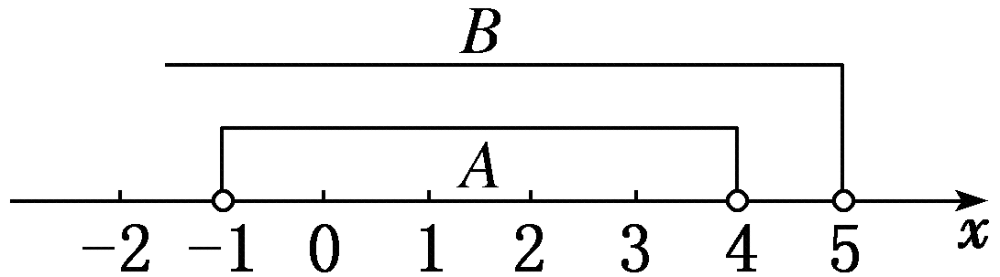

## 讲解

### 判据

两集合写法不同，问相等、真包含或是否包含时，先弄清实际成员。有限集合可以列全；无限集合需要对任意成员证明一个方向，再证明另一方向或给额外成员。看见几项相同，不能据此确认全部相等。以下方法为按数学规范补写。

成员是数、点还是几何对象必须先辨。生成式中参数取整数还是正整数会改变最小成员及能否反向实现；未知字母名字不同本身不改变集合。

### 流程

1. **确定每个集合收集什么。** 一个有序数对是一个完整点，不拆坐标；几何对象用定义或定理判，不能凭图形比例。核对数域和生成参数范围。
2. **证明一个包含方向。** 有限集合逐个验全；条件集合取任意成员$x$，用它在起始集合的全部条件推出目标成员条件。生成式还要说明所选新参数合法，不能只看到形式近似。
3. **检查反向或严格性。** 要证明相等，再对目标任意成员作反向推导；要证明真包含，给一个外集合有而内集合没有的合法对象。找一个共同成员不能替代全体证明，找一个额外成员也只能否定相应方向。
4. **生成范围须两向核对。** 输出是整数可证明生成集合包含于整数集，但未证明全体整数都能生成。任取整数，构造合法整数参数实现它；正整数参数还必须为正，零值不能混入。
5. **整理两个方向的结论。** 两向都成立是相等；只一向成立是真包含；两向都失败是互不包含。空集、相同成员名字和额外端点均按实际成员处理，不从示意位置猜结论。

以下多小问原例把数与点、开区间、三角形定义、正奇数和整数生成式放在同一成员判断框架下。

## 例题

### 原题 7-0

> 来源ID HSMA-B1-C1-D7b6407ccc879-P0261；原件 `专题1.2 集合间的基本关系（举一反三讲义）数学人教A版2019必修第一册（解析版）.docx`；DOCX正文段落 P0261—P0262；答案与详解 P0263—P0265。年份、地区、题目身份沿原资料记载，未独立核实。

**原资料题干与选项：**

【例7】（25-26高一上·全国·课后作业）已知集合$P=\{1,2,3,4\},Q=\left\{ y\left| y=x+1,x\in P\right.\right\}$，那么集合$M=\{3,4,5\}$与Q的关系是（    ）

A．$M\nsubseteq Q$  B．$M\subsetneq Q$  C．$Q\subsetneq M$  D．$Q=M$

**原资料答案与详解（完整保留，公式转写为LaTeX）：**

【解题思路】先得出集合$Q$，再根据集合的基本关系得出.

【解答过程】由题意可得$Q=\left\{ 2,3,4,5\right\}$，故集合$M$是集合$Q$的真子集，即$M\subsetneq Q$．

故选：B.

**展开解析与核验（依据原详解补足，勘误另标）：**

**先求完整输出，再比较两个方向。** P的输入$1,2,3,4$分别使$y=x+1$成为$2,3,4,5$，所以Q恰为$\{2,3,4,5\}$，没有其他合法输入能给新成员。

M的三个成员$3,4,5$都在Q，故$M\subseteq Q$；Q还含$2$而M没有，所以两边不同，是$M\subsetneq Q$。A否定了已证明的包含，错；B给正确关系；C方向相反，Q的$2$是反例；D相等被额外成员$2$否定。选B。

### 原题 7-3

> 来源ID HSMA-B1-C1-D7b6407ccc879-P0290；原件 `专题1.2 集合间的基本关系（举一反三讲义）数学人教A版2019必修第一册（解析版）.docx`；DOCX正文段落 P0290—P0295；答案与详解 P0296—P0307。年份、地区、题目身份沿原资料记载，未独立核实。

**原资料题干与选项：**

【变式7-3】（25-26高一·江苏·假期作业）指出下列各对集合之间的关系.

(1)$A=\{-1,1\}$，$B=\{(-1,-1),(-1,1),(1,-1),(1,1)\}$；

(2)$A=\{x\mid-1<x<4\}$，$B=\{x\mid x-5<0\}$；

(3)$A=\{x\mid x\text{是等边三角形}\}$，$B=\{x\mid x\text{是等腰三角形}\}$；

(4)$M=\{x\mid x=2n-1,n\in\mathbb N^*\}$，$N=\{x\mid x=2n+1,n\in\mathbb N^*\}$；

(5)$A=\{x\mid x=2a+3b,a\in\mathbb Z,b\in\mathbb Z\}$，$B=\{x\mid x=4m-3n,m\in\mathbb Z,n\in\mathbb Z\}$.

**原资料答案与详解（完整保留，公式转写为LaTeX）：**

【解题思路】（1）由集合A和集合B的代表元素判断；

（2）利用数轴求解判断；

（3）由等边三角形和等腰三角形的关系判断；

（4）由n∈N*判断；

（5）由任意k∈Z是否符合集合元素的公共属性判断.

【解答过程】（1）集合A的代表元素是数，集合B的代表元素是有序实数对，故A与B之间无包含关系.

（2）集合B＝{x|x<5}，用数轴表示集合A，B如图所示，由图可知A$\subsetneq $B.

（3）等边三角形是三边相等的三角形，等腰三角形是两边相等的三角形，故A$\subsetneq $B.

（4）两个集合都表示正奇数组成的集合，但由于n∈N*，因此集合M含有元素“1”，而集合N不含元素“1”，故N$\subsetneq $M.

（5）A＝{x|x＝2a＋3b，a∈Z，b∈Z}，因为任意k∈Z，k＝2×(－k)＋3k∈A，所以A＝{x|x＝2a＋3b，a∈Z，b∈Z}＝Z，

因为任意k∈Z，k＝4k－3k∈B，所以B＝{x|x＝4m－3n，m∈Z，n∈Z}＝Z，所以A＝B＝Z.

**展开解析与核验（依据原详解补足，勘误另标）：**

（1）A收数$-1,1$，B收完整数对。A的$1$不是B中的任一点，故$A\nsubseteq B$；B的$(-1,-1)$不是A中的数，故$B\nsubseteq A$。两个方向都失败，互不包含，不能把坐标数当成点本身。

（2）B的$x-5<0$等价于$x<5$。任一A成员满足$-1<x<4$，因此$x<5$，在B中；$4$在B而不在A，因A右端开。故$A\subsetneq B$，不是只凭数轴中较短的一段判断。

（3）按原资料的等腰定义“至少两边相等”，任一等边三角形三边全相等，必有两边相等，故属于等腰集合。反向不成立：边长$3,3,4$均正，且$3+3>4$、$3+4>3$，能构成非退化三角形；它有两边相等而第三边不同，是等腰而非等边。这个存在见证说明B确有额外对象，因此$A\subsetneq B$。理由来自定义及三角形存在条件，不依赖图形外观。

（4）任一N成员可写为$2n+1$，$n\in\mathbb N^*$。把它写成$2(n+1)-1$，而$n+1$仍为正整数，因此在M中，$N\subseteq M$。M中$n=1$给成员$1$；N若产生$1$则$2n+1=1$需$n=0$，不在正整数范围，所以$1\notin N$，得到$N\subsetneq M$。不能只看到两个式子都产生奇数就称相等。

（5）先证A每个成员$2a+3b$为整数，因为整数乘整数、相加仍是整数，故$A\subseteq\mathbb Z$。再任取$k\in\mathbb Z$，选$a=-k,b=k$，二者都是合法整数，代入$2a+3b=-2k+3k=k$，所以$\mathbb Z\subseteq A$，得到$A=\mathbb Z$。

B的任一成员$4m-3n$也为整数，故$B\subseteq\mathbb Z$；任取整数$k$，选$m=k,n=k$，代入$4m-3n=4k-3k=k$，所以$\mathbb Z\subseteq B$。两边各完成两个方向，故$A=B=\mathbb Z$，包含负整数、零及正整数，不是只比较头几个生成值。

## 易错

- **把坐标出现在数集中当成点入数集。** 左侧对象整体必须相同，一个数和一个数对不是同一成员。
- **只证输出属于某数域就称等于该数域。** 还须反向构造，保证数域内每个数都能由合法参数实现。
- **生成式换参数时忘了范围。** 正整数参数不能取$0$，这个禁值可能恰好使最小成员缺失。
- **真包含只写包含不找差别。** 用一个合法额外成员排除相等，说明它为何在外集合而不在内集合。
- **几何集合按图猜。** 从定义推出包含，再用符合三角形存在条件的反例说明反向不成立。
