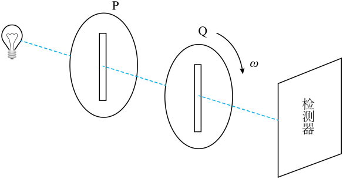

## 错法

以为自然光沿各个横向方向都有振动，第二片怎么转都能透过一样多；忽略第一片已经把自然光变成线偏振光。也有人把转一圈看作只经历一次亮暗变化。

## 正解

先看第二片收到的光。第一片固定后，它已只沿第一片的轴振动。第二片转动改变投影，强度为I₁cos²θ，所以平行最亮、垂直最暗。

单片对理想自然光的旋转不改平均透射强度，是因为入射方向统计上没有偏好；这不能推广到已有起偏器的两片系统。自然光经第一片之后的输入状态已经改变。

强度规律每180°重复，而轴方向作为线方向也在180°后相同。整周计两个最大、两个最小，首尾同一个状态不重复算。

## 例题

> 题目与解析：第四章 光（专项训练）（解析版）.docx，来源ID S02，第431—442段。分段选取时保留该子问的完整题干、答案与解析；题目背景和原资料标注照录。

35．（25-26高二下·安徽·期末）我国“墨子号”量子科学实验卫星利用光子偏振态实现量子通信。如图所示，在实验室中用偏振片研究偏振光：一束自然光依次垂直通过偏振片$P$、$Q$，$P$的透振方向固定为竖直方向，$Q$以光的传播方向为轴匀速旋转。下列说法正确的是（     ）

A．经过偏振片$P$后的光，其振动方向沿各个方向的强度均相同

B．当$Q$的透振方向与$P$垂直时，透射光强度达到最大

C．在$Q$旋转一周的过程中，检测器接收到的光强会出现两次最大值和两次最小值

D．改变$P$、$Q$的前后顺序，旋转偏振片时所能测得的最大透射光强度会随之改变

**原资料答案：** C

**原资料详解：** 

A．自然光垂直通过偏振片$P$后，会变成仅沿$P$透振方向（竖直方向）振动的偏振光，不是振动方向沿各方向强度相同，A错误；

B．根据马吕斯定律，透射光强度满足$I=I_0\cos^2\theta$（$\theta$为两个偏振片透振方向的夹角）。当$Q$与$P$透振方向垂直时，$\theta=90^\circ$，$I=0$，透射光强度最小，B错误；

C．在Q旋转一周（$0^\circ\sim360^\circ$）的过程中，$\theta=0^\circ$和$180^\circ$时，两偏振片透振方向平行，光强达到最大，共2次；$\theta=90^\circ$和$270^\circ$时，两偏振片透振方向垂直，光强最小，共2次。因此光强会出现两次最大值、两次最小值，C正确；

D．自然光通过第一个偏振片后，强度都会变为原自然光的$\frac12$；改变$P,Q$顺序后，当两个偏振片透振方向平行时，最大透射光强度仍然是原自然光强度的$\frac12$，最大透射光强度不变，D错误。

故选C。

### 顺着本题再看清一步

A体现没有更新第一片后的状态；B颠倒垂直时透过强度；D把顺序交换当最大值改变，而原题理想自然光下最大仍为原强度一半。C准确给一周两次最大与最小。
