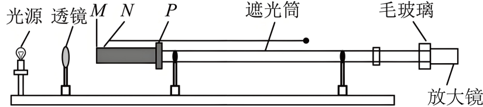
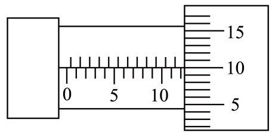

## 错法

把“光场能叠加”和“肉眼可观察稳定干涉条纹”当成同一件事。仅有两束光重叠、亮度增加、颜色相同，都不足以保证固定明暗分布。

## 正解

稳定干涉要两路频率相同、相位差稳定，偏振方向有可共同叠加的分量。若相位差随机快速改变，瞬间的加强、减弱位置会改变，观察的平均强度便没有稳定条纹。

实验用同一光源经单缝形成共同照明，再照双缝，使两缝的相位联系保留；激光也通常取同一束分成两路。滤光片选择较窄波段，有助条纹清晰，但不能把两台互不相关的同色灯自动锁定相位。

单缝与双缝的作用不同：前者提供共同照明与相干条件，后者产生两路路径差。条纹能否观察还取决于光路重叠、强度比例、环境稳定与空间分辨率。

## 例题

> 题目与解析：高二上物理第四章  光·基础通关卷（解析版）.docx，来源ID S13，第127—142段。分段选取时保留该子问的完整题干、答案与解析；题目背景和原资料标注照录。

11．（6分）某小组同学用下图装置进行“用双缝干涉测量光的波长”实验，光具座上放置的光学元件从左向右依次为光源、透镜、M、N、$P$、遮光筒、毛玻璃、放大镜（目镜）。

(1)M、$N$、P三个光学元件依次为_____。

A．单缝、双缝、滤光片

B．双缝、滤光片、单缝

C．滤光片、单缝、双缝

D．滤光片、双缝、单缝

(2)某次测量中，小明将测量头的分划板中心刻线对准第1条亮条纹中心，手轮示数$x_1=1.700\,\mathrm{mm}$，调节测量头，让分划板中心刻线对准第5条亮条纹中心时，手轮示数如图所示，此时示数$x_2=$_____mm。

(3)若测出装置中双缝的间距$d=0.2\,\mathrm{mm}$、双缝到屏的距离$L=1000.00\,\mathrm{mm}$，则形成此干涉图样的单色光的波长为_____mm。

**原资料答案：** (1)C；(2)12.100；(3)$5.2\times10^{-4}$

**原资料详解：** （1）为使双缝获得由同一单缝形成的相干光，光路中应先用滤光片获得单色光，再依次通过单缝和双缝。因此$M$，$N$，$P$依次为滤光片、单缝、双缝。

故选C。

（2）测量头的主尺读数为$12.000\,\mathrm{mm}$，可动刻度读数为$0.100\,\mathrm{mm}$，故$x_2=12.000\,\mathrm{mm}+0.100\,\mathrm{mm}=12.100\,\mathrm{mm}$

（3）由双缝干涉条纹间距公式得$\Delta x=\frac{L\lambda}{d}$

第1条到第5条亮条纹间有$4$个条纹间距，故$\Delta x=\frac{x_2-x_1}{4}=\frac{12.100\,\mathrm{mm}-1.700\,\mathrm{mm}}4=2.600\,\mathrm{mm}$

由上式整理得$\lambda=\frac{d\Delta x}{L}$

代入数据得$\lambda=\frac{0.2\times2.600}{1000.00}\,\mathrm{mm}=5.2\times10^{-4}\,\mathrm{mm}$

### 顺着本题再看清一步

第（1）问M、N、P依次为滤光片、单缝、双缝。A、B、D的排序不能实现题设安排的同色共同照明再分路，C正确。第（2）（3）问保留完整原读数与波长计算，说明即使相干建立，测量还需看准同类条纹中心、数清四个间隔。
