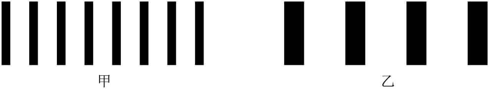

## 讲解

### 是什么

同一束光照亮相距很近的两条狭缝，双缝提供频率相同、相位差稳定的相干光。在屏上，两路光在某些位置加强、某些位置减弱，形成明暗条纹。

两缝间距d、双缝到屏距离L、波长λ、相邻同类条纹间距Δx都用长度单位。d不是单条缝的宽度；相邻亮纹到暗纹通常是半个同类条纹间距。

### 怎么来的

设屏上一点距离中央位置x，L远大于d且x/L很小。两路几何距离差近似为d sinθ，几何中tanθ=x/L，小角度下sinθ≈tanθ，所以：

$$\delta\approx\frac{dx}{L}.$$

同相双缝在路径差mλ处出现亮纹，在(m+1/2)λ处出现暗纹。把亮纹条件代入上式：

$$x_m\approx\frac{mL\lambda}{d}.$$

相邻亮纹对应m增加1，位置差为：

$$\Delta x\approx\frac{L\lambda}{d}.$$

因此屏更远、波长更长会使间距增大，双缝间距更大则使条纹更密。中央两路等长且源同相，各色光都在中央加强；白光中央常为白色亮纹，其余位置各波长条纹错开。

### 什么时候能用

条纹近似等距的公式需要远屏、小角度、相干双缝和给定介质中的λ。单缝较宽或缝宽有限会影响可见度与强度包络，不把理想等强亮纹当所有实际图样。

两束独立普通光即使颜色相同，相位差也可能快速变化，通常不出现稳定条纹。双缝各自受同一源驱动，是保证相干的重要条件，不是任意两个亮点就等于双缝。

## 例题

> 题目与解析：第四章 光（专项训练）（解析版）.docx，来源ID S02，第301—307段。分段选取时保留该子问的完整题干、答案与解析；题目背景和原资料标注照录。

23．（多选）（25-26高二上·广东深圳·期中）某同学用单色光进行双缝干涉实验，在屏上观察到如甲图所示的条纹，仅改变一个实验条件后，观察到的条纹如乙图所示。他改变的实验条件可能是（　　）

A．减小光源到单缝的距离

B．增大双缝到光屏之间的距离

C．增大双缝之间的距离

D．换用频率更低的单色光源

**原资料答案：** BD

**原资料详解：** 由$\Delta x=\frac{L}{d}\lambda$可知，条纹间距变大，则可能是增大了双缝到光屏之间的距离L，或者减小了双缝间的距离d，或者换用了波长更大、频率更低的单色光源，条纹间距与光源到单缝的距离无关。

故选BD。

### 顺着本题再看清一步

原解析还提到“减小双缝间距”也可使间距大，但原选项C写的是增大，方向相反，不能把解析中的可能操作直接贴到C上。D先用λ=c/f判断频率降低对应波长增大，再用条纹公式。

## 易错

- 图乙比甲稀疏，说明Δx增大，不是亮度提高。
- B增L、D减f从而增λ，都可增间距；A只改源到单缝距离，C增d会减间距，因此答案BD。
- 逐项比较默认只有一个条件改变，若多量同时改变，应看Lλ/d的总比例。
