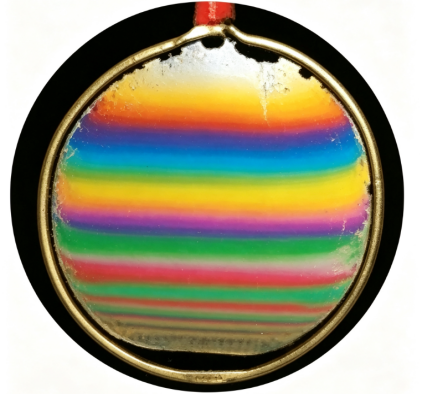

## 讲解

### 是什么

光到达薄膜后，一部分由前表面反射，另一部分进入膜、经后表面反射再出来。这两路来自同一入射光，具有可保持的相位关系，叠加形成薄膜干涉。

薄膜厚度t、膜折射率n、真空波长λ₀决定传播相位。正入射时，第二路在膜中多走约2t，对应光程差2nt，不能把膜内距离2t直接与真空波长混比。

### 怎么来的

两路的相位差包含两部分：多走光程形成的相位差，以及反射本身可能引入的相位变化。普通透明介质、近正入射模型下，从低折射率向高折射率界面反射会产生π相位变化，反向反射无此π变化。

例如空气—肥皂膜—空气，前反射有π变化，后反射没有。两路相位差可写为传播项再加一个π（符号按2π等价）：

$$\Delta\varphi=\frac{2\pi}{\lambda_0}(2nt)+\pi.$$

当2nt为整倍λ₀时反射光减弱，当它为半整数倍λ₀时反射光加强。改变外侧、膜和基底的折射率顺序，两个反射相位的差也可能改变，所以不能把某一种膜的明暗条件套给所有镀膜。

厚度随位置变化，满足同一干涉条件的位置形成等厚条纹；白光中不同波长在不同厚度处加强，出现彩色条纹。膜厚均匀、入射角也相同的理想膜，各点具有相同干涉状态，可整体偏亮或偏暗，却没有空间交替条纹。

### 什么时候能用

先找真正产生两路反射的前、后表面，再判膜厚与反射相位。空气劈尖是两玻璃板之间空气层两表面的反射，不是拿两块玻璃各自整个厚度当空气膜厚。

增透膜通过减少设计波段的反射增强透射，效果依波长、角度、折射率与吸收而变，不能说所有颜色同样增强。反射相位条件经[薄膜干涉模型](https://openstax.org/books/university-physics-volume-3/pages/3-4-interference-in-thin-films)核对。

## 例题

> 题目与解析：第四章 光（专项训练）（解析版）.docx，来源ID S02，第357—363段。分段选取时保留该子问的完整题干、答案与解析；题目背景和原资料标注照录。

28．（25-26高二上·江苏盐城·期中）如图是白光照射肥皂膜后形成的上疏下密的干涉条纹图样。若在中国空间站内完成相同实验（空间站内可近似为完全失重），则薄膜上（　　）

A．无干涉条纹

B．有等间距的干涉条纹

C．有上疏下密的干涉条纹

D．有上密下疏的干涉条纹

**原资料答案：** A

**原资料详解：** 薄膜干涉现象发生的原因是肥皂膜在重力作用下产生上薄下厚的楔形，进而使得上下表面反射回来的光线有光程差而发生干涉，太空中由于处于完全失重状态，肥皂膜上下表面平行，能发生干涉现象，但由于肥皂膜厚度均匀，不能看到干涉条纹。

故选A。

### 顺着本题再看清一步

B、C、D都要求膜不同位置有周期改变的相位差，均匀膜在相同入射角条件下没有这一厚度梯度，因此均错。原解析把重力造成厚度分布作为实验背景，本条保留它，但将“失重就必然均匀”的实际装置推断限定为题目的理想假设。

## 易错

- 原题假设失重后膜均匀、上下表面平行，所以不再有空间上疏下密等条纹，A正确。
- 均匀膜仍可能有两路反射的干涉，不能把“无条纹”改成“无干涉”。
- 失重本身并不能保证任何真实肥皂膜瞬间均匀；本题结论还依赖原解析采用的均匀膜、共同入射角模型。
