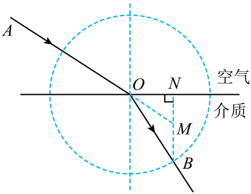

## 讲解

### 判据

已知界面、入射光与角度或可换成正弦的几何长度时，入口是折射定律。先按传播方向标两侧折射率，再写：

$$n_1\sin i=n_2\sin r.$$

i、r均相对局部法线。空气近似n₁=1射入玻璃时n₂=sin i/sin r；玻璃射空气时比例倒转，不能按“入射/折射”两个名字机械排分子分母。

### 流程

1. **标出入射点、介质与箭头。** 光从哪侧来，决定n₁、n₂的身份，不凭图在上还是在下判断光疏光密。
2. **作垂直界面的法线。** 已知光线与界面夹角α，就把对应法线角写成90°−α。曲面先用入射点的切线作局部法线；圆面沿半径入射时角为零。
3. **从角或长度求正弦。** 辅助圆、直角三角形常可用对边/斜边，不必先求反三角函数。本题OM与OB在水平投影上相等，是关键几何关系。
4. **列定律并检查方向。** 光疏到密应靠近法线，光密到疏应远离。若算出sin r>1，转入全反射判断，不画虚假的折射线。
5. **多界面逐面追踪。** 每次入射重画法线，必要时用光路可逆验证。平行玻璃砖两侧空气相同时出射线与入射线平行，仍可能横向偏移。

本题小写r表示OM长度，角度另记θ₁、θ₂；长度R、r同单位，所得n没有单位。

## 例题

> 题目与解析：高二上物理第四章  光·基础通关卷（解析版）.docx，来源ID S13，第45—51段。分段选取时保留该子问的完整题干、答案与解析；题目背景和原资料标注照录。

5．如图所示，一束单色光从空气斜射入某种透明介质中，入射点为O。实验者进行了如下操作：①以O为圆心、R为半径画圆，该圆与折射光线交于B点；②过B作介质与空气分界面的垂线$BN$，延长入射光线$AO$交$BN$于M点，测得$OM$的长度为r。则透明介质对该单色光的折射率n为（　　）

A．$\frac rR$

B．$\frac Rr$

C．$\frac{\sqrt{R^2-r^2}}r$

D．$\frac R{\sqrt{R^2-r^2}}$

**原资料答案：** B

**原资料详解：** 根据折射定律，介质折射率$n=\frac{\sin\theta_1}{\sin\theta_2}$

由几何关系有$\sin\theta_1\cdot r=\sin\theta_2\cdot R$

可得折射率$n=\frac Rr$，故选B。

### 顺着本题再看清一步

看到辅助圆，先想到把正弦转成投影长度。OM和OB长度分别r、R，二者端点均在BN上，所以水平投影同为ON；因此sinθ₁=ON/r、sinθ₂=ON/R，相除给R/r。每个等式都来自同一个直角三角形，未跳过几何理由。

## 易错

- 延长AO到M，不要把折射OB和BN之间的夹角误认成与界面的角。BN平行法线。
- r sinθ₁=R sinθ₂给n=R/r，B正确。A倒比；C、D使用的勾股组合并不是定律中的正弦比。
- 若使用角度比i/r而非正弦比，一般没有折射定律依据。
