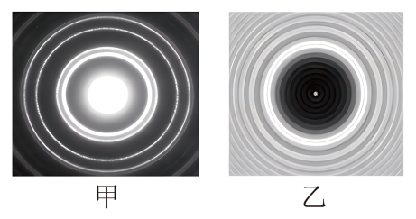

## 错法

看见中心亮点，就猜圆板中心开了孔；或把圆孔衍射、泊松亮斑和小孔成像一起叫“圆孔成像”。混淆了透光与遮光结构，也混淆了波动图样与物体的几何像。

## 正解

泊松亮斑出现在不透明圆板挡光后的几何阴影中心。圆板边缘绕射来的光，在轴线中心具有对称的相位关系，叠加形成亮点；这无需在板中心开孔。

圆孔衍射则由透过孔的光形成中央亮斑与圆环。小孔成像通常在几何光学条件下形成物体倒像；孔过小会受衍射影响而模糊，不能把圆环当作物体倒像。

先查题干是孔还是板，再看亮点位于主要透光区还是阴影内部。尺寸、照明与屏距不同，图样大小不能单独作有无圆孔的证据。

## 例题

> 题目与解析：第四章 光（专项训练）（解析版）.docx，来源ID S02，第402—409段。分段选取时保留该子问的完整题干、答案与解析；题目背景和原资料标注照录。

32．（25-26高二上·江苏宿迁·期末）某研究性学习小组用激光束照射圆孔和不透明圆板后，得到如图所示的衍射图样，据此可以判断出（　　）

A．甲图是光线射到圆孔后的衍射图样

B．乙图是光线射到圆孔后的衍射图样

C．甲、乙图都是光线射到圆孔后的衍射图样

D．甲、乙图都是光线射到圆板后的衍射图样

**原资料答案：** A

**原资料详解：** 根据衍射现象图样的特点，可知圆孔衍射的图样，是中央为亮斑，周围环绕着明暗相间的同心圆环；不透明圆板衍射的图样，是在圆板阴影的中心有一个亮斑，周围是明暗相间的圆环。故甲图是光线射到圆孔后的衍射图样，乙图是光线射到圆板后的衍射图样。故选A。

### 顺着本题再看清一步

甲是中央大亮斑和周围圆环，按本题为圆孔衍射；乙是圆板暗影中心的小亮点，按本题为泊松亮斑。A正确，B把乙认成圆孔错，C把两图都认圆孔错，D把两图都认圆板错。原合并解析拆成逐项判断，没有另造图或题。
